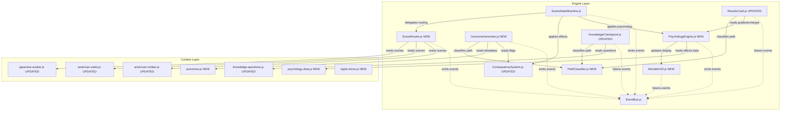

# Design Document: Branching Narrative System with Player Psychology

## 1. System Overview

The branching narrative system transforms Witness Interactive from a linear story into a choice-driven experience where player decisions create divergent narrative paths. The core principle is "Paths diverge. Lessons converge." Players experience different emotional journeys and historical perspectives based on their choices, but all paths teach the same AP History reasoning skills.

The system introduces true branching through explicit scene routing (replacing sequential indices), three distinct path variants per role (Compliance, Instinct, Witness), personalized outcome generation, and path-aware knowledge assessment. An integrated Player Psychology System tracks four psychological dimensions (Morale, Loyalty, Humanity, Composure) throughout gameplay, calculating a Teammate Grade and Personality Archetype that reflects the player's decision-making patterns.

All paths converge at the Outcome Screen and Historical Ripple Screen, ensuring educational outcomes remain consistent while narrative experiences vary. The system maintains strict separation between engine logic and content data, communicates exclusively via EventBus, and requires no new dependencies for GitHub Pages compatibility.

## 2. Architecture Diagram



## 3. Component Specifications

### 3a. SceneRouter.js (NEW)

**File path:** `js/engine/SceneRouter.js`

**Responsibility:** Manages scene navigation by ID, validates scene graph integrity, and routes players through branching narratives.

**Public Interface:**

```javascript
class SceneRouter {
  constructor(eventBus)
  
  // Builds Scene_Map from role scene array. Sets startScene.
  // Validates all nextScene references exist. Logs all broken routes before returning.
  // Returns: { valid: boolean, errors: string[] }
  loadRole(roleData): { valid: boolean, errors: string[] }
  
  // Returns scene object for given ID. Returns null and logs error if not found.
  getScene(sceneId: string): Scene | null
  
  // Validates a scene object has required fields. Emits warnings for violations.
  // Returns array of warning strings (empty if valid)
  validateScene(scene: Scene): string[]
  
  // Routes to next scene based on choice. Applies consequence flags via ConsequenceSystem.
  // Emits scene:transition event. Returns false if routing fails.
  handleChoice(choiceId: string, currentScene: Scene): boolean
  
  // Returns the start scene for the loaded role
  getStartScene(): Scene | null
  
  // Returns true if scene is terminal (all choices have no nextScene)
  isTerminal(scene: Scene): boolean
  
  // Validates complete path connectivity from start to terminal scenes
  // Returns: { valid: boolean, unreachableScenes: string[], loops: string[][] }
  validatePaths(): { valid: boolean, unreachableScenes: string[], loops: string[][] }
}
```

**EventBus Events:**
- Emits: `scene:transition` with payload `{ fromSceneId, toSceneId, choiceId }`
- Emits: `scene:terminal` with payload `{ sceneId, consequenceFlags }`
- Emits: `scene:validation-warning` with payload `{ sceneId, warnings: string[] }`
- Listens: none (driven externally by SceneStateMachine)

**Must NOT contain:** Scene narrative text, choice text, error message strings (use error codes), path classification logic

### 3b. OutcomeGenerator.js (NEW)

**File path:** `js/engine/OutcomeGenerator.js`

**Responsibility:** Generates personalized epilogue text based on player choices and consequence flags.

**Public Interface:**

```javascript
class OutcomeGenerator {
  constructor(eventBus, outcomeTemplates)
  
  // Reads flags from ConsequenceSystem. Selects outcome template from outcomes.js.
  // Returns personalized epilogue object.
  generate(role: string, consequenceFlags: object): OutcomeResult
  
  // Classifies the player's path variant from consequence flags
  // Returns: 'compliance' | 'instinct' | 'witness'
  classifyPath(consequenceFlags: object): string
}

// OutcomeResult shape:
{
  survived: boolean,
  pathVariant: 'compliance' | 'instinct' | 'witness',
  epilogue: string,        // 100–200 words, references player choices
  historicalAnchor: string // final sentence connecting to broader history
}
```

**EventBus Events:**
- Emits: `outcome:generated` with payload `{ role, pathVariant, survived }`
- Listens: `scene:terminal` (triggers generation)

**Must NOT contain:** Epilogue text, historical anchor text, path classification rules (injected via outcomeTemplates)

### 3c. PathClassifier.js (NEW)

**File path:** `js/engine/PathClassifier.js`

**Responsibility:** Pure utility for classifying player path variant from consequence flags using data-driven rules.

**Public Interface:**

```javascript
class PathClassifier {
  // Reads consequence flags and returns the dominant path variant
  // Classification rules must be defined as data, not hardcoded logic
  classify(consequenceFlags: object, pathRules: PathRule[]): 'compliance' | 'instinct' | 'witness'
  
  // Returns a human-readable summary of the path for the Results Card
  getSummary(pathVariant: string): string
  
  // Returns array of other available path variants given the current one
  getOtherPaths(pathVariant: string): string[]
}

// PathRule shape:
{
  variant: 'compliance' | 'instinct' | 'witness',
  requiredFlags: { [flagName: string]: boolean },
  weight: number
}
```

**EventBus Events:** None (pure utility, no side effects)

**Must NOT contain:** Path variant names, summary text, flag names (all passed as data)

### 3d. PsychologyEngine.js (NEW)

**File path:** `js/engine/PsychologyEngine.js`

**Responsibility:** Tracks four psychological scores throughout gameplay, calculates Teammate Grade and Personality Archetype.

**Public Interface:**

```javascript
class PsychologyEngine {
  constructor(eventBus)
  
  // Initialize scores to 50 for a new session. Clear all history.
  init(): void
  
  // Apply score deltas from a choice object's psychologyEffects field
  // Clamps all scores to 0–100 after applying
  // Emits psychology:scores-updated event
  applyEffects(psychologyEffects: PsychologyEffects): void
  
  // Returns current snapshot of all four scores
  getScores(): ScoreSnapshot
  
  // Returns score change history as array of ChoiceImpact objects
  getHistory(): ChoiceImpact[]
  
  // Calculates final Teammate Grade from score snapshot
  // Returns grade object with letter, label, and description
  calculateGrade(scores: ScoreSnapshot, gradeConfig: GradeConfig): GradeResult
  
  // Returns the Personality Archetype matching the score pattern
  // Uses archetype data from psychology-data.js (injected, not imported directly)
  classifyArchetype(scores: ScoreSnapshot, archetypes: Archetype[], role: string): ArchetypeResult
  
  // Resets all scores and history. Call on role restart.
  reset(): void
}

// Data shapes:
PsychologyEffects = {
  morale:    number,  // positive or negative delta, e.g. +10, -15
  loyalty:   number,
  humanity:  number,
  composure: number
}

ScoreSnapshot = {
  morale:    number,  // 0–100
  loyalty:   number,  // 0–100
  humanity:  number,  // 0–100
  composure: number   // 0–100
}

ChoiceImpact = {
  sceneId:   string,
  choiceId:  string,
  effects:   PsychologyEffects,
  scoresAfter: ScoreSnapshot
}

GradeResult = {
  letter:      'A' | 'B' | 'C' | 'D' | 'F',
  label:       string,  // e.g. "Exceptional" — comes from psychology-data.js
  description: string,  // 1–2 sentences — comes from psychology-data.js
  scoreUsed:   number   // the composite score (0–100) that produced this grade
}

ArchetypeResult = {
  name:        string,  // e.g. "The Reluctant Hero" — from psychology-data.js
  description: string,  // 2–3 sentences — from psychology-data.js
  dominantTrait: string // which of the four scores was highest
}
```

**EventBus Events:**
- Emits: `psychology:scores-updated` with payload `{ sceneId, choiceId, effects, scores }`
- Emits: `psychology:grade-calculated` with payload `{ grade, archetype }`
- Listens: `scene:terminal` (triggers grade and archetype calculation)

**Must NOT contain:** Grade labels, archetype names, archetype descriptions, score labels (all injected as data)

### 3e. MoraleHUD.js (NEW)

**File path:** `js/engine/MoraleHUD.js`

**Responsibility:** Renders and animates four score bars in UI, shows delta animations after choices, manages visibility during gameplay.

**Public Interface:**

```javascript
class MoraleHUD {
  constructor(eventBus, hudLabels)
  
  // Creates and injects the HUD element. Sets all bars to 50.
  init(): void
  
  // Updates bar fill widths with CSS transition animation
  // Shows delta popup (+N or -N) next to each changed bar for 1.5 seconds then fades
  updateDisplay(scores: ScoreSnapshot, effects: PsychologyEffects): void
  
  // Shows the HUD (called when choices appear)
  show(): void
  
  // Hides the HUD (called when typewriter is running)
  hide(): void
  
  // Shows the final grade and archetype in an expanded overlay
  showFinalResults(grade: GradeResult, archetype: ArchetypeResult): void
  
  // Removes HUD from DOM. Call on role restart.
  destroy(): void
}
```

**EventBus Events:**
- Listens: `psychology:scores-updated` (calls updateDisplay)
- Listens: `scene:choices-shown` (calls show)
- Listens: `scene:narrative-started` (calls hide)
- Listens: `psychology:grade-calculated` (calls showFinalResults)

**Must NOT contain:** Score labels, grade text, archetype text (all passed via hudLabels parameter)

**Visual Design Specifications:**
- Fixed position bottom-right, max 200px wide, opacity 0.85
- Four horizontal bars with labels and color-coded fills:
  - Morale: `--color-morale` (deep amber #C8892A)
  - Loyalty: `--color-loyalty` (steel blue #4A7FA5)
  - Humanity: `--color-humanity` (warm gold #D4A843)
  - Composure: `--color-composure` (sage green #6B9E7A)
- Fill width = score% of total bar width
- CSS transition: `width 0.6s ease-out`
- Score drops: bar flashes red briefly
- Score rises: bar flashes white briefly
- Delta popups: green for positive (+10), red for negative (-8), fade over 1.5s
- Mobile (≤320px): collapse to icons only
- Respects `prefers-reduced-motion`: skip animations, instant updates
- `pointer-events: none` to avoid intercepting clicks

### 3f. SceneStateMachine.js (UPDATED)

**File path:** `js/engine/SceneStateMachine.js`

**Changes Required:**

1. **Constructor update:** Accept `sceneRouter` and `psychologyEngine` as dependencies
   ```javascript
   constructor(eventBus, sceneRouter, consequenceSystem, psychologyEngine)
   ```

2. **Add initRole method:** Validates role before starting
   ```javascript
   // Validates role data via SceneRouter. Aborts if validation fails.
   // Returns: { success: boolean, errors: string[] }
   initRole(roleData): { success: boolean, errors: string[] }
   ```

3. **Update handleChoice method:** Apply psychology effects after consequence flags
   ```javascript
   handleChoice(choiceId) {
     // ... existing consequence flag logic ...
     
     // Apply psychology effects if defined on the choice
     if (choice.psychologyEffects) {
       this.psychologyEngine.applyEffects(choice.psychologyEffects);
     }
     
     // Delegate routing to SceneRouter
     const success = this.sceneRouter.handleChoice(choiceId, this.currentScene);
     if (success) {
       this.currentScene = this.sceneRouter.getScene(choice.nextScene);
     }
   }
   ```

4. **Replace sequential navigation:** Remove index-based scene access, use SceneRouter.getScene()

**EventBus Events:** All existing event signatures remain unchanged to avoid breaking downstream components

### 3g. ConsequenceSystem.js (UPDATED)

**File path:** `js/engine/ConsequenceSystem.js`

**New Method:**

```javascript
// Returns a snapshot of all current flags as a plain object
// Used by OutcomeGenerator and PathClassifier
getFlags(): object
```

**Everything else stays the same.**

### 3h. KnowledgeCheckpoint.js (UPDATED)

**File path:** `js/engine/KnowledgeCheckpoint.js`

**Updated Method:**

```javascript
// Selects 3 questions for the player based on their path variant
// Falls back to questions from other paths if fewer than 3 exist for the player's path
selectQuestions(allQuestions: Question[], pathVariant: string): Question[3]
```

**Question Object Shape (updated):**

```javascript
{
  id: string,
  pathVariant: 'compliance' | 'instinct' | 'witness',  // NEW FIELD
  question: string,
  choices: string[4],
  correctIndex: number,
  explanations: string[4],
  apTheme: string
}
```

### 3i. ResultsCard.js (UPDATED)

**File path:** `js/engine/ResultsCard.js`

**Updated Display Sections:**

1. **Path Taken Section** (existing, enhanced):
   ```
   Path taken: [Compliance|Instinct|Witness]
   Other paths: [list of paths not yet taken]
   Play again to see how history changes
   ```
   OR if all paths completed:
   ```
   All paths completed for this role
   ```

2. **Teammate Grade Section** (NEW):
   ```
   ─────────────────────────────
   TEAMMATE GRADE
   [Letter] — [Label]
   [Description]
   ─────────────────────────────
   ```

3. **Personality Archetype Section** (NEW):
   ```
   YOU WERE
   [Archetype Name]
   [Archetype Description for this role]
   ─────────────────────────────
   ```

4. **Final Scores Section** (NEW):
   ```
   YOUR SCORES
   State of Mind    [bar] [number]
   Duty Rating      [bar] [number]
   Humanity         [bar] [number]
   Under Pressure   [bar] [number]
   ─────────────────────────────
   ```

5. **Educator Note** (NEW):
   ```
   These ratings reflect choices made within the game's narrative framework.
   Historical figures on December 7th made decisions under conditions of total
   shock and chaos. Judgment of their actions requires the full historical
   context taught in your AP curriculum.
   ```

**Path Completion Tracking:** Session-only, no localStorage. Track completed paths in memory during current browser session.

## 4. Content File Specifications

### 4a. Scene Object Shape (UPDATED)

```javascript
{
  id: string,                    // required — unique, format: 'ja-scene-01a'
  narrative: string,             // required — 80–150 words, second person present tense
  apThemes: string[],            // required — min 1 value from valid AP theme list
  apKeyConcept: string,          // optional
  atmosphericEffect: string,     // optional
  ambientTrack: string,          // optional
  narratorAudio: string,         // optional
  choices: Choice[],             // required — 2–3 choices
  educatorNote: string           // optional
}
```

**Choice Object Shape (UPDATED):**

```javascript
{
  id: string,                    // required — unique within scene
  text: string,                  // required — 4–8 words
  consequences: object,          // required — flag name to boolean/number
  psychologyEffects: {           // required — NEW FIELD
    morale: number,              // delta: -20 to +20
    loyalty: number,
    humanity: number,
    composure: number
  },
  nextScene: string | null,      // required — scene ID or null for terminal
  consequenceText: string        // optional — 15–25 word immediate feedback
}
```

### 4b. outcomes.js (NEW)

**File path:** `js/content/missions/pearl-harbor/outcomes.js`

**Data Structure:**

```javascript
export const PEARL_HARBOR_OUTCOMES = {
  'japanese-aviator': {
    compliance: {
      survived: { 
        epilogue: string,        // 100–200 words
        historicalAnchor: string // 1–2 sentences
      },
      killed: { 
        epilogue: string, 
        historicalAnchor: string 
      }
    },
    instinct: {
      survived: { epilogue: string, historicalAnchor: string },
      killed:   { epilogue: string, historicalAnchor: string }
    },
    witness: {
      survived: { epilogue: string, historicalAnchor: string },
      killed:   { epilogue: string, historicalAnchor: string }
    }
  },
  'american-sailor': {
    compliance: {
      survived: { epilogue: string, historicalAnchor: string },
      killed:   { epilogue: string, historicalAnchor: string }
    },
    instinct: {
      survived: { epilogue: string, historicalAnchor: string },
      killed:   { epilogue: string, historicalAnchor: string }
    },
    witness: {
      survived: { epilogue: string, historicalAnchor: string },
      killed:   { epilogue: string, historicalAnchor: string }
    }
  },
  'american-civilian': {
    compliance: {
      survived: { epilogue: string, historicalAnchor: string },
      killed:   { epilogue: string, historicalAnchor: string }
    },
    instinct: {
      survived: { epilogue: string, historicalAnchor: string },
      killed:   { epilogue: string, historicalAnchor: string }
    },
    witness: {
      survived: { epilogue: string, historicalAnchor: string },
      killed:   { epilogue: string, historicalAnchor: string }
    }
  }
};
```

**Content will be written in Section 8 (Branching Scene Content).**


### 4c. psychology-data.js (NEW)

**File path:** `js/content/missions/pearl-harbor/psychology-data.js`

**Grade Configuration:**

```javascript
export const GRADE_CONFIG = {
  calculation: 'weighted_average',
  weights: {
    morale:    0.30,
    loyalty:   0.25,
    humanity:  0.30,
    composure: 0.15
  },
  thresholds: [
    { 
      min: 85, 
      letter: 'A', 
      label: 'Exceptional',
      description: 'You maintained your humanity under impossible conditions. History remembers people like you.'
    },
    { 
      min: 70, 
      letter: 'B', 
      label: 'Steadfast',
      description: 'You held together when everything fell apart. Not perfect — but present.'
    },
    { 
      min: 55, 
      letter: 'C', 
      label: 'Conflicted',
      description: 'You carried the weight of impossible choices. That conflict made you human.'
    },
    { 
      min: 40, 
      letter: 'D', 
      label: 'Fractured',
      description: 'The pressure broke through. December 7th tested everyone differently.'
    },
    { 
      min: 0, 
      letter: 'F', 
      label: 'Lost',
      description: 'Some days shatter people completely. History is full of those days too.'
    }
  ]
};
```

**HUD Display Labels:**

```javascript
export const HUD_LABELS = {
  morale:    'State of Mind',
  loyalty:   'Duty Rating',
  humanity:  'Humanity',
  composure: 'Under Pressure',
  gradeHeader: 'Teammate Grade',
  archetypeHeader: 'You Were'
};
```

**Psychology Effects will be defined per choice in Section 8.**

**Personality Archetypes will be defined in Section 7.**


### 4d. knowledge-questions.js (UPDATED)

**File path:** `js/content/missions/pearl-harbor/knowledge-questions.js`

**Updated Question Pool Structure:** 6 questions per role (2 per path variant), 18 questions total.

**Question Object Shape:**

```javascript
{
  id: string,
  role: 'japanese-aviator' | 'american-sailor' | 'american-civilian',
  pathVariant: 'compliance' | 'instinct' | 'witness',  // NEW FIELD
  question: string,
  choices: string[4],
  correctIndex: number,
  explanations: string[4],
  apTheme: string
}
```

**Complete question content will be written in Section 9.**

### 4e. ripple-intros.js (NEW)

**File path:** `js/content/missions/pearl-harbor/ripple-intros.js`

**Data Structure:**

```javascript
export const RIPPLE_INTROS = {
  'japanese-aviator': {
    compliance: string,  // 15–30 words
    instinct:   string,
    witness:    string
  },
  'american-sailor': {
    compliance: string,
    instinct:   string,
    witness:    string
  },
  'american-civilian': {
    compliance: string,
    instinct:   string,
    witness:    string
  }
};
```

**Complete intro text will be written in Section 10.**


## 5. Path Classification Logic

**Path classification uses a weighted scoring system based on consequence flags.**

**Classification Rules (data-driven, not hardcoded):**

```javascript
export const PATH_RULES = [
  // Compliance path indicators
  { variant: 'compliance', flag: 'followedOrders', value: true, weight: 3 },
  { variant: 'compliance', flag: 'stayedAtPost', value: true, weight: 2 },
  { variant: 'compliance', flag: 'completedMission', value: true, weight: 2 },
  { variant: 'compliance', flag: 'maintainedFormation', value: true, weight: 2 },
  { variant: 'compliance', flag: 'followedProcedure', value: true, weight: 2 },
  
  // Instinct path indicators
  { variant: 'instinct', flag: 'followedOrders', value: false, weight: 3 },
  { variant: 'instinct', flag: 'helpedWounded', value: true, weight: 3 },
  { variant: 'instinct', flag: 'brokeFormation', value: true, weight: 3 },
  { variant: 'instinct', flag: 'actedOnConscience', value: true, weight: 2 },
  { variant: 'instinct', flag: 'droveTowardHarbor', value: true, weight: 2 },
  
  // Witness path indicators
  { variant: 'witness', flag: 'observedRatherThanActed', value: true, weight: 4 },
  { variant: 'witness', flag: 'watchedFromDistance', value: true, weight: 3 },
  { variant: 'witness', flag: 'stayedHome', value: true, weight: 2 },
  { variant: 'witness', flag: 'circledAtAltitude', value: true, weight: 3 },
  { variant: 'witness', flag: 'frozeUnderPressure', value: true, weight: 2 }
];
```

**Classification Algorithm:**
1. For each path variant, sum weights of all matching flags
2. Path with highest total weight wins
3. Ties go to 'witness' (default for ambiguous playthroughs)
4. Minimum threshold: variant must have at least weight 4 to be selected

**Default Flag Values (all roles start with these):**

```javascript
export const DEFAULT_FLAGS = {
  followedOrders: false,
  stayedAtPost: false,
  completedMission: false,
  maintainedFormation: false,
  followedProcedure: false,
  helpedWounded: false,
  brokeFormation: false,
  actedOnConscience: false,
  droveTowardHarbor: false,
  observedRatherThanActed: false,
  watchedFromDistance: false,
  stayedHome: false,
  circledAtAltitude: false,
  frozeUnderPressure: false
};
```


## 6. Convergence Scene Design Rules

All `*-scene-05` convergence scenes must follow these rules:

1. **Universal Narrative:** The scene narrative must work emotionally for a player arriving from any of the three paths. It cannot assume specific prior events or choices.

2. **Single Terminal Choice:** The convergence scene must have exactly one choice that leads to outcome calculation (no nextScene — terminal).

3. **Universal Choice Text:** The final choice text must be the same regardless of path. Use universal language like:
   - "Accept what has happened"
   - "Face what comes next"
   - "Carry this forward"
   - "Remember this moment"

4. **Required AP Themes:** Convergence scenes must include `apThemes: ['causation', 'continuity-and-change']` — these themes apply to all paths.

5. **Extended Length:** Convergence scene narratives must be 120–150 words (slightly longer than branch scenes) because they carry emotional weight for all paths.

6. **Emotional Resonance:** The narrative should acknowledge the magnitude of December 7th without referencing specific player actions. Focus on:
   - The scale of what just happened
   - The irreversibility of the moment
   - The transition from action to aftermath
   - The weight of memory and witness

7. **No Path-Specific Details:** Avoid references to:
   - Specific locations the player may or may not have visited
   - Specific people the player may or may not have encountered
   - Specific actions the player may or may not have taken
   - Instead use: sensory details (smoke, sound, light), emotional states (shock, exhaustion, clarity), universal experiences (time slowing, silence after chaos)


## 7. Personality Archetypes

**Nine archetypes — each applies to any role that matches the score pattern.**

```javascript
export const ARCHETYPES = [
  {
    id: 'the-soldier',
    name: 'The Soldier',
    dominantPattern: { loyalty: 'highest', composure: 'high' },
    descriptions: {
      'japanese-aviator': 'You flew as you were trained. Every order followed, every target hit. History will debate whether that was honor or obedience — you lived it as both.',
      'american-sailor': 'You ran to your post when others ran for their lives. The Navy trained you for this moment and you answered. That discipline saved lives around you even as it cost you.',
      'american-civilian': 'You did what you were told: stayed inside, turned off your lights, waited. In chaos, that steadiness was its own form of courage.'
    }
  },
  {
    id: 'the-reluctant-hero',
    name: 'The Reluctant Hero',
    dominantPattern: { humanity: 'highest', loyalty: 'low' },
    descriptions: {
      'japanese-aviator': 'You broke from what you were supposed to do when it mattered most. The mission demanded one thing; you gave something else. Call it weakness or conscience — you will carry it either way.',
      'american-sailor': 'You left your post to help someone. The Navy would call that a failure of duty. The man you pulled from the water would call it something else.',
      'american-civilian': 'You didn\'t wait for permission. You moved toward the people who needed help, against every instruction, through smoke and confusion. Some things are more important than following the rules.'
    }
  },
  {
    id: 'the-witness',
    name: 'The Witness',
    dominantPattern: { composure: 'highest', morale: 'low' },
    descriptions: {
      'japanese-aviator': 'You watched history happen from above. Your composure held while the world below broke apart. Witnesses carry a different burden — not guilt, but memory. You will remember everything.',
      'american-sailor': 'You saw it all. The Arizona going down. The oil burning. The men in the water. You survived because you watched before you acted. Now you carry what you saw.',
      'american-civilian': 'You stood on your roof and watched Pearl Harbor burn. Most people looked away. You didn\'t. Witnesses matter — someone has to remember what it actually looked like.'
    }
  },
  {
    id: 'the-survivor',
    name: 'The Survivor',
    dominantPattern: { morale: 'low', composure: 'low' },
    descriptions: {
      'japanese-aviator': 'You made it back to the carrier. That\'s the whole story. Everything else — the moral weight, the strategic meaning — comes later. Right now you just survived.',
      'american-sailor': 'You got out of the water. That was enough. December 7th demanded survival first and everything else second. You answered the first demand.',
      'american-civilian': 'You made it through December 7th. In the days that followed, that would have to be enough to build from.'
    }
  },
  {
    id: 'the-broken',
    name: 'The Broken',
    dominantPattern: { morale: 'lowest', humanity: 'high' },
    descriptions: {
      'japanese-aviator': 'The attack succeeded. Your mission was a tactical triumph. But something in you registered what that success actually meant, and it cost you something you won\'t get back.',
      'american-sailor': 'You felt every death on December 7th. That sensitivity is not weakness — but it will take years to carry. The men who came home whole were the ones who learned not to feel it. You couldn\'t do that.',
      'american-civilian': 'You understood what was happening before most people did. That understanding came at a price. The weight of December 7th settled on you differently.'
    }
  },
  {
    id: 'the-divided',
    name: 'The Divided',
    dominantPattern: { loyalty: 'mid', humanity: 'mid' },
    descriptions: {
      'japanese-aviator': 'You were never fully one thing or another on December 7th. Part soldier, part human being, pulling in both directions the entire time. History is full of people like you — it just rarely acknowledges them.',
      'american-sailor': 'You split the difference on every decision. Not fully committed to duty, not fully committed to instinct. That ambivalence is honest. December 7th was not a day for clean answers.',
      'american-civilian': 'You wanted to help and to be safe. You followed some rules and broke others. December 7th found you somewhere in the middle of yourself — which is exactly where most people are found.'
    }
  },
  {
    id: 'the-calculating',
    name: 'The Calculating',
    dominantPattern: { composure: 'highest', humanity: 'low' },
    descriptions: {
      'japanese-aviator': 'You never lost your head. Every decision was tactical, measured, efficient. In a war, that is valuable. Whether it is admirable is a question for later.',
      'american-sailor': 'You assessed every situation before acting. While others panicked, you calculated. That cost you time but saved you from mistakes. The men you didn\'t stop to help — that calculation has a ledger too.',
      'american-civilian': 'You processed December 7th as a series of problems to solve: what to do, where to go, how to stay safe. The emotional reckoning would come later. For December 7th, you were exactly what the situation required.'
    }
  },
  {
    id: 'the-protector',
    name: 'The Protector',
    dominantPattern: { humanity: 'highest', composure: 'high' },
    descriptions: {
      'japanese-aviator': 'You carried your wingman in your mind through the entire mission. Whatever else you did on December 7th, you were thinking about the person beside you. That impulse — protecting your own — is the oldest human instinct there is.',
      'american-sailor': 'You stayed for other people. Every decision weighted toward keeping someone else alive. The Navy values mission accomplishment. You valued the man next to you. December 7th needed both.',
      'american-civilian': 'Your neighborhood, your family, your street — you thought about all of it before yourself. The people around you would have made it through December 7th worse without you.'
    }
  },
  {
    id: 'the-frozen',
    name: 'The Frozen',
    dominantPattern: { composure: 'lowest' },
    descriptions: {
      'japanese-aviator': 'There were moments when the training left you and you were just a person in an aircraft watching something terrible happen. Those moments of freezing are not failure — they are the mind trying to protect itself from what it is witnessing.',
      'american-sailor': 'The shock of December 7th caught you completely. The mind goes blank sometimes — not from cowardice, but from an experience so far outside normal that the brain simply stops. You came back. That matters.',
      'american-civilian': 'You stood in your street and could not move. The sound, the smoke, the incomprehensibility of it — December 7th paralyzed a lot of people who had lived through nothing like it. You were not alone in that.'
    }
  }
];
```

**Archetype Matching Algorithm:**
1. Calculate which score is highest (dominantTrait)
2. Check if score pattern matches any archetype's dominantPattern
3. Pattern matching rules:
   - 'highest': score is the maximum of all four
   - 'high': score is above 65
   - 'mid': score is between 35 and 65
   - 'low': score is below 35
   - 'lowest': score is the minimum of all four
4. If multiple archetypes match, prioritize by specificity (more conditions = higher priority)
5. Return archetype with role-specific description


## 8. Branching Scene Content

### 8a. Japanese Aviator Scenes

**ja-scene-01 (Existing - Branch Point)**

```javascript
{
  id: 'ja-scene-01',
  narrative: 'Dawn breaks over the Pacific. Your Zero fighter sits ready on the carrier deck, engine warm. Around you, pilots check instruments with practiced hands. The briefing was clear: Pearl Harbor. First wave. Wheeler Field, then Battleship Row. Your wingman catches your eye — he looks steady, but his hands shake slightly as he adjusts his flight cap. The deck officer signals. Thirty seconds to launch.',
  apThemes: ['causation', 'perspective'],
  atmosphericEffect: 'dawn-carrier',
  choices: [
    {
      id: 'ready-for-mission',
      text: 'Signal ready. This is what you trained for.',
      consequences: { followedOrders: true, completedMission: true },
      psychologyEffects: { morale: 8, loyalty: 10, humanity: -5, composure: 5 },
      nextScene: 'ja-scene-02a'
    },
    {
      id: 'uneasy-but-proceed',
      text: 'Nod to your wingman. Proceed despite unease.',
      consequences: { followedOrders: true, actedOnConscience: true },
      psychologyEffects: { morale: -5, loyalty: 5, humanity: 8, composure: -8 },
      nextScene: 'ja-scene-02b'
    },
    {
      id: 'focus-on-duty',
      text: 'Focus on the mission. Nothing else matters.',
      consequences: { followedOrders: true, maintainedFormation: true },
      psychologyEffects: { morale: 3, loyalty: 12, humanity: -8, composure: 10 },
      nextScene: 'ja-scene-02c'
    }
  ]
}
```

**ja-scene-02a (Compliance Branch)**

```javascript
{
  id: 'ja-scene-02a',
  narrative: 'Formation holds perfect. Six aircraft, tight as training dictated. Below, Oahu emerges from morning haze — green mountains, white beaches, the harbor glinting. Your radio crackles: "Tora, tora, tora." Surprise achieved. Wheeler Field ahead. Anti-aircraft fire begins, black puffs against blue sky. Your squadron leader banks right. Every pilot follows. This is what discipline looks like: twenty men moving as one mind.',
  apThemes: ['causation', 'perspective'],
  atmosphericEffect: 'flight-formation',
  choices: [
    {
      id: 'stay-in-formation',
      text: 'Hold position. Follow your leader.',
      consequences: { maintainedFormation: true, followedOrders: true },
      psychologyEffects: { morale: 5, loyalty: 15, humanity: -5, composure: 10 },
      nextScene: 'ja-scene-03a'
    },
    {
      id: 'question-silently',
      text: 'Stay in formation but question what comes next.',
      consequences: { maintainedFormation: true, actedOnConscience: true },
      psychologyEffects: { morale: -8, loyalty: -5, humanity: 10, composure: -10 },
      nextScene: 'ja-scene-03a'
    }
  ]
}
```

**ja-scene-02b (Instinct Branch)**

```javascript
{
  id: 'ja-scene-02b',
  narrative: 'Your wingman\'s aircraft shudders — engine trouble, smoke trailing. He signals distress. The formation continues without breaking. Protocol says maintain mission priority. Your hand hovers over the stick. Below, Pearl Harbor spreads like a map. Above, your squadron pulls ahead. Your wingman falls behind, losing altitude. The radio is silent about him. In thirty seconds, you will be too far to help.',
  apThemes: ['perspective', 'argumentation'],
  atmosphericEffect: 'flight-crisis',
  choices: [
    {
      id: 'break-formation',
      text: 'Break formation. Stay with your wingman.',
      consequences: { brokeFormation: true, actedOnConscience: true, followedOrders: false },
      psychologyEffects: { morale: -10, loyalty: -15, humanity: 15, composure: -12 },
      nextScene: 'ja-scene-03b'
    },
    {
      id: 'continue-mission',
      text: 'Continue mission. He knew the risks.',
      consequences: { maintainedFormation: true, completedMission: true },
      psychologyEffects: { morale: -15, loyalty: 10, humanity: -12, composure: 5 },
      nextScene: 'ja-scene-03a'
    }
  ]
}
```

**ja-scene-02c (Witness Branch)**

```javascript
{
  id: 'ja-scene-02c',
  narrative: 'You climb. Higher than mission parameters specify. From 12,000 feet, the entire island spreads below — Pearl Harbor, Honolulu, the mountains. Your squadron descends toward Wheeler Field. You watch them go. The radio demands your position. You don\'t answer. From this altitude, you can see everything: the harbor full of ships, the airfields, the city waking up. In two minutes, all of it will change. You are the only person in the world watching from here, now.',
  apThemes: ['perspective', 'continuity-and-change'],
  atmosphericEffect: 'high-altitude',
  choices: [
    {
      id: 'circle-and-observe',
      text: 'Circle at altitude. Bear witness.',
      consequences: { observedRatherThanActed: true, circledAtAltitude: true, followedOrders: false },
      psychologyEffects: { morale: -5, loyalty: -8, humanity: 12, composure: 8 },
      nextScene: 'ja-scene-03c'
    },
    {
      id: 'rejoin-formation',
      text: 'Descend. Rejoin your squadron.',
      consequences: { maintainedFormation: true, followedOrders: true },
      psychologyEffects: { morale: 5, loyalty: 10, humanity: -5, composure: 5 },
      nextScene: 'ja-scene-03a'
    }
  ]
}
```


**ja-scene-03a (Compliance - Wheeler Field Attack)**

```javascript
{
  id: 'ja-scene-03a',
  narrative: 'Wheeler Field erupts below. Your squadron hits parked aircraft with precision — P-40s explode in neat rows. No air resistance. They never got off the ground. Your bomb release is clean, textbook. Secondary explosions ripple across the tarmac. The radio celebrates: "Direct hit! Direct hit!" You bank for Battleship Row. Smoke rises behind you. This is what success looks like in war: overwhelming, efficient, exactly as planned.',
  apThemes: ['causation', 'argumentation'],
  atmosphericEffect: 'bombing-run',
  choices: [
    {
      id: 'proceed-to-harbor',
      text: 'Proceed to Battleship Row. Complete the mission.',
      consequences: { completedMission: true, followedOrders: true },
      psychologyEffects: { morale: 10, loyalty: 12, humanity: -10, composure: 8 },
      nextScene: 'ja-scene-04a'
    },
    {
      id: 'assess-damage',
      text: 'Circle once. Assess what you\'ve done.',
      consequences: { actedOnConscience: true },
      psychologyEffects: { morale: -8, loyalty: 5, humanity: 8, composure: -5 },
      nextScene: 'ja-scene-04a'
    }
  ]
}
```

**ja-scene-03b (Instinct - Lone Engagement)**

```javascript
{
  id: 'ja-scene-03b',
  narrative: 'Your wingman ditches in the ocean two miles offshore. You circle his position, watching his canopy open, watching him swim. An American P-40 climbs from Hickam — someone got airborne. It turns toward you. Your fuel gauge reads half. You can engage and protect your wingman\'s position, or climb for altitude and survival. The P-40 is closing. Your wingman waves from the water. The radio screams for all aircraft to proceed to primary targets.',
  apThemes: ['perspective', 'argumentation'],
  atmosphericEffect: 'dogfight-tension',
  choices: [
    {
      id: 'engage-fighter',
      text: 'Engage the P-40. Protect your wingman.',
      consequences: { actedOnConscience: true, brokeFormation: true },
      psychologyEffects: { morale: 5, loyalty: -10, humanity: 12, composure: -8 },
      nextScene: 'ja-scene-04b'
    },
    {
      id: 'climb-for-safety',
      text: 'Climb. Preserve your aircraft.',
      consequences: { followedOrders: false },
      psychologyEffects: { morale: -12, loyalty: -5, humanity: -8, composure: 8 },
      nextScene: 'ja-scene-04b'
    }
  ]
}
```

**ja-scene-03c (Witness - Harbor from Above)**

```javascript
{
  id: 'ja-scene-03c',
  narrative: 'From 12,000 feet, Pearl Harbor looks like a training diagram. Battleship Row: seven capital ships moored in pairs. Ford Island in the center. The harbor entrance narrow. You watch the first wave hit. Torpedoes draw white lines across blue water. Explosions bloom orange and black. The Arizona erupts — you feel it in your chest even at this altitude. Oil spreads across the harbor, catches fire. Men are dying down there. Hundreds. Maybe thousands. You are watching it happen.',
  apThemes: ['perspective', 'continuity-and-change'],
  atmosphericEffect: 'high-altitude-witness',
  choices: [
    {
      id: 'continue-observing',
      text: 'Stay at altitude. Remember everything.',
      consequences: { observedRatherThanActed: true, circledAtAltitude: true },
      psychologyEffects: { morale: -12, loyalty: -10, humanity: 15, composure: 10 },
      nextScene: 'ja-scene-04c'
    },
    {
      id: 'descend-to-fight',
      text: 'Descend. Join the attack.',
      consequences: { completedMission: true },
      psychologyEffects: { morale: -5, loyalty: 8, humanity: -10, composure: -8 },
      nextScene: 'ja-scene-04a'
    }
  ]
}
```

**ja-scene-04a (Compliance - Battleship Row Approach)**

```javascript
{
  id: 'ja-scene-04a',
  narrative: 'Battleship Row burns. You line up your approach through smoke and anti-aircraft fire. The Nevada is moving — trying to escape the harbor. Your target. The radio coordinates the attack: "All aircraft, focus Nevada. Sink her in the channel." If she blocks the entrance, the entire Pacific Fleet is trapped. Your bomb is armed. The ship fills your sight. Sailors run across her deck. Your hand is steady on the release.',
  apThemes: ['causation', 'argumentation'],
  atmosphericEffect: 'battleship-attack',
  choices: [
    {
      id: 'release-on-target',
      text: 'Release on target. Complete the mission.',
      consequences: { completedMission: true, followedOrders: true },
      psychologyEffects: { morale: 8, loyalty: 15, humanity: -15, composure: 10 },
      nextScene: 'ja-scene-05'
    },
    {
      id: 'pull-up-early',
      text: 'Pull up. Miss deliberately.',
      consequences: { actedOnConscience: true, followedOrders: false },
      psychologyEffects: { morale: -15, loyalty: -18, humanity: 18, composure: -12 },
      nextScene: 'ja-scene-05'
    }
  ]
}
```

**ja-scene-04b (Instinct - Second Thoughts at Altitude)**

```javascript
{
  id: 'ja-scene-04b',
  narrative: 'The P-40 is gone — you don\'t know if you hit it or it broke off. Your wingman is a speck in the ocean below. Fuel reads one-quarter. Pearl Harbor burns to the north. Your carrier is southeast. You can make one pass over the harbor and still reach the carrier, or turn now and guarantee your return. The mission is succeeding without you. Your wingman is in the water. The radio has stopped calling your number.',
  apThemes: ['perspective', 'argumentation'],
  atmosphericEffect: 'solo-flight',
  choices: [
    {
      id: 'one-pass-harbor',
      text: 'One pass over the harbor. Then home.',
      consequences: { completedMission: true },
      psychologyEffects: { morale: -5, loyalty: 5, humanity: -5, composure: 5 },
      nextScene: 'ja-scene-05'
    },
    {
      id: 'turn-for-carrier',
      text: 'Turn for the carrier. You\'ve done enough.',
      consequences: { followedOrders: false },
      psychologyEffects: { morale: -10, loyalty: -8, humanity: 5, composure: 8 },
      nextScene: 'ja-scene-05'
    }
  ]
}
```

**ja-scene-04c (Witness - Second Wave Observation)**

```javascript
{
  id: 'ja-scene-04c',
  narrative: 'The second wave arrives. You watch from above as fresh aircraft dive on targets already burning. The harbor is chaos now — ships sinking, oil fires spreading, anti-aircraft fire desperate and scattered. You have not dropped your bomb. Your fuel is low. No one has ordered you down. No one has ordered you home. You are outside the battle, watching history happen, carrying the weight of not participating. Your aircraft is undamaged. Your hands are clean. Your memory will not be.',
  apThemes: ['perspective', 'continuity-and-change'],
  atmosphericEffect: 'high-altitude-witness',
  choices: [
    {
      id: 'stay-until-end',
      text: 'Stay until it ends. Witness all of it.',
      consequences: { observedRatherThanActed: true, circledAtAltitude: true },
      psychologyEffects: { morale: -15, loyalty: -12, humanity: 18, composure: 12 },
      nextScene: 'ja-scene-05'
    },
    {
      id: 'return-to-carrier',
      text: 'Return to carrier. You\'ve seen enough.',
      consequences: { followedOrders: false },
      psychologyEffects: { morale: -10, loyalty: -8, humanity: 10, composure: 5 },
      nextScene: 'ja-scene-05'
    }
  ]
}
```

**ja-scene-05 (Convergence - All Paths)**

```javascript
{
  id: 'ja-scene-05',
  narrative: 'The carrier deck rises to meet you. Your wheels touch down. Deck crew swarms your aircraft. Around you, pilots climb from cockpits — some jubilant, some silent, some shaking. The mission succeeded. Pearl Harbor is burning. The Pacific Fleet is crippled. Your commander will call this a great victory. Your aircraft is being refueled for a potential third wave. The deck smells like aviation fuel and ocean salt. Your hands remember the stick, the throttle, the bomb release. December 7th, 1941. You were here. You did this. Or you watched it happen. Or you tried not to. History will not care which.',
  apThemes: ['causation', 'continuity-and-change'],
  atmosphericEffect: 'carrier-return',
  choices: [
    {
      id: 'accept-what-happened',
      text: 'Accept what has happened.',
      consequences: {},
      psychologyEffects: { morale: 0, loyalty: 0, humanity: 0, composure: 0 },
      nextScene: null  // Terminal - triggers outcome
    }
  ]
}
```


### 8b. American Sailor Scenes

**as-scene-01 (Existing - Branch Point)**

```javascript
{
  id: 'as-scene-01',
  narrative: 'Sunday morning on the USS Arizona. You\'re topside, coffee in hand, watching the sun climb over the mountains. Most of the crew is below — sleeping in, writing letters, playing cards. The harbor is quiet. Ford Island across the water. The Nevada is moored ahead. Your watch doesn\'t start for an hour. Then you hear it: aircraft engines, wrong pitch, wrong direction. You look up. Planes diving. The first explosion hits Ford Island. Your coffee cup falls. This is not a drill.',
  apThemes: ['causation', 'perspective'],
  atmosphericEffect: 'morning-harbor',
  choices: [
    {
      id: 'run-to-post',
      text: 'Run to your battle station immediately.',
      consequences: { followedOrders: true, stayedAtPost: true },
      psychologyEffects: { morale: 8, loyalty: 15, humanity: -5, composure: 10 },
      nextScene: 'as-scene-02a'
    },
    {
      id: 'warn-crew-below',
      text: 'Run below deck. Warn the crew.',
      consequences: { helpedWounded: true, actedOnConscience: true },
      psychologyEffects: { morale: 5, loyalty: -8, humanity: 15, composure: -5 },
      nextScene: 'as-scene-02b'
    },
    {
      id: 'freeze-and-watch',
      text: 'Freeze. Watch what\'s happening.',
      consequences: { frozeUnderPressure: true, observedRatherThanActed: true },
      psychologyEffects: { morale: -15, loyalty: -10, humanity: 5, composure: -20 },
      nextScene: 'as-scene-02c'
    }
  ]
}
```

**as-scene-02a (Compliance - Battle Station)**

```javascript
{
  id: 'as-scene-02a',
  narrative: 'You reach your station — anti-aircraft gun, port side. Two other sailors are already there, loading ammunition. Planes everywhere. Torpedoes in the water. The Oklahoma is rolling. You train the gun on a low-flying bomber. Your hands work the mechanism like training taught you. Fire. Reload. Fire. The ship shudders — torpedo hit, aft. The deck tilts. You keep firing. This is what discipline looks like: doing your job while the world ends around you.',
  apThemes: ['causation', 'perspective'],
  atmosphericEffect: 'anti-aircraft-fire',
  choices: [
    {
      id: 'stay-at-gun',
      text: 'Stay at your gun. Keep firing.',
      consequences: { stayedAtPost: true, followedOrders: true },
      psychologyEffects: { morale: 10, loyalty: 18, humanity: -8, composure: 12 },
      nextScene: 'as-scene-03a'
    },
    {
      id: 'help-wounded-nearby',
      text: 'Help wounded sailor nearby.',
      consequences: { helpedWounded: true, stayedAtPost: false },
      psychologyEffects: { morale: -5, loyalty: -10, humanity: 15, composure: -8 },
      nextScene: 'as-scene-03b'
    }
  ]
}
```

**as-scene-02b (Instinct - Below Deck Warning)**

```javascript
{
  id: 'as-scene-02b',
  narrative: 'Below deck is chaos. Men scrambling from bunks, half-dressed, confused. "This is real!" you shout. "Get topside! Now!" Some listen. Some freeze. The ship shudders — torpedo hit. The lights flicker. Water rushes in from somewhere forward. The corridor tilts. Men push past you toward the ladders. One sailor is trapped under a fallen locker. He\'s screaming. The water is rising. You have maybe thirty seconds before this compartment floods.',
  apThemes: ['perspective', 'argumentation'],
  atmosphericEffect: 'flooding-corridor',
  choices: [
    {
      id: 'free-trapped-sailor',
      text: 'Free the trapped sailor.',
      consequences: { helpedWounded: true, actedOnConscience: true },
      psychologyEffects: { morale: 5, loyalty: -5, humanity: 18, composure: -10 },
      nextScene: 'as-scene-03b'
    },
    {
      id: 'get-topside-now',
      text: 'Get topside while you can.',
      consequences: { followedOrders: false },
      psychologyEffects: { morale: -15, loyalty: -8, humanity: -12, composure: 5 },
      nextScene: 'as-scene-03a'
    }
  ]
}
```

**as-scene-02c (Witness - Topside Paralysis)**

```javascript
{
  id: 'as-scene-02c',
  narrative: 'You can\'t move. Planes dive. Bombs fall. The Oklahoma capsizes — you watch men slide off her hull into the water. The Arizona shudders beneath your feet. Explosions everywhere. Your mind knows you should run, should act, should do something. Your body will not respond. This is what shock looks like: standing still while history happens. A sailor grabs your arm, shakes you. "Move!" he screams. The spell breaks. You run.',
  apThemes: ['perspective', 'continuity-and-change'],
  atmosphericEffect: 'shock-paralysis',
  choices: [
    {
      id: 'run-to-station-late',
      text: 'Run to your battle station.',
      consequences: { stayedAtPost: true, frozeUnderPressure: true },
      psychologyEffects: { morale: -10, loyalty: 5, humanity: 5, composure: -15 },
      nextScene: 'as-scene-03a'
    },
    {
      id: 'help-men-in-water',
      text: 'Help men in the water.',
      consequences: { helpedWounded: true, observedRatherThanActed: false },
      psychologyEffects: { morale: -5, loyalty: -10, humanity: 15, composure: -10 },
      nextScene: 'as-scene-03b'
    }
  ]
}
```

**as-scene-03a (Compliance - At Station During Explosion)**

```javascript
{
  id: 'as-scene-03a',
  narrative: 'The forward magazine explodes. You feel it before you hear it — a pressure wave that lifts the deck, throws you against the bulkhead. The Arizona breaks in half. Fire everywhere. The gun mount is gone. Your crewmates are gone. You\'re alive because you were thrown clear. The ship is sinking. Oil burning on the water. Men screaming. The abandon ship order comes too late — the ship is already going down. You have seconds to decide: forward toward the bow, or aft toward the stern.',
  apThemes: ['causation', 'argumentation'],
  atmosphericEffect: 'magazine-explosion',
  choices: [
    {
      id: 'abandon-ship-procedure',
      text: 'Follow abandon ship procedure. Go aft.',
      consequences: { followedProcedure: true, followedOrders: true },
      psychologyEffects: { morale: 5, loyalty: 12, humanity: -5, composure: 10 },
      nextScene: 'as-scene-04a'
    },
    {
      id: 'search-for-survivors',
      text: 'Search forward for survivors.',
      consequences: { helpedWounded: true, followedOrders: false },
      psychologyEffects: { morale: -8, loyalty: -10, humanity: 18, composure: -12 },
      nextScene: 'as-scene-04b'
    }
  ]
}
```

**as-scene-03b (Instinct - Saved Men Below)**

```javascript
{
  id: 'as-scene-03b',
  narrative: 'You got three men out of that flooding compartment. Three. You don\'t know how many you left behind. The ship is breaking apart. You\'re in a passageway, waist-deep in water, oil-slicked and dark. One of the men you saved is injured — broken leg, can\'t walk. The other two are helping him. The way aft is blocked by fire. The way forward leads deeper into the ship. Topside is up a ladder twenty feet ahead, but you\'ll have to leave the injured man to climb it.',
  apThemes: ['perspective', 'argumentation'],
  atmosphericEffect: 'flooded-passage',
  choices: [
    {
      id: 'carry-injured-man',
      text: 'Carry the injured man up the ladder.',
      consequences: { helpedWounded: true, actedOnConscience: true },
      psychologyEffects: { morale: 10, loyalty: -5, humanity: 20, composure: -8 },
      nextScene: 'as-scene-04b'
    },
    {
      id: 'climb-alone-send-help',
      text: 'Climb alone. Send help from topside.',
      consequences: { followedProcedure: true },
      psychologyEffects: { morale: -12, loyalty: 5, humanity: -10, composure: 8 },
      nextScene: 'as-scene-04a'
    }
  ]
}
```

**as-scene-03c (Witness - Watched First Wave)**

```javascript
{
  id: 'as-scene-03c',
  narrative: 'You watched the first wave from the rail. Paralyzed. Useless. Now you\'re moving — too late, but moving. The Arizona is dying. Men everywhere in the water, covered in oil. Some swimming, some floating, some burning. The USS Vestal is alongside, taking survivors. You can swim for it — maybe fifty yards through oil and debris. Or you can stay on the Arizona and help pull men from below. The ship is going down. Everyone knows it. Some men are still trying to save her.',
  apThemes: ['perspective', 'continuity-and-change'],
  atmosphericEffect: 'oil-fire-water',
  choices: [
    {
      id: 'swim-for-vestal',
      text: 'Swim for the Vestal. Survive.',
      consequences: { observedRatherThanActed: true },
      psychologyEffects: { morale: -10, loyalty: -12, humanity: -8, composure: 5 },
      nextScene: 'as-scene-04c'
    },
    {
      id: 'stay-and-help',
      text: 'Stay. Help pull men out.',
      consequences: { helpedWounded: true, observedRatherThanActed: false },
      psychologyEffects: { morale: 5, loyalty: 8, humanity: 18, composure: -10 },
      nextScene: 'as-scene-04b'
    }
  ]
}
```


**as-scene-04a (Compliance - Abandon Ship Procedure)**

```javascript
{
  id: 'as-scene-04a',
  narrative: 'You followed procedure. Went aft, found the designated muster point, helped launch life rafts. The Arizona is settling fast. The stern is still above water — barely. Officers are organizing the evacuation. Wounded are being loaded into boats. The oil fire is spreading. You\'re in the water now, swimming away from the ship, following the others toward Ford Island. Behind you, the Arizona groans. Men are still trapped inside. You can hear them.',
  apThemes: ['causation', 'argumentation'],
  atmosphericEffect: 'abandon-ship',
  choices: [
    {
      id: 'swim-to-shore',
      text: 'Swim to shore. You did your duty.',
      consequences: { followedProcedure: true, followedOrders: true },
      psychologyEffects: { morale: -5, loyalty: 10, humanity: -10, composure: 8 },
      nextScene: 'as-scene-05'
    },
    {
      id: 'swim-back-to-ship',
      text: 'Swim back. Try to help.',
      consequences: { helpedWounded: true, followedOrders: false },
      psychologyEffects: { morale: -10, loyalty: -8, humanity: 18, composure: -15 },
      nextScene: 'as-scene-05'
    }
  ]
}
```

**as-scene-04b (Instinct - Helped Wounded at Rail)**

```javascript
{
  id: 'as-scene-04b',
  narrative: 'You got the injured man topside. And two others. And a kid who couldn\'t have been more than eighteen. You\'re at the rail now, helping them into the water, away from the oil fire. Your arms are shaking. Your lungs burn. The ship is going down. You should jump. But there\'s another man crawling across the deck, burned, barely conscious. And another trapped under debris. And the water is full of men who need help. You can\'t save them all. You can\'t even save most of them. But you can save one more.',
  apThemes: ['perspective', 'argumentation'],
  atmosphericEffect: 'rescue-effort',
  choices: [
    {
      id: 'save-one-more',
      text: 'Save one more. Then jump.',
      consequences: { helpedWounded: true, actedOnConscience: true },
      psychologyEffects: { morale: 10, loyalty: -5, humanity: 20, composure: -10 },
      nextScene: 'as-scene-05'
    },
    {
      id: 'jump-now',
      text: 'Jump now. You\'ve done enough.',
      consequences: { helpedWounded: true },
      psychologyEffects: { morale: -8, loyalty: 5, humanity: 8, composure: 5 },
      nextScene: 'as-scene-05'
    }
  ]
}
```

**as-scene-04c (Witness - Pulled from Water by Vestal)**

```javascript
{
  id: 'as-scene-04c',
  narrative: 'Hands pull you from the water. The Vestal\'s crew. You\'re on their deck, coughing oil, shaking. Around you, other survivors — some wounded, some in shock, all covered in the same black slick. The Arizona is sinking behind you. You watched it happen. You were there. You survived. Men are still dying in the water. The Vestal\'s crew is throwing lines, pulling men aboard. An officer shouts for anyone who can stand to help. You can stand. Barely. But you can stand.',
  apThemes: ['perspective', 'continuity-and-change'],
  atmosphericEffect: 'rescue-ship',
  choices: [
    {
      id: 'help-pull-survivors',
      text: 'Help pull survivors aboard.',
      consequences: { helpedWounded: true, observedRatherThanActed: false },
      psychologyEffects: { morale: 5, loyalty: 8, humanity: 15, composure: -5 },
      nextScene: 'as-scene-05'
    },
    {
      id: 'stay-down-recover',
      text: 'Stay down. Recover.',
      consequences: { observedRatherThanActed: true },
      psychologyEffects: { morale: -15, loyalty: -10, humanity: -5, composure: 5 },
      nextScene: 'as-scene-05'
    }
  ]
}
```

**as-scene-05 (Convergence - All Paths)**

```javascript
{
  id: 'as-scene-05',
  narrative: 'The oil fire burns across the harbor. Black smoke rises thousands of feet. The Arizona is gone — settled on the bottom, her superstructure barely above water. The Oklahoma is capsized. The West Virginia is sinking. You\'re on Ford Island now, or the Vestal, or in a rescue boat. Alive. Covered in oil and blood and seawater. Around you, hundreds of men in the same condition. Some crying. Some silent. Some still trying to help. The attack is over. The war has started. You were on the Arizona this morning. Now the Arizona is a tomb. 1,177 men. You knew their names. Some of them.',
  apThemes: ['causation', 'continuity-and-change'],
  atmosphericEffect: 'aftermath-harbor',
  choices: [
    {
      id: 'face-what-comes-next',
      text: 'Face what comes next.',
      consequences: {},
      psychologyEffects: { morale: 0, loyalty: 0, humanity: 0, composure: 0 },
      nextScene: null  // Terminal - triggers outcome
    }
  ]
}
```


### 8c. American Civilian Scenes

**ac-scene-01 (Existing - Branch Point)**

```javascript
{
  id: 'ac-scene-01',
  narrative: 'Sunday morning in Honolulu. You\'re in your kitchen, coffee brewing, radio playing music. Your neighbor Mrs. Tanaka is in her garden — you can see her through the window, tending vegetables. The mountains are green from last night\'s rain. Church bells ring somewhere. Then: aircraft engines, low and loud. Wrong. You step outside. Planes diving toward Pearl Harbor. Explosions. Black smoke rising. Mrs. Tanaka drops her gardening shears. This is happening. Here. Now.',
  apThemes: ['causation', 'perspective'],
  atmosphericEffect: 'suburban-morning',
  choices: [
    {
      id: 'stay-inside',
      text: 'Go inside. Lock the doors.',
      consequences: { stayedHome: true, followedOrders: true },
      psychologyEffects: { morale: -5, loyalty: 10, humanity: -5, composure: 8 },
      nextScene: 'ac-scene-02a'
    },
    {
      id: 'drive-toward-harbor',
      text: 'Get in your car. Drive toward the harbor.',
      consequences: { droveTowardHarbor: true, actedOnConscience: true },
      psychologyEffects: { morale: 5, loyalty: -10, humanity: 12, composure: -10 },
      nextScene: 'ac-scene-02b'
    },
    {
      id: 'go-to-roof',
      text: 'Climb to your roof. See what\'s happening.',
      consequences: { watchedFromDistance: true, observedRatherThanActed: true },
      psychologyEffects: { morale: -8, loyalty: -5, humanity: 8, composure: 5 },
      nextScene: 'ac-scene-02c'
    }
  ]
}
```

**ac-scene-02a (Compliance - Stayed Home)**

```javascript
{
  id: 'ac-scene-02a',
  narrative: 'Inside. Doors locked. Radio on. The announcer\'s voice cracks: "This is not a drill. Pearl Harbor is under attack. Stay in your homes. Do not use telephones. Await instructions." Explosions rattle your windows. Planes overhead. You can hear anti-aircraft fire. Your neighbor is pounding on your door — Mrs. Tanaka, terrified, asking to come in. The radio says stay inside. The radio says don\'t open doors. The radio says await instructions. Mrs. Tanaka is crying.',
  apThemes: ['perspective', 'argumentation'],
  atmosphericEffect: 'indoor-tension',
  choices: [
    {
      id: 'let-neighbor-in',
      text: 'Let Mrs. Tanaka in.',
      consequences: { helpedWounded: true, actedOnConscience: true },
      psychologyEffects: { morale: 5, loyalty: -5, humanity: 15, composure: -5 },
      nextScene: 'as-scene-03a'
    },
    {
      id: 'follow-radio-instructions',
      text: 'Follow the radio instructions. Stay locked.',
      consequences: { stayedHome: true, followedOrders: true },
      psychologyEffects: { morale: -15, loyalty: 12, humanity: -18, composure: 10 },
      nextScene: 'ac-scene-03a'
    }
  ]
}
```

**ac-scene-02b (Instinct - Drove Toward Harbor)**

```javascript
{
  id: 'ac-scene-02b',
  narrative: 'You\'re driving toward Pearl Harbor. Traffic is chaos — some fleeing, some like you driving toward the smoke. Military police at an intersection, waving everyone back. You ignore them. Closer now. You can see the harbor. Ships burning. The Arizona exploding — you feel it in your chest. Planes everywhere. A bomb hits a building two blocks ahead. Debris rains down. Your car is full of strangers you picked up along the way — a woman with two children, an old man, a sailor trying to get back to his ship. They\'re all looking at you to decide what happens next.',
  apThemes: ['perspective', 'argumentation'],
  atmosphericEffect: 'urban-chaos',
  choices: [
    {
      id: 'get-them-to-safety',
      text: 'Turn around. Get them to safety.',
      consequences: { helpedWounded: true, actedOnConscience: true },
      psychologyEffects: { morale: 5, loyalty: -5, humanity: 18, composure: -8 },
      nextScene: 'ac-scene-03b'
    },
    {
      id: 'keep-driving-forward',
      text: 'Keep driving forward. People need help.',
      consequences: { droveTowardHarbor: true, actedOnConscience: true },
      psychologyEffects: { morale: -5, loyalty: -10, humanity: 15, composure: -15 },
      nextScene: 'ac-scene-03b'
    }
  ]
}
```

**ac-scene-02c (Witness - Roof Observation)**

```javascript
{
  id: 'ac-scene-02c',
  narrative: 'From your roof, you can see everything. Pearl Harbor five miles away — ships burning, planes diving, explosions rippling across the water. The city below you is waking up to war. People running in streets. Cars crashing. Sirens. Your neighbors are coming outside, looking up, looking toward the harbor. Mrs. Tanaka is in her yard, frozen, staring. You could go down. Help. Organize. Do something. Or you could stay here and witness. Someone should see this. Someone should remember exactly what it looked like.',
  apThemes: ['perspective', 'continuity-and-change'],
  atmosphericEffect: 'rooftop-view',
  choices: [
    {
      id: 'stay-and-witness',
      text: 'Stay on the roof. Bear witness.',
      consequences: { watchedFromDistance: true, observedRatherThanActed: true },
      psychologyEffects: { morale: -10, loyalty: -8, humanity: 10, composure: 10 },
      nextScene: 'ac-scene-03c'
    },
    {
      id: 'go-down-and-help',
      text: 'Go down. Help your neighbors.',
      consequences: { helpedWounded: true, observedRatherThanActed: false },
      psychologyEffects: { morale: 5, loyalty: 5, humanity: 15, composure: -8 },
      nextScene: 'ac-scene-03b'
    }
  ]
}
```

**ac-scene-03a (Compliance - Listened to Radio)**

```javascript
{
  id: 'ac-scene-03a',
  narrative: 'The radio is your lifeline. Martial law declared. Governor\'s orders: stay indoors, blackout curtains tonight, no lights after dark. The attack is over. The damage is catastrophic. Casualties unknown. The announcer\'s voice is steady but you can hear the fear underneath. Outside, military trucks roll past. Soldiers everywhere. Your neighborhood is silent. Everyone inside, listening to radios, waiting for instructions. This is what compliance looks like in wartime: waiting, listening, obeying. Safe. Powerless. Obedient.',
  apThemes: ['causation', 'continuity-and-change'],
  atmosphericEffect: 'martial-law',
  choices: [
    {
      id: 'stay-inside-all-day',
      text: 'Stay inside. Follow all instructions.',
      consequences: { stayedHome: true, followedOrders: true },
      psychologyEffects: { morale: -8, loyalty: 15, humanity: -10, composure: 10 },
      nextScene: 'ac-scene-04a'
    },
    {
      id: 'check-on-neighbors',
      text: 'Check on neighbors despite orders.',
      consequences: { helpedWounded: true, followedOrders: false },
      psychologyEffects: { morale: 5, loyalty: -8, humanity: 15, composure: -5 },
      nextScene: 'ac-scene-04b'
    }
  ]
}
```

**ac-scene-03b (Instinct - Helped Neighbors)**

```javascript
{
  id: 'ac-scene-03b',
  narrative: 'You\'re at a makeshift aid station — someone\'s garage, now full of wounded. Civilians, sailors, soldiers. A doctor who lives three streets over is doing triage. You\'re helping however you can: water, bandages, holding hands, moving the worst cases to cars for hospital runs. The hospitals are overwhelmed. Everyone is overwhelmed. A woman asks about her husband — he works at Pearl Harbor. You don\'t know what to tell her. No one knows anything yet. Just that it\'s bad. Very bad.',
  apThemes: ['perspective', 'argumentation'],
  atmosphericEffect: 'aid-station',
  choices: [
    {
      id: 'stay-and-help-all-day',
      text: 'Stay and help as long as needed.',
      consequences: { helpedWounded: true, actedOnConscience: true },
      psychologyEffects: { morale: 10, loyalty: -5, humanity: 20, composure: -10 },
      nextScene: 'ac-scene-04b'
    },
    {
      id: 'go-home-to-family',
      text: 'Go home. Your family needs you.',
      consequences: { helpedWounded: true },
      psychologyEffects: { morale: -5, loyalty: 5, humanity: 8, composure: 5 },
      nextScene: 'ac-scene-04a'
    }
  ]
}
```

**ac-scene-03c (Witness - Watched Mrs. Tanaka)**

```javascript
{
  id: 'ac-scene-03c',
  narrative: 'From your roof, you watch Mrs. Tanaka board up her windows. She\'s Japanese. Born in Hawaii, lived here forty years, but Japanese. You watch your other neighbors watch her. You see the looks. The suspicion. The fear turning into something uglier. Mrs. Tanaka sees it too. She works faster, head down, not making eye contact. This is what December 7th looks like from a rooftop: not just the harbor burning, but the neighborhood changing. Fear spreading like the smoke. You could go down there. Stand with her. Or you could stay up here and watch what happens next.',
  apThemes: ['perspective', 'continuity-and-change'],
  atmosphericEffect: 'neighborhood-tension',
  choices: [
    {
      id: 'go-stand-with-tanaka',
      text: 'Go down. Stand with Mrs. Tanaka.',
      consequences: { helpedWounded: true, actedOnConscience: true },
      psychologyEffects: { morale: 5, loyalty: -10, humanity: 20, composure: -8 },
      nextScene: 'ac-scene-04b'
    },
    {
      id: 'keep-watching',
      text: 'Stay on the roof. Keep watching.',
      consequences: { watchedFromDistance: true, observedRatherThanActed: true },
      psychologyEffects: { morale: -15, loyalty: -8, humanity: -10, composure: 10 },
      nextScene: 'ac-scene-04c'
    }
  ]
}
```


**ac-scene-04a (Compliance - Martial Law Declared)**

```javascript
{
  id: 'ac-scene-04a',
  narrative: 'Martial law. Curfew at sunset. Military checkpoints on every major road. You have your ID ready when soldiers stop you. "Where are you going?" "Home." "Stay there." You nod. You comply. This is what safety looks like now: soldiers with rifles, checkpoints, orders. The city is locked down. The harbor still smolders. Rumors everywhere: invasion coming, saboteurs in the hills, fifth column attacks. You don\'t know what\'s true. You just know to follow instructions, show your ID, get home before dark.',
  apThemes: ['causation', 'continuity-and-change'],
  atmosphericEffect: 'checkpoint',
  choices: [
    {
      id: 'comply-completely',
      text: 'Comply with all orders. Stay safe.',
      consequences: { followedOrders: true, stayedHome: true },
      psychologyEffects: { morale: -5, loyalty: 15, humanity: -8, composure: 10 },
      nextScene: 'ac-scene-05'
    },
    {
      id: 'question-checkpoint',
      text: 'Question the checkpoint procedures.',
      consequences: { actedOnConscience: true, followedOrders: false },
      psychologyEffects: { morale: -10, loyalty: -10, humanity: 10, composure: -12 },
      nextScene: 'ac-scene-05'
    }
  ]
}
```

**ac-scene-04b (Instinct - Pushed Back at Checkpoint)**

```javascript
{
  id: 'ac-scene-04b',
  narrative: 'The checkpoint soldier stops you. "No civilians past this point." You\'re trying to get to the aid station. Or to check on someone. Or to help somehow. "I said no civilians." His rifle is not pointed at you but it could be. You\'re not a threat. You\'re trying to help. But he doesn\'t care. Orders are orders. The city is locked down. You can comply and go home, or you can push back and see what happens. December 7th has changed the rules. You\'re still learning what the new rules are.',
  apThemes: ['perspective', 'argumentation'],
  atmosphericEffect: 'checkpoint-confrontation',
  choices: [
    {
      id: 'push-back-argue',
      text: 'Push back. Argue your case.',
      consequences: { actedOnConscience: true, followedOrders: false },
      psychologyEffects: { morale: -5, loyalty: -15, humanity: 12, composure: -10 },
      nextScene: 'ac-scene-05'
    },
    {
      id: 'comply-and-leave',
      text: 'Comply. Go home.',
      consequences: { followedOrders: true },
      psychologyEffects: { morale: -10, loyalty: 10, humanity: -5, composure: 5 },
      nextScene: 'ac-scene-05'
    }
  ]
}
```

**ac-scene-04c (Witness - Neighborhood Silence)**

```javascript
{
  id: 'ac-scene-04c',
  narrative: 'Evening. Your neighborhood is silent. Blackout curtains in every window. No lights. No cars. Just darkness and the smell of smoke from the harbor. Mrs. Tanaka\'s house is dark too. You don\'t know if she\'s inside or if they took her somewhere. You heard rumors: Japanese families being questioned, detained, watched. You don\'t know what\'s true. You just know the silence. The fear. The way everything changed in one morning. You\'re safe. You\'re home. You followed the rules. And you watched it all happen.',
  apThemes: ['perspective', 'continuity-and-change'],
  atmosphericEffect: 'blackout-night',
  choices: [
    {
      id: 'check-on-tanaka',
      text: 'Check on Mrs. Tanaka despite the curfew.',
      consequences: { helpedWounded: true, followedOrders: false },
      psychologyEffects: { morale: 5, loyalty: -10, humanity: 18, composure: -10 },
      nextScene: 'ac-scene-05'
    },
    {
      id: 'stay-inside-dark',
      text: 'Stay inside. Lights off. Silent.',
      consequences: { watchedFromDistance: true, followedOrders: true },
      psychologyEffects: { morale: -15, loyalty: 10, humanity: -12, composure: 8 },
      nextScene: 'ac-scene-05'
    }
  ]
}
```

**ac-scene-05 (Convergence - All Paths)**

```javascript
{
  id: 'ac-scene-05',
  narrative: 'December 7th ends. The sun sets over an island transformed. Pearl Harbor burns. Martial law is in effect. The radio announces casualties — thousands, they think, but they don\'t know yet. You\'re in your home, or at an aid station, or at a checkpoint, or in the dark. Civilian. Witness. Helper. Compliant. Resistant. All of the above. You were not in uniform. You were not at Pearl Harbor. But you were here. You saw it. You lived through the day America entered the war. What you did today — or didn\'t do — will stay with you. The war is just beginning.',
  apThemes: ['causation', 'continuity-and-change'],
  atmosphericEffect: 'evening-aftermath',
  choices: [
    {
      id: 'carry-this-forward',
      text: 'Carry this forward.',
      consequences: {},
      psychologyEffects: { morale: 0, loyalty: 0, humanity: 0, composure: 0 },
      nextScene: null  // Terminal - triggers outcome
    }
  ]
}
```


## 9. Outcome Epilogues

### 9a. Japanese Aviator Outcomes

**Compliance Path - Survived:**
```javascript
epilogue: "You returned to the carrier. Mission accomplished. Every target hit, every order followed. Your commander praised your discipline. In the ready room, pilots celebrated — sake, cheers, certainty that the war would be short. You said nothing. Your hands were steady on the stick the entire mission. They shake now. You flew perfectly. You bombed precisely. You killed efficiently. The Emperor's forces achieved total surprise. History will call it a great victory. You will call it December 7th, 1941, and you will remember the harbor burning below you, and you will never be certain whether what you felt was pride or horror or both.",

historicalAnchor: "The Pearl Harbor attack succeeded tactically but failed strategically — it unified American resolve and brought the world's largest industrial power into the war against Japan."
```

**Compliance Path - Killed:**
```javascript
epilogue: "You did not return. Anti-aircraft fire over Battleship Row — one shell, one moment, one end. Your wingman saw you go down. He reported that you were on target when it happened, bomb released, mission accomplished. Your name was added to the list of honored dead. Your family received notification that you died in service to the Emperor. The attack succeeded. Japan achieved surprise. The Pacific Fleet was crippled. Your part in that success was complete and final. You followed every order. You flew every mission parameter perfectly. You died doing your duty.",

historicalAnchor: "Twenty-nine Japanese aircraft were lost in the Pearl Harbor attack. Their crews became the first Japanese military casualties of the Pacific War."
```

**Instinct Path - Survived:**
```javascript
epilogue: "You made it back, but not the way you were supposed to. You broke formation. You stayed with your wingman. You engaged when you should have proceeded to target. Your commander was furious — called it a failure of discipline, a betrayal of the mission. You were not decorated. You were not celebrated. But your wingman lived. He ditched in the ocean and was recovered. He knows what you did. You know what you did. The attack succeeded without you. The harbor burned without your bomb. History will not record your choice. Your wingman will remember it for the rest of his life.",

historicalAnchor: "Individual acts of conscience during the Pearl Harbor attack were rarely documented — the official narrative emphasized discipline, coordination, and tactical success."
```

**Instinct Path - Killed:**
```javascript
epilogue: "You did not return. You broke formation to help your wingman and an American fighter caught you alone. Your aircraft went down in the ocean between Oahu and the carrier group. No one recovered your body. Your commander reported you as killed in action but noted the deviation from mission parameters. Your family received the notification. Your wingman survived — rescued from the water by a Japanese destroyer. He knows you died protecting him. The attack succeeded. The mission was accomplished. Your part in it was incomplete, unauthorized, and fatal.",

historicalAnchor: "The chaos of combat often obscured individual actions — many acts of courage or conscience went unrecorded in official reports."
```

**Witness Path - Survived:**
```javascript
epilogue: "You returned with a full bomb load. You never engaged. You circled at altitude and watched the entire attack unfold below you. Your commander was speechless — rage, confusion, disbelief. You were not court-martialed because the attack succeeded and because no one knew what to do with you. You watched Pearl Harbor burn. You saw the Arizona explode. You witnessed the Oklahoma capsize. You counted the ships, the fires, the scale of it. You did not participate. You did not prevent it. You bore witness. That is what you will carry: not guilt for what you did, but the weight of what you saw and chose not to do.",

historicalAnchor: "The view from altitude provided the most complete picture of the attack's devastation — a perspective few participants had and fewer still chose to process fully."
```

**Witness Path - Killed:**
```javascript
epilogue: "You did not return. Anti-aircraft fire found you at altitude — you were circling, observing, not evading. Your aircraft went down in the mountains north of Pearl Harbor. American forces found the wreckage weeks later. Your bomb was still armed, never released. Japanese command listed you as killed in action. They did not understand why you never engaged. Your family received notification of your death in service. You saw everything. You witnessed the entire attack from the best vantage point anyone had. And then you died, carrying that witness with you.",

historicalAnchor: "Some Japanese aircraft crashed in the mountains surrounding Pearl Harbor — their wreckage and remains were recovered months or years later."
```

### 9b. American Sailor Outcomes

**Compliance Path - Survived:**
```javascript
epilogue: "You followed procedure. Ran to your battle station, stayed at your post, fought until the ship went down, then followed abandon ship protocol exactly as trained. The Navy will commend you for it. You did everything right. You survived because you did everything right. 1,177 men from the Arizona did not survive. You knew some of them. You served with them. You followed the same procedures they did. The difference between you and them is luck, timing, position on the ship. You will spend the rest of your life knowing you did your duty perfectly and it was not enough to save anyone but yourself.",

historicalAnchor: "The USS Arizona sank in nine minutes. Survival often depended on location at the moment of the magazine explosion, not on training or courage."
```

**Compliance Path - Killed:**
```javascript
epilogue: "You did not survive. You were at your battle station when the forward magazine exploded. You died instantly, doing your duty, exactly where the Navy trained you to be. Your name is on the memorial. Your body was never recovered — it remains with the Arizona, with 1,177 others. Your family received notification. Your service record notes that you were at your assigned post when the ship was lost. You followed every procedure. You did everything the Navy asked. December 7th did not care.",

historicalAnchor: "Most Arizona casualties died in the initial magazine explosion. Their remains were never recovered and are still entombed in the ship."
```

**Instinct Path - Survived:**
```javascript
epilogue: "You left your post. You went below to warn the crew. You pulled men from flooding compartments. You carried wounded to the rail. You saved three men — you know their names. The Navy will not commend you for it because you abandoned your battle station. Your service record will note the deviation. The three men you saved will write letters to your family after the war. They will say you are the reason they lived. You will carry both truths: that you failed your duty and that you saved lives. December 7th does not resolve into simple stories.",

historicalAnchor: "Many Arizona survivors owed their lives to shipmates who broke protocol to help others — acts rarely reflected in official commendations."
```

**Instinct Path - Killed:**
```javascript
epilogue: "You did not survive. You went below to help trapped sailors. You got three men out. You went back for a fourth. The compartment flooded before you could reach the ladder. Your body was never recovered. The three men you saved survived the war. They told the story of the sailor who came back for them. Your name is on the memorial. Your service record notes you were not at your assigned post when the ship was lost. The Navy cannot commend what it cannot officially acknowledge. The men you saved will remember you anyway.",

historicalAnchor: "Countless acts of heroism during the Arizona's sinking went unrecorded — men who died saving others in flooded compartments, in burning passageways, in the chaos of the ship breaking apart."
```

**Witness Path - Survived:**
```javascript
epilogue: "You froze. You watched the first wave from the rail, paralyzed. You moved too late. You survived because you were thrown clear by the explosion, because you swam when you finally could move, because the Vestal pulled you from the water. You did not save anyone. You did not fight. You watched. The Navy will not court-martial you because half the survivors have similar stories — shock, paralysis, the mind shutting down under impossible circumstances. You will carry the memory of standing still while men died around you. Trauma does not care about courage. December 7th broke people in different ways.",

historicalAnchor: "Combat shock and paralysis were common but rarely discussed in official accounts — the human mind's response to overwhelming violence."
```

**Witness Path - Killed:**
```javascript
epilogue: "You did not survive. You froze on deck during the first wave. You were still standing there, paralyzed, when the magazine exploded. Your body was never recovered. Your name is on the memorial. Your family received notification. There is no official record of what you did or did not do in those final minutes. You were there. You saw it happen. You could not move. And then you died. The Arizona holds your remains with 1,177 others. Shock and death do not appear differently in the casualty lists.",

historicalAnchor: "The Arizona memorial makes no distinction between how men died — all 1,177 names are honored equally."
```

### 9c. American Civilian Outcomes

**Compliance Path - Survived:**
```javascript
epilogue: "You stayed inside. You followed every instruction. You locked your doors, listened to the radio, obeyed martial law, showed your ID at checkpoints. You were safe. You survived December 7th without injury, without incident, without risk. Your neighbors were not all so fortunate. Mrs. Tanaka was detained — you heard later she was released, but you never saw her again. The aid stations needed volunteers. The hospitals were overwhelmed. You stayed inside. You followed the rules. You were exactly the kind of citizen martial law requires: obedient, fearful, safe. You will spend years wondering if that was courage or cowardice or just survival.",

historicalAnchor: "Martial law in Hawaii lasted until 1944. Compliance was widespread, resistance was rare, and the line between safety and complicity was never clear."
```

**Compliance Path - Killed:**
```javascript
epilogue: "You did not survive. A bomb hit your neighborhood — a stray, off-target, one of the few that fell outside the military zones. You were inside, following instructions, waiting for the all-clear. The bomb did not care about compliance. Your name was added to the civilian casualty list. Forty-nine civilians died on December 7th. You were one of them. Your family received notification. Your neighborhood memorial includes your name. You followed every rule and died anyway.",

historicalAnchor: "Forty-nine civilians were killed during the Pearl Harbor attack, most by anti-aircraft shells falling back to earth or by bombs that missed military targets."
```

**Instinct Path - Survived:**
```javascript
epilogue: "You drove toward the harbor. You helped at the aid station. You carried wounded. You gave water to sailors covered in oil. You argued with soldiers at checkpoints. You checked on Mrs. Tanaka despite the curfew. You did not follow instructions. You followed your conscience. The authorities did not commend you — they barely tolerated you. The people you helped will not forget you. You have their names, their faces, their gratitude. You also have the memory of the ones you could not help, the ones who died while you were helping someone else. December 7th demanded choices. You made yours.",

historicalAnchor: "Civilian volunteers were crucial in the immediate aftermath — driving wounded to hospitals, setting up aid stations, providing shelter — often working outside official channels."
```

**Instinct Path - Killed:**
```javascript
epilogue: "You did not survive. You were driving toward Pearl Harbor when a bomb hit the road ahead. Or you were at an aid station when it was struck. Or you were helping at the wrong place at the wrong time. Forty-nine civilians died on December 7th. You were one of them. You were not in uniform. You were not military. You were trying to help. Your name is on the civilian memorial. The people you helped before you died will remember you. The war you did not live to see lasted four more years.",

historicalAnchor: "Civilian casualties on December 7th included volunteers, bystanders, and those who moved toward danger to help others."
```

**Witness Path - Survived:**
```javascript
epilogue: "You watched from your roof. You saw Pearl Harbor burn. You saw your neighborhood change. You saw Mrs. Tanaka board up her windows and you saw your neighbors watch her with suspicion. You saw martial law arrive. You saw everything and you did nothing. You were safe. You survived. You have the most complete memory of anyone in your neighborhood — you watched it all unfold. You will carry that memory and the knowledge that you could have acted and chose not to. Witnesses are necessary. Witnesses are also complicit. You are both.",

historicalAnchor: "The view from Honolulu's hills provided civilians with a panoramic perspective of the attack — a vantage point that made them witnesses to history and to their own inaction."
```

**Witness Path - Killed:**
```javascript
epilogue: "You did not survive. You were on your roof when anti-aircraft fire fell back to earth. Or a stray bomb. Or debris. Forty-nine civilians died on December 7th. You were one of them. You were watching. You were bearing witness. You were not participating. And then you died, carrying your witness with you. Your family found you on the roof. Your name is on the civilian memorial. You saw December 7th from the best vantage point in Honolulu. No one will ever know exactly what you saw.",

historicalAnchor: "Some civilian casualties were people who went to high ground or rooftops to watch the attack — witnesses killed by falling debris or anti-aircraft fire."
```


## 10. Knowledge Checkpoint Questions

### 10a. Japanese Aviator Questions

**Question 1 (Compliance Path):**
```javascript
{
  id: 'ja-compliance-1',
  role: 'japanese-aviator',
  pathVariant: 'compliance',
  question: 'The Japanese attack on Pearl Harbor achieved tactical surprise but is often considered a strategic failure. Which outcome best explains this assessment?',
  choices: [
    'The attack destroyed all American aircraft carriers',
    'The attack unified American public opinion and brought the U.S. fully into WWII',
    'The attack prevented the U.S. from declaring war on Germany',
    'The attack convinced Britain to negotiate peace with Japan'
  ],
  correctIndex: 1,
  explanations: [
    'Incorrect. All American carriers were at sea during the attack and survived.',
    'Correct. The attack eliminated American isolationism overnight and created overwhelming public support for war — exactly what Japanese planners hoped to avoid.',
    'Incorrect. The U.S. declared war on Japan, and Germany then declared war on the U.S.',
    'Incorrect. Britain was already at war with Germany and had interests in opposing Japanese expansion.'
  ],
  apTheme: 'causation'
}
```

**Question 2 (Compliance Path):**
```javascript
{
  id: 'ja-compliance-2',
  role: 'japanese-aviator',
  pathVariant: 'compliance',
  question: 'Japanese military culture emphasized absolute obedience to orders. How did this cultural factor influence the execution of the Pearl Harbor attack?',
  choices: [
    'It led to poor tactical decisions when circumstances changed',
    'It enabled precise coordination of a complex multi-wave attack',
    'It prevented pilots from adapting to unexpected American resistance',
    'It caused high Japanese casualties due to inflexible tactics'
  ],
  correctIndex: 1,
  explanations: [
    'Incorrect. Japanese pilots actually showed tactical flexibility within their mission parameters.',
    'Correct. The attack required split-second timing across multiple squadrons — discipline and obedience enabled this coordination.',
    'Incorrect. American resistance was minimal due to surprise; adaptation was not a major factor.',
    'Incorrect. Japanese casualties were relatively low (29 aircraft lost out of 353).'
  ],
  apTheme: 'perspective'
}
```

**Question 3 (Instinct Path):**
```javascript
{
  id: 'ja-instinct-1',
  role: 'japanese-aviator',
  pathVariant: 'instinct',
  question: 'Some Japanese pilots reportedly expressed moral reservations about attacking without a declaration of war. What does this reveal about the relationship between individual conscience and state military action?',
  choices: [
    'Individual moral concerns have no place in military operations',
    'Soldiers can simultaneously fulfill duties and question the morality of their orders',
    'Moral reservations always lead to refusal to follow orders',
    'State military actions are always supported by individual soldiers'
  ],
  correctIndex: 1,
  explanations: [
    'Incorrect. This is an absolutist claim that ignores historical evidence of soldiers wrestling with moral questions.',
    'Correct. Historical accounts show individuals can execute orders while privately questioning their morality — the two are not mutually exclusive.',
    'Incorrect. Most soldiers who questioned the attack still participated — moral doubt does not always lead to disobedience.',
    'Incorrect. This ignores documented cases of soldiers questioning orders throughout history.'
  ],
  apTheme: 'argumentation'
}
```

**Question 4 (Instinct Path):**
```javascript
{
  id: 'ja-instinct-2',
  role: 'japanese-aviator',
  pathVariant: 'instinct',
  question: 'The decision to attack Pearl Harbor was made by Japanese military and political leaders, but executed by individual pilots. How does this illustrate the concept of historical agency?',
  choices: [
    'Only leaders have historical agency; individuals merely follow orders',
    'Historical agency exists at multiple levels — leaders decide strategy, individuals execute it, and both shape outcomes',
    'Individual pilots had no agency because they were following orders',
    'Historical agency only matters when individuals refuse orders'
  ],
  correctIndex: 1,
  explanations: [
    'Incorrect. This denies agency to the vast majority of historical actors.',
    'Correct. Historical agency operates at multiple scales — leaders set direction, but individual actions (even in following orders) shape how events unfold.',
    'Incorrect. Even in following orders, individuals make choices about how to execute them.',
    'Incorrect. Agency exists in both compliance and resistance.'
  ],
  apTheme: 'perspective'
}
```

**Question 5 (Witness Path):**
```javascript
{
  id: 'ja-witness-1',
  role: 'japanese-aviator',
  pathVariant: 'witness',
  question: 'Historians rely on eyewitness accounts to reconstruct events like Pearl Harbor. What limitation does the "witness perspective" introduce to historical understanding?',
  choices: [
    'Witnesses always lie about what they saw',
    'Witnesses can only report what they directly observed, missing the broader strategic context',
    'Witness accounts are always more accurate than official records',
    'Witnesses have no value to historians'
  ],
  correctIndex: 1,
  explanations: [
    'Incorrect. While witnesses may misremember or misinterpret, deliberate lying is not the primary limitation.',
    'Correct. A pilot circling at altitude sees the attack\'s scale but not the strategic decisions behind it or the political consequences — witness accounts provide crucial detail but limited context.',
    'Incorrect. Witness accounts and official records both have limitations and biases.',
    'Incorrect. Witness accounts are invaluable primary sources despite their limitations.'
  ],
  apTheme: 'perspective'
}
```

**Question 6 (Witness Path):**
```javascript
{
  id: 'ja-witness-2',
  role: 'japanese-aviator',
  pathVariant: 'witness',
  question: 'The Pearl Harbor attack lasted approximately two hours. How does this brief timeframe relate to its long-term historical significance?',
  choices: [
    'Brief events cannot have long-term significance',
    'The attack\'s significance comes from its immediate casualties, not its duration',
    'A brief event can serve as a catalyst for massive long-term change — the attack\'s two hours reshaped decades',
    'Only prolonged events like wars have historical significance'
  ],
  correctIndex: 2,
  explanations: [
    'Incorrect. Many historically significant events (assassinations, battles, attacks) are brief.',
    'Incorrect. The attack\'s significance extends far beyond immediate casualties to include political, strategic, and cultural consequences.',
    'Correct. The attack was a catalyst event — its two hours triggered America\'s entry into WWII, reshaped the Pacific, and influenced global politics for decades.',
    'Incorrect. This ignores countless brief but significant historical events.'
  ],
  apTheme: 'continuity-and-change'
}
```

### 10b. American Sailor Questions

**Question 1 (Compliance Path):**
```javascript
{
  id: 'as-compliance-1',
  role: 'american-sailor',
  pathVariant: 'compliance',
  question: 'The USS Arizona sank in nine minutes, killing 1,177 men. Most were at their assigned battle stations. What does this reveal about the relationship between military discipline and survival in unexpected attacks?',
  choices: [
    'Military discipline always ensures survival',
    'Following protocol guarantees safety in combat',
    'Discipline and training can be insufficient when circumstances exceed all planning — survival often depends on factors beyond individual control',
    'Sailors should have abandoned their posts immediately'
  ],
  correctIndex: 2,
  explanations: [
    'Incorrect. The Arizona casualties prove that discipline alone does not ensure survival.',
    'Incorrect. Many sailors died following protocol exactly as trained.',
    'Correct. The Arizona sailors did everything right by their training, but the magazine explosion created circumstances beyond any protocol — survival often depended on location, timing, and luck.',
    'Incorrect. Abandoning posts would have left the fleet defenseless; the issue was not discipline but the unprecedented nature of the attack.'
  ],
  apTheme: 'causation'
}
```

**Question 2 (Compliance Path):**
```javascript
{
  id: 'as-compliance-2',
  role: 'american-sailor',
  pathVariant: 'compliance',
  question: 'After Pearl Harbor, the U.S. Navy emphasized the Arizona as a symbol of sacrifice and duty. How do nations use military disasters to shape public memory and national identity?',
  choices: [
    'Nations always hide military disasters to avoid embarrassment',
    'Military disasters are forgotten quickly',
    'Nations can transform disasters into symbols of resilience and justification for continued conflict',
    'Only victories shape national identity'
  ],
  correctIndex: 2,
  explanations: [
    'Incorrect. Pearl Harbor was widely publicized and memorialized, not hidden.',
    'Incorrect. Pearl Harbor remains central to American WWII memory 80+ years later.',
    'Correct. The Arizona became a symbol of American sacrifice and resolve — the disaster was transformed into a rallying point that justified the war effort and shaped national identity.',
    'Incorrect. Defeats and disasters often shape national identity as powerfully as victories (e.g., the Alamo, Dunkirk, Pearl Harbor).'
  ],
  apTheme: 'continuity-and-change'
}
```

**Question 3 (Instinct Path):**
```javascript
{
  id: 'as-instinct-1',
  role: 'american-sailor',
  pathVariant: 'instinct',
  question: 'Many Arizona survivors reported leaving their posts to help wounded shipmates. These actions violated protocol but saved lives. How should historians evaluate such actions?',
  choices: [
    'As failures of discipline that should be condemned',
    'As irrelevant to understanding the attack',
    'As examples of how individuals navigate impossible moral choices when formal rules prove inadequate',
    'As proof that military discipline is unnecessary'
  ],
  correctIndex: 2,
  explanations: [
    'Incorrect. This applies peacetime standards to an unprecedented crisis.',
    'Incorrect. These actions reveal how individuals respond when training meets chaos — crucial for understanding human behavior in crisis.',
    'Correct. These actions show individuals making real-time moral calculations when protocol cannot account for circumstances — neither pure heroism nor pure failure, but human response to impossible situations.',
    'Incorrect. This overgeneralizes from crisis behavior to all military contexts.'
  ],
  apTheme: 'argumentation'
}
```

**Question 4 (Instinct Path):**
```javascript
{
  id: 'as-instinct-2',
  role: 'american-sailor',
  pathVariant: 'instinct',
  question: 'The concept of "moral injury" describes psychological harm from actions that violate one\'s moral code. How might this concept apply to Pearl Harbor survivors who had to choose between duty and helping wounded friends?',
  choices: [
    'Moral injury only applies to those who committed atrocities',
    'Sailors who followed orders could not experience moral injury',
    'Moral injury can result from impossible choices where any action violates some moral principle — duty vs. compassion, orders vs. conscience',
    'Only those who violated orders experienced moral injury'
  ],
  correctIndex: 2,
  explanations: [
    'Incorrect. Moral injury can result from any action that violates personal moral codes, not just atrocities.',
    'Incorrect. Following orders to stay at post while hearing friends die can cause moral injury.',
    'Correct. Pearl Harbor created impossible choices — staying at post meant abandoning wounded friends; helping friends meant abandoning duty. Either choice could cause moral injury.',
    'Incorrect. Those who followed orders could also experience moral injury from what they could not do.'
  ],
  apTheme: 'perspective'
}
```

**Question 5 (Witness Path):**
```javascript
{
  id: 'as-witness-1',
  role: 'american-sailor',
  pathVariant: 'witness',
  question: 'Combat shock and paralysis were common at Pearl Harbor but rarely appear in official accounts. Why might these experiences be underrepresented in historical records?',
  choices: [
    'Combat shock did not actually occur at Pearl Harbor',
    'Official military narratives often emphasize heroism and action over psychological trauma and paralysis',
    'All sailors responded with immediate action',
    'Historians are not interested in psychological responses'
  ],
  correctIndex: 1,
  explanations: [
    'Incorrect. Numerous survivor accounts describe paralysis, shock, and delayed response.',
    'Correct. Official narratives tend to highlight courage and action; experiences of shock and paralysis complicate heroic narratives and were often omitted or minimized in formal records.',
    'Incorrect. Many sailors described being frozen or unable to process what was happening initially.',
    'Incorrect. Modern historians actively seek to understand psychological dimensions of combat.'
  ],
  apTheme: 'perspective'
}
```

**Question 6 (Witness Path):**
```javascript
{
  id: 'as-witness-2',
  role: 'american-sailor',
  pathVariant: 'witness',
  question: 'The USS Arizona Memorial preserves the ship as a tomb for 1,177 sailors. How does this physical memorial shape public memory of Pearl Harbor?',
  choices: [
    'Memorials have no effect on how people remember events',
    'The memorial focuses attention on American sacrifice while potentially obscuring broader strategic and political contexts',
    'Memorials only matter to those who visit them',
    'The memorial provides complete historical understanding'
  ],
  correctIndex: 1,
  explanations: [
    'Incorrect. Physical memorials powerfully shape collective memory and public understanding.',
    'Correct. The memorial emphasizes sacrifice and loss (crucial aspects) but visitors may not engage with strategic failures, intelligence lapses, or broader Pacific War context — memorials shape what we remember and how.',
    'Incorrect. Memorials influence broader cultural memory through images, education, and symbolic power.',
    'Incorrect. No single memorial can provide complete historical understanding — they emphasize certain aspects while necessarily omitting others.'
  ],
  apTheme: 'continuity-and-change'
}
```


### 10c. American Civilian Questions

**Question 1 (Compliance Path):**
```javascript
{
  id: 'ac-compliance-1',
  role: 'american-civilian',
  pathVariant: 'compliance',
  question: 'Martial law in Hawaii lasted from December 1941 until October 1944. What does this extended period reveal about the relationship between security and civil liberties during wartime?',
  choices: [
    'Wartime always requires complete suspension of civil liberties',
    'Security concerns can lead to prolonged restrictions that extend far beyond immediate military necessity',
    'Martial law had no effect on Hawaiian civilians',
    'Civil liberties and security are always perfectly balanced'
  ],
  correctIndex: 1,
  explanations: [
    'Incorrect. This is an absolutist claim not supported by varied historical examples.',
    'Correct. Hawaii\'s martial law lasted nearly three years after Pearl Harbor — far longer than the immediate threat justified. Security concerns can normalize restrictions that persist beyond their original rationale.',
    'Incorrect. Martial law profoundly affected civilian life: curfews, censorship, military courts, restricted movement.',
    'Incorrect. The tension between security and liberty is rarely balanced, especially in crisis.'
  ],
  apTheme: 'continuity-and-change'
}
```

**Question 2 (Compliance Path):**
```javascript
{
  id: 'ac-compliance-2',
  role: 'american-civilian',
  pathVariant: 'compliance',
  question: 'Following Pearl Harbor, many Japanese-American civilians in Hawaii were detained or placed under surveillance despite no evidence of sabotage. What historical pattern does this reflect?',
  choices: [
    'Wartime security measures are always based on evidence',
    'Ethnic minorities are often scapegoated during national crises regardless of actual threat',
    'Japanese-Americans were actually guilty of sabotage',
    'Surveillance had no effect on Japanese-American communities'
  ],
  correctIndex: 1,
  explanations: [
    'Incorrect. Many wartime measures are based on fear and prejudice rather than evidence.',
    'Correct. Despite no evidence of sabotage by Japanese-Americans at Pearl Harbor, they faced detention and surveillance — a pattern repeated throughout history when ethnic minorities are associated with enemy nations.',
    'Incorrect. No Japanese-American was ever convicted of sabotage related to Pearl Harbor.',
    'Incorrect. Surveillance, detention, and suspicion profoundly affected Japanese-American communities and families.'
  ],
  apTheme: 'perspective'
}
```

**Question 3 (Instinct Path):**
```javascript
{
  id: 'ac-instinct-1',
  role: 'american-civilian',
  pathVariant: 'instinct',
  question: 'Civilian volunteers provided crucial aid after Pearl Harbor, often working outside official channels. What does this reveal about the relationship between formal authority and grassroots response in crises?',
  choices: [
    'Only official government response matters in crises',
    'Grassroots civilian action is always more effective than official response',
    'Effective crisis response often requires both official coordination and grassroots initiative working in tension',
    'Civilian volunteers had no impact on Pearl Harbor response'
  ],
  correctIndex: 2,
  explanations: [
    'Incorrect. Official response was overwhelmed; civilian volunteers filled critical gaps.',
    'Incorrect. This overstates the case — both were necessary.',
    'Correct. Hospitals and official aid were overwhelmed; civilian volunteers provided crucial immediate help. But they also sometimes conflicted with military authority. Effective response required both, even when they worked in tension.',
    'Incorrect. Civilian volunteers drove wounded to hospitals, set up aid stations, and provided immediate care.'
  ],
  apTheme: 'argumentation'
}
```

**Question 4 (Instinct Path):**
```javascript
{
  id: 'ac-instinct-2',
  role: 'american-civilian',
  pathVariant: 'instinct',
  question: 'Some civilians drove toward Pearl Harbor to help despite military orders to stay away. How should historians evaluate actions that violate authority in service of humanitarian goals?',
  choices: [
    'Any violation of authority is wrong regardless of intent',
    'Humanitarian intent always justifies violating authority',
    'Historical evaluation must consider both the legitimacy of authority and the moral weight of humanitarian action — neither automatically trumps the other',
    'Historians should not make moral evaluations'
  ],
  correctIndex: 2,
  explanations: [
    'Incorrect. This absolutist position ignores contexts where authority is illegitimate or inadequate.',
    'Incorrect. This ignores cases where violating authority causes more harm than good.',
    'Correct. Historians must weigh multiple factors: Was the authority legitimate? Was the humanitarian need real? What were the consequences? Neither authority nor humanitarian intent automatically justifies action.',
    'Incorrect. While historians should avoid presentism, evaluating moral dimensions of past actions is part of historical analysis.'
  ],
  apTheme: 'argumentation'
}
```

**Question 5 (Witness Path):**
```javascript
{
  id: 'ac-witness-1',
  role: 'american-civilian',
  pathVariant: 'witness',
  question: 'Civilians who watched Pearl Harbor from Honolulu\'s hills had a unique perspective on the attack. What does this "distant witness" perspective contribute to historical understanding?',
  choices: [
    'Distant witnesses saw nothing of value',
    'Only those directly involved can provide useful historical accounts',
    'Distant witnesses provide context about scale, duration, and broader impact that participants in the chaos cannot',
    'All perspectives are equally valuable'
  ],
  correctIndex: 2,
  explanations: [
    'Incorrect. Distant witnesses saw the attack\'s full scale and duration.',
    'Incorrect. Different perspectives provide different types of valuable information.',
    'Correct. Participants saw immediate chaos; distant witnesses saw the attack\'s scale, the harbor\'s geography, the progression of waves — different perspectives provide complementary information.',
    'Incorrect. While all perspectives have value, they provide different types of information with different strengths and limitations.'
  ],
  apTheme: 'perspective'
}
```

**Question 6 (Witness Path):**
```javascript
{
  id: 'ac-witness-2',
  role: 'american-civilian',
  pathVariant: 'witness',
  question: 'Pearl Harbor transformed Hawaii from a relatively isolated territory to a militarized zone central to the Pacific War. How does this illustrate the concept of historical contingency?',
  choices: [
    'Historical events are predetermined and inevitable',
    'Hawaii would have been militarized regardless of Pearl Harbor',
    'A single event (the attack) radically altered Hawaii\'s trajectory in ways that were not predetermined — history is contingent on specific events',
    'Historical contingency is not a valid concept'
  ],
  correctIndex: 2,
  explanations: [
    'Incorrect. This denies contingency — the idea that specific events shape outcomes that were not inevitable.',
    'Incorrect. While Hawaii had military presence, the attack transformed it into a massive military hub — not a predetermined outcome.',
    'Correct. Pearl Harbor was contingent (not inevitable), and it radically transformed Hawaii\'s role, population, economy, and culture in ways that were not predetermined by prior conditions.',
    'Incorrect. Historical contingency is a well-established concept in historical analysis.'
  ],
  apTheme: 'continuity-and-change'
}
```


## 11. Historical Ripple Intros

```javascript
export const RIPPLE_INTROS = {
  'japanese-aviator': {
    compliance: 'You flew your mission as ordered. Here is what that morning set in motion.',
    instinct: 'You made choices no manual could predict. The history that followed didn\'t care.',
    witness: 'You watched it happen from above. What you witnessed on December 7th changed everything.'
  },
  'american-sailor': {
    compliance: 'You did your duty when the Arizona went down. Here is what that sacrifice meant.',
    instinct: 'You saved who you could. The war that followed needed people like you.',
    witness: 'You survived the Arizona. What you saw that morning shaped the war to come.'
  },
  'american-civilian': {
    compliance: 'You followed the rules when chaos came to Hawaii. Here is what December 7th started.',
    instinct: 'You helped when others needed it most. The war that followed was built on moments like yours.',
    witness: 'You watched your island transform in a single morning. Here is what that transformation meant.'
  }
};
```


## 12. Correctness Properties

*A property is a characteristic or behavior that should hold true across all valid executions of a system—essentially, a formal statement about what the system should do. Properties serve as the bridge between human-readable specifications and machine-verifiable correctness guarantees.*

**Property 1: Scene routing follows nextScene references**
*For any* scene with choices, when a player selects a choice with a defined nextScene ID, the system should navigate to the scene with that exact ID.
**Validates: Requirements 1.1**

**Property 2: Scene map construction completeness**
*For any* valid role data containing an array of scenes, the Scene_Map should contain an entry for every scene ID in that array.
**Validates: Requirements 1.2**

**Property 3: Missing scene error logging**
*For any* nextScene reference that does not exist in the Scene_Map, the system should log an error containing the missing scene ID.
**Validates: Requirements 1.3, 9.1**

**Property 4: Start scene initialization**
*For any* mission configuration with a defined startScene field, the Scene_Router should return that scene as the first scene.
**Validates: Requirements 1.4**

**Property 5: Scene validation completeness**
*For any* scene object, validation should check for the presence of all required fields (id, narrative, choices, apThemes).
**Validates: Requirements 1.5, 2.1, 2.4**

**Property 6: Choice structure validation**
*For any* scene with choices, each choice should contain an id, text, consequences, psychologyEffects, and nextScene field.
**Validates: Requirements 2.2**

**Property 7: Terminal scene detection**
*For any* scene where all choices have nextScene === null, the system should identify it as terminal and trigger outcome calculation.
**Validates: Requirements 2.3, 10.3**

**Property 8: AP themes warning**
*For any* scene missing the apThemes array, the system should emit a console warning containing the scene ID.
**Validates: Requirements 2.5, 9.3**

**Property 9: Outcome generation from flags**
*For any* set of consequence flags and role identifier, the Outcome_Generator should produce an outcome object with epilogue, historicalAnchor, pathVariant, and survived fields.
**Validates: Requirements 5.1, 5.2**

**Property 10: Epilogue word count bounds**
*For any* generated epilogue, the word count should be between 100 and 200 words inclusive.
**Validates: Requirements 5.3**

**Property 11: Default outcome fallback**
*For any* flag combination that matches no specific outcome template, the system should return a default outcome rather than failing.
**Validates: Requirements 5.6**

**Property 12: Path classification from flags**
*For any* set of consequence flags, the PathClassifier should return exactly one of three values: 'compliance', 'instinct', or 'witness'.
**Validates: Requirements 6.1**

**Property 13: Historical Ripple timeline invariance**
*For any* path variant, the Historical Ripple timeline content should remain identical — only the intro text should vary.
**Validates: Requirements 6.5**

**Property 14: Knowledge question pool size**
*For any* role, the question pool should contain at least 6 questions.
**Validates: Requirements 7.1**

**Property 15: Question path variant field**
*For any* knowledge question, it should include a pathVariant field with value 'compliance', 'instinct', or 'witness'.
**Validates: Requirements 7.2**

**Property 16: Question selection by path**
*For any* path variant and question pool, the system should select exactly 3 questions matching that path variant (or supplement with other paths if fewer than 3 exist).
**Validates: Requirements 7.4, 7.8**

**Property 17: Results card path display**
*For any* completed playthrough, the Results Card should display the path variant the player followed.
**Validates: Requirements 8.1, 8.2**

**Property 18: Navigation prevention on invalid scene**
*For any* choice referencing a non-existent nextScene ID, the system should prevent navigation and keep the player on the current scene.
**Validates: Requirements 9.2**

**Property 19: Validation warnings for content violations**
*For any* scene violating content standards (word count, choice count, missing fields), the system should emit validation warnings.
**Validates: Requirements 9.4, 9.5, 9.6**

**Property 20: Path connectivity validation**
*For any* role, every path variant should have a complete route from startScene to a terminal scene.
**Validates: Requirements 10.1, 10.4**

**Property 21: Loop detection**
*For any* scene graph, the system should detect if any sequence of nextScene references creates a cycle that prevents reaching a terminal scene.
**Validates: Requirements 10.2**

**Property 22: Psychology score clamping**
*For any* psychology score after applying effects, the value should be between 0 and 100 inclusive.
**Validates: Psychology System - score bounds**

**Property 23: Grade calculation determinism**
*For any* identical score snapshot, the calculateGrade function should always return the same grade letter.
**Validates: Psychology System - grade consistency**

**Property 24: Archetype classification uniqueness**
*For any* score snapshot, the classifyArchetype function should return exactly one archetype.
**Validates: Psychology System - archetype selection**

**Property 25: Session isolation**
*For any* two sequential playthroughs in the same browser session, consequence flags and psychology scores from the first playthrough should not affect the second.
**Validates: Requirements - session isolation, Psychology System - reset**


## 13. Error Handling Strategy

### 13a. Scene Routing Errors

**Missing Scene References:**
- Detection: SceneRouter.loadRole() validates all nextScene references
- Response: Log error with scene ID and invalid reference, mark role as invalid
- User Impact: Role fails to load, user sees error message
- Recovery: None — content must be fixed

**Circular References:**
- Detection: SceneRouter.validatePaths() performs cycle detection
- Response: Log all detected cycles with scene IDs involved
- User Impact: Role fails to load
- Recovery: None — content must be fixed

**Missing Start Scene:**
- Detection: SceneRouter.loadRole() checks for startScene in mission config
- Response: Log error, role fails validation
- User Impact: Role cannot be started
- Recovery: None — content must be fixed

### 13b. Content Validation Warnings

**Missing AP Themes:**
- Detection: SceneRouter.validateScene() checks for apThemes array
- Response: Emit console warning with scene ID
- User Impact: Scene still loads, warning logged
- Recovery: Graceful degradation — scene functions but is flagged for content review

**Word Count Violations:**
- Detection: SceneRouter.validateScene() counts words in narrative
- Response: Emit console warning if <80 or >150 words
- User Impact: Scene still loads
- Recovery: Graceful degradation

**Choice Count Violations:**
- Detection: SceneRouter.validateScene() counts choices
- Response: Emit console warning if <2 or >8 choices
- User Impact: Scene still loads
- Recovery: Graceful degradation

### 13c. Psychology System Errors

**Missing Psychology Effects:**
- Detection: SceneStateMachine checks for psychologyEffects field
- Response: Skip psychology update, log warning
- User Impact: Scores don't update for that choice
- Recovery: Graceful degradation — game continues

**Invalid Score Values:**
- Detection: PsychologyEngine.applyEffects() validates deltas
- Response: Clamp to valid range (0-100), log warning
- User Impact: Scores stay within bounds
- Recovery: Automatic correction

**Missing Grade/Archetype Data:**
- Detection: PsychologyEngine checks for required data on calculation
- Response: Use default/fallback values, log error
- User Impact: Generic grade/archetype displayed
- Recovery: Graceful degradation

### 13d. Outcome Generation Errors

**No Matching Outcome Template:**
- Detection: OutcomeGenerator.generate() checks for template match
- Response: Use default template, log warning
- User Impact: Generic epilogue displayed
- Recovery: Graceful degradation

**Invalid Path Classification:**
- Detection: PathClassifier.classify() validates result
- Response: Default to 'witness', log error
- User Impact: Player sees witness-path content
- Recovery: Graceful degradation

### 13e. Knowledge Checkpoint Errors

**Insufficient Questions:**
- Detection: KnowledgeCheckpoint.selectQuestions() checks pool size
- Response: Supplement with questions from other paths, log warning
- User Impact: Player sees mixed-path questions
- Recovery: Graceful degradation

**Missing Path Variant Field:**
- Detection: KnowledgeCheckpoint validates question objects
- Response: Treat as 'compliance' path, log warning
- User Impact: Question still displays
- Recovery: Graceful degradation


## 14. Testing Strategy

### 14a. Dual Testing Approach

The system requires both unit testing and property-based testing:

**Unit Tests:** Verify specific examples, edge cases, and error conditions
- Specific scene routing scenarios
- Terminal scene detection
- Error handling for missing scenes
- Grade calculation for known score combinations
- Archetype matching for specific patterns

**Property Tests:** Verify universal properties across all inputs
- Scene routing follows nextScene for any valid scene graph
- Score clamping works for any delta values
- Path classification returns valid variant for any flag combination
- Outcome generation produces valid structure for any inputs
- Validation detects issues in any malformed scene

**Configuration:** Minimum 100 iterations per property test (due to randomization)

**Test Tagging:** Each property test must reference its design document property:
```javascript
// Feature: branching-narrative-system, Property 1: Scene routing follows nextScene references
test('scene routing follows nextScene for any valid scene graph', () => {
  // property test implementation
});
```

### 14b. Component Testing

**SceneRouter.js:**
- Unit: Test specific invalid scene references, circular paths, missing start scenes
- Property: For any valid role data, loadRole() should build complete Scene_Map
- Property: For any nextScene reference, getScene() should return scene or null consistently

**OutcomeGenerator.js:**
- Unit: Test specific flag combinations produce expected outcomes
- Property: For any flag combination, generate() should return valid OutcomeResult structure
- Property: For any generated epilogue, word count should be 100-200

**PathClassifier.js:**
- Unit: Test specific flag patterns produce expected path variants
- Property: For any flag object, classify() should return one of three valid variants
- Property: For any path variant, getOtherPaths() should return exactly two alternatives

**PsychologyEngine.js:**
- Unit: Test specific score combinations produce expected grades
- Property: For any score deltas, applyEffects() should clamp results to 0-100
- Property: For any score snapshot, calculateGrade() should be deterministic
- Property: For any score pattern, classifyArchetype() should return exactly one archetype

**MoraleHUD.js:**
- Unit: Test HUD visibility during different game states
- Unit: Test delta popup display and fade timing
- Integration: Test HUD updates when psychology:scores-updated fires

**SceneStateMachine.js:**
- Unit: Test choice handling applies both consequence and psychology effects
- Integration: Test scene transitions emit correct events
- Integration: Test terminal scene triggers outcome calculation

### 14c. Integration Testing

**Full Playthrough Tests (per role, per path):**
- Compliance path: Verify scenes 01 → 02a → 03a → 04a → 05
- Instinct path: Verify scenes 01 → 02b → 03b → 04b → 05
- Witness path: Verify scenes 01 → 02c → 03c → 04c → 05

**Cross-Component Integration:**
- Scene transition → Psychology update → HUD display
- Terminal scene → Outcome generation → Results Card display
- Path classification → Knowledge question selection → Checkpoint display

**Session Isolation:**
- Play role twice, verify flags/scores don't carry over
- Verify reset() clears all state between playthroughs

### 14d. Content Validation Testing

**Automated Checks:**
- All scenes have valid nextScene references
- All scenes include apThemes array
- All epilogues are 100-200 words
- All questions have pathVariant field
- All choices have psychologyEffects field

**Manual Review Required:**
- Narrative quality (second person, present tense, sensory details)
- Historical accuracy of scene content
- AP curriculum alignment of questions
- Emotional resonance of convergence scenes
- Archetype descriptions match role contexts

### 14e. Manual Testing Checklist

For each role, a tester must verify:

- [ ] Playing compliance path produces expected scene sequence
- [ ] Playing instinct path produces expected scene sequence
- [ ] Playing witness path produces expected scene sequence
- [ ] Outcome epilogue differs between paths
- [ ] Historical Ripple intro differs between paths
- [ ] Knowledge checkpoint questions differ between paths
- [ ] Results Card correctly names path taken
- [ ] Results Card shows other available paths
- [ ] Teammate Grade displays with correct letter and label
- [ ] Personality Archetype displays with role-specific description
- [ ] Psychology scores display as bars with correct values
- [ ] MoraleHUD shows/hides correctly during gameplay
- [ ] Delta popups animate after each choice
- [ ] No console errors on any complete playthrough
- [ ] Playing role twice in one session doesn't carry over state
- [ ] All three paths are completable (no dead ends)

### 14f. Playwright MCP Testing

After implementation, use Playwright MCP to test:

**Full Game Flow:**
```javascript
// Test compliance path for Japanese Aviator
await page.goto('index.html');
await page.click('[data-role="japanese-aviator"]');
await page.click('[data-choice="ready-for-mission"]');
await page.click('[data-choice="stay-in-formation"]');
// ... continue through full path
// Verify outcome screen shows compliance epilogue
// Verify Results Card shows "Path taken: Compliance"
```

**Psychology System:**
```javascript
// Verify MoraleHUD appears during choices
await expect(page.locator('#morale-hud')).toBeVisible();
// Verify delta popups after choice
await page.click('[data-choice="ready-for-mission"]');
await expect(page.locator('.delta-popup')).toBeVisible();
// Verify scores update
const moraleBar = page.locator('[data-score="morale"] .fill');
await expect(moraleBar).toHaveCSS('width', /.+/);
```

**Path Divergence:**
```javascript
// Play same role twice with different choices
// First playthrough: compliance
// Second playthrough: instinct
// Verify different scenes appear
// Verify different outcomes appear
```


## 15. Implementation Sequence

### Phase 1: Foundation (SceneRouter + Data Structures)

**Rationale:** Everything depends on scene routing working correctly. Build and validate the foundation before adding complexity.

1. **Create SceneRouter.js** (js/engine/SceneRouter.js)
   - Implement all public methods
   - Focus on loadRole(), getScene(), validateScene()
   - Add comprehensive validation and error logging
   - No dependencies on other new components

2. **Update Scene Data Structures** (all role files)
   - Add id field to all existing scenes
   - Add nextScene field to all choices
   - Add psychologyEffects field to all choices (can be zero deltas initially)
   - Update scene-01 in each role to branch correctly

3. **Validate Scene Routing** (manual testing)
   - Use SceneRouter.loadRole() on each role
   - Verify Scene_Map builds correctly
   - Verify validation catches missing scenes
   - Fix all broken references before proceeding

### Phase 2: Branching Content

**Rationale:** With routing working, add the actual branching scenes. This can be done incrementally per role.

4. **Write Japanese Aviator Branching Scenes**
   - Scenes 02a/b/c, 03a/b/c, 04a/b/c, 05
   - Follow game-writing.md standards
   - Include all psychologyEffects
   - Test routing through all three paths

5. **Write American Sailor Branching Scenes**
   - Scenes 02a/b/c, 03a/b/c, 04a/b/c, 05
   - Same standards and testing

6. **Write American Civilian Branching Scenes**
   - Scenes 02a/b/c, 03a/b/c, 04a/b/c, 05
   - Same standards and testing

### Phase 3: Path Classification

**Rationale:** Pure utility with no dependencies. Can be built and tested independently.

7. **Create PathClassifier.js** (js/engine/PathClassifier.js)
   - Implement classify() with data-driven rules
   - Implement getSummary() and getOtherPaths()
   - Unit test with known flag combinations
   - Property test with random flag combinations

8. **Create path classification data** (in psychology-data.js)
   - Define PATH_RULES array
   - Define DEFAULT_FLAGS object
   - Test classification with all three roles' expected flags

### Phase 4: Psychology System

**Rationale:** Self-contained system that can be built and tested before integration.

9. **Create PsychologyEngine.js** (js/engine/PsychologyEngine.js)
   - Implement score tracking and clamping
   - Implement grade calculation
   - Implement archetype classification
   - Unit test grade thresholds
   - Property test score clamping

10. **Create psychology-data.js** (js/content/missions/pearl-harbor/psychology-data.js)
    - Define GRADE_CONFIG
    - Define ARCHETYPES array with all 9 archetypes
    - Define HUD_LABELS
    - Verify all archetype descriptions exist for all roles

11. **Create MoraleHUD.js** (js/engine/MoraleHUD.js)
    - Implement HUD rendering and injection
    - Implement bar animations and delta popups
    - Implement show/hide logic
    - Add CSS for HUD styling
    - Test visibility and animations manually

### Phase 5: Outcome Generation

**Rationale:** Depends on PathClassifier. Build after path classification is working.

12. **Create outcomes.js** (js/content/missions/pearl-harbor/outcomes.js)
    - Write all 18 outcome epilogues (3 roles × 3 paths × 2 survival states)
    - Follow word count requirements (100-200 words)
    - Include historical anchors
    - Verify all combinations have content

13. **Create OutcomeGenerator.js** (js/engine/OutcomeGenerator.js)
    - Implement generate() method
    - Integrate with PathClassifier
    - Handle missing template fallback
    - Unit test with known flag combinations
    - Property test structure validation

### Phase 6: Knowledge Checkpoint Updates

**Rationale:** Depends on PathClassifier. Relatively independent of other systems.

14. **Update knowledge-questions.js** (js/content/missions/pearl-harbor/knowledge-questions.js)
    - Add pathVariant field to all existing questions
    - Write 12 new questions (2 per path per role)
    - Verify 6 questions per role total
    - Verify AP themes and explanations

15. **Update KnowledgeCheckpoint.js** (js/engine/KnowledgeCheckpoint.js)
    - Implement selectQuestions() with path awareness
    - Handle insufficient question fallback
    - Test question selection for all paths

### Phase 7: Results Card Updates

**Rationale:** Depends on PathClassifier and PsychologyEngine. Build after both are working.

16. **Update ResultsCard.js** (js/engine/ResultsCard.js)
    - Add path taken display
    - Add other paths display
    - Add Teammate Grade section
    - Add Personality Archetype section
    - Add final scores display with bars
    - Add educator note
    - Test with all path/grade/archetype combinations

### Phase 8: Historical Ripple Updates

**Rationale:** Simple content addition, minimal dependencies.

17. **Create ripple-intros.js** (js/content/missions/pearl-harbor/ripple-intros.js)
    - Write all 9 intro texts (3 roles × 3 paths)
    - Follow 15-30 word requirement
    - Verify intros match path emotional tone

18. **Update Historical Ripple component** (wherever it lives)
    - Read path variant from PathClassifier
    - Select appropriate intro text
    - Display intro before timeline
    - Verify timeline content stays identical

### Phase 9: Integration

**Rationale:** Wire everything together. This is where components interact via EventBus.

19. **Update SceneStateMachine.js** (js/engine/SceneStateMachine.js)
    - Accept sceneRouter and psychologyEngine in constructor
    - Add initRole() method with validation
    - Update handleChoice() to apply psychology effects
    - Delegate routing to SceneRouter
    - Test scene transitions end-to-end

20. **Update main.js** (js/main.js)
    - Initialize PsychologyEngine
    - Initialize MoraleHUD with HUD_LABELS
    - Initialize SceneRouter
    - Pass dependencies to SceneStateMachine
    - Wire EventBus listeners
    - Test full game initialization

21. **Update ConsequenceSystem.js** (js/engine/ConsequenceSystem.js)
    - Add getFlags() method
    - Test flag retrieval
    - Verify no other changes needed

### Phase 10: Testing and Polish

**Rationale:** Comprehensive testing after all components are integrated.

22. **Manual Testing** (all roles, all paths)
    - Complete playthrough checklist for each role
    - Verify all three paths per role
    - Verify outcomes differ
    - Verify psychology system works
    - Verify no console errors

23. **Playwright MCP Testing** (full game flow)
    - Test complete playthroughs programmatically
    - Test path divergence
    - Test psychology score updates
    - Test session isolation

24. **Content Review** (historical accuracy)
    - Use Fetch MCP to verify historical facts in scenes
    - Review all epilogues for accuracy
    - Review all knowledge questions for AP alignment
    - Fix any historical inaccuracies

25. **Performance Testing** (if needed)
    - Verify scene transitions are smooth
    - Verify HUD animations don't cause lag
    - Verify large scene graphs load quickly

### Phase 11: Deployment

**Rationale:** Final checks before committing.

26. **Final Validation**
    - Run all tests
    - Check console for warnings
    - Verify GitHub Pages compatibility
    - Test on multiple browsers

27. **Git Commit** (using GitHub MCP)
    - Commit format: `feat(branching-narrative): implement true branching with psychology system`
    - Include comprehensive commit message
    - Push to main only after all tests pass


## 16. Critical Bug Fixes (Prerequisites)

**These bugs must be fixed BEFORE implementing the branching narrative system. The branching system depends on stable scene transitions, audio management, and effect timing.**

### Bug 1: White Screen Crash - nextScene: "outcome" Not Handled

**File:** `js/engine/SceneStateMachine.js`

**Problem:** When a player reaches the final scene and makes a choice, `choice.nextScene` is `"outcome"`. The code calls `transitionTo("outcome")` which tries to find a scene with `id === "outcome"`, returns -1, and causes a white screen crash.

**Fix in SceneStateMachine.js:**

```javascript
transitionTo(nextSceneId) {
  if (typeof nextSceneId !== 'string') {
    console.error('SceneStateMachine.transitionTo: nextSceneId must be a string');
    return;
  }
  
  // Handle outcome signal - end of role narrative
  if (nextSceneId === 'outcome') {
    this.eventBus.emit('role:complete', {
      missionId: this.currentMissionId,
      roleId: this.currentRoleId,
      consequences: this.currentConsequences || {}
    });
    return;
  }
  
  // ... rest of existing transitionTo code unchanged
}
```

**Fix in main.js:**

```javascript
eventBus.on('choice:made', (data) => {
  const { nextSceneId, consequences } = data;
  sceneStateMachine.currentConsequences = consequences;
  sceneStateMachine.transitionTo(nextSceneId);
});
```

**Fix in UIController.js:** Add handler for `role:complete` event to trigger outcome/epilogue screen. Change any handler listening for `game:complete` to listen for `role:complete` instead.

### Bug 2: Ambient Audio Never Plays - Field Name Mismatch

**File:** `js/engine/SceneStateMachine.js`

**Problem:** Content files store ambient sound in `scene.ambientSound.id`. SceneStateMachine checks `newScene.ambientTrack` which doesn't exist. Crossfade event never fires.

**Fix in SceneStateMachine.js:**

```javascript
const ambientTrackId = newScene.ambientTrack || (newScene.ambientSound && newScene.ambientSound.id);

if (ambientTrackId) {
  if (this.currentAmbientTrack !== ambientTrackId) {
    this.eventBus.emit('ambient:crossfade', {
      from: this.currentAmbientTrack,
      to: ambientTrackId,
      duration: 1500
    });
    this.currentAmbientTrack = ambientTrackId;
  }
}
```

**Apply same fix in loadRole() for first scene:**

```javascript
const firstAmbientTrack = firstScene.ambientTrack || (firstScene.ambientSound && firstScene.ambientSound.id);
if (firstAmbientTrack) {
  this.currentAmbientTrack = firstAmbientTrack;
  this.eventBus.emit('ambient:crossfade', {
    from: null,
    to: firstAmbientTrack,
    duration: 1000
  });
}
```

**Verify in AmbientSoundManager.js:** Ensure it listens for `ambient:crossfade` and calls its crossfade method.

### Bug 3: Effects Fire Before Scene Is Rendered

**File:** `js/engine/AtmosphericEffects.js`

**Problem:** Effects fire on `scene:transition` before the scene HTML is rendered, causing effects to appear before narrative text.

**Fix:**

```javascript
// Remove applyImmediateEffects from scene:transition handler
this.eventBus.on('scene:transition', (data) => {
  this.fadeOutAllEffects();
  if (data && data.scene) {
    this.currentSceneId = data.scene.id;
  }
});

// Apply immediate effects after scene is rendered
this.eventBus.on('scene:rendered', (data) => {
  if (data && data.sceneId) {
    this.applyImmediateEffects({ id: data.sceneId });
  }
});
```

**Fix in UIController.js:** After rendering scene HTML and before starting typewriter, emit:

```javascript
eventBus.emit('scene:rendered', { sceneId: scene.id });
```

### Bug 4: Narrator Audio Bleeds Into Next Scene

**File:** `js/engine/NarratorAudioManager.js`

**Fix:**

```javascript
this.eventBus.on('scene:transition', () => {
  this.stopAll();
});
```

**Verify:** `stopAll()` must call `source.stop()` on the actual AudioBufferSourceNode — setting a flag is not sufficient.

### Edge Case 1: Timed Choice Expires With No Valid Default

**File:** `js/engine/TimedChoiceSystem.js`

**Problem:** If `defaultChoice` is undefined, null, or doesn't match any choice, the game crashes or freezes.

**Fix:**

```javascript
onTimerExpired() {
  const scene = this.currentScene;
  if (!scene || !scene.choices || scene.choices.length === 0) {
    console.warn('TimedChoiceSystem: Timer expired but no choices available');
    return;
  }
  
  // Try defaultChoice first, fall back to first choice
  const defaultId = scene.timedChoice && scene.timedChoice.defaultChoice;
  const selectedChoice = scene.choices.find(c => c.id === defaultId) || scene.choices[0];
  
  if (!selectedChoice) {
    console.warn('TimedChoiceSystem: No valid choice found on timer expiry');
    return;
  }
  
  this.eventBus.emit('choice:made', {
    choiceId: selectedChoice.id,
    nextSceneId: selectedChoice.nextScene,
    consequences: selectedChoice.consequences || {},
    autoSelected: true
  });
}
```

### Edge Case 2: Player Clicks Choice During Scene Transition

**File:** `js/engine/UIController.js`

**Problem:** Player can click choice button while transition is in progress, causing double transitions.

**Fix:**

```javascript
// In scene:transition handler
this.isTransitioning = true;

// In scene:rendered handler
this.isTransitioning = false;

// In choice button click handlers
if (this.isTransitioning) {
  console.warn('UIController: Choice click ignored - transition in progress');
  return;
}

// Also disable via CSS
choicesContainer.classList.add('choices-disabled');
// Remove after scene:rendered
choicesContainer.classList.remove('choices-disabled');
```

**CSS:**

```css
.choices-disabled {
  pointer-events: none;
  opacity: 0.5;
}
```

### Edge Case 3: Player Skips Typewriter Before It Completes

**File:** `js/engine/TypewriterEffect.js`

**Problem:** When player skips typewriter, effects may not fire correctly.

**Fix:** Ensure both natural completion and skip emit the same event:

```javascript
// Both natural completion and skip must emit this
eventBus.emit('typewriter:complete', { sceneId: this.currentSceneId });
```

### Edge Case 4: Player Clicks Choice Before Typewriter Finishes

**File:** `js/engine/UIController.js`

**Problem:** Player can click choice while typewriter is running.

**Fix:**

```javascript
// In choice click handler, before emitting choice:made
if (typewriterEffect && typewriterEffect.isRunning()) {
  typewriterEffect.complete(); // Force complete, fires typewriter:complete event
  // Small delay to allow effects to register before transition
  await new Promise(resolve => setTimeout(resolve, 50));
}
```

### Edge Case 5: Role Selected While Previous Role Audio Is Still Playing

**Files:** `js/engine/NarratorAudioManager.js` and `js/engine/AmbientSoundManager.js`

**Fix in both files:**

```javascript
this.eventBus.on('role:complete', () => {
  this.stopAll(); // or this.stopAllSounds()
});

this.eventBus.on('role:selected', () => {
  this.stopAll();
  this.currentAmbientTrack = null; // Reset for new role
});
```

### Edge Case 6: Effects Layer Accumulates Particles Across Roles

**File:** `js/engine/AtmosphericEffects.js`

**Problem:** Old particles remain when starting new role.

**Fix:**

```javascript
this.eventBus.on('role:complete', () => {
  this.clearAllEffects();
});

this.eventBus.on('role:selected', () => {
  this.clearAllEffects();
  this.effectsLayer.style.animation = ''; // Clear ocean sway
});
```

### Edge Case 7: Multiple Rapid Clicks on Same Choice Button

**File:** `js/engine/UIController.js`

**Problem:** Double-clicking emits `choice:made` twice, causing double transitions.

**Fix:**

```javascript
choiceButton.addEventListener('click', function handleChoice() {
  // Remove ALL choice button listeners immediately
  allChoiceButtons.forEach(btn => btn.replaceWith(btn.cloneNode(true)));
  
  // Then emit
  eventBus.emit('choice:made', { ... });
});
```

### Edge Case 8: Scene Transition Called When No Role Is Loaded

**File:** `js/engine/SceneStateMachine.js`

**Fix:**

```javascript
if (!this.currentRoleId || this.scenes.length === 0) {
  console.error('SceneStateMachine.transitionTo: No role loaded, ignoring transition to', nextSceneId);
  return;
}
```

### Edge Case 9: AudioContext Suspended When Narrator Tries to Play

**Files:** `js/engine/NarratorAudioManager.js` and `js/engine/AmbientSoundManager.js`

**Fix:**

```javascript
async playAudioFile(src, type) {
  // If context is suspended, queue the sound and wait for unlock
  if (this.audioContext.state === 'suspended') {
    this.pendingSound = { src, type };
    console.log('[Audio] Context suspended, queuing sound:', src);
    return Promise.resolve();
  }
  // ... rest of playback code
}

this.eventBus.on('audio:unlocked', () => {
  if (this.pendingSound) {
    const { src, type } = this.pendingSound;
    this.pendingSound = null;
    this.playAudioFile(src, type);
  }
});
```

### Edge Case 10: Knowledge Checkpoint Reached With No Questions

**File:** `js/engine/UIController.js`

**Fix:**

```javascript
if (roleQuestions.length === 0) {
  console.warn(`No questions for role "${this.currentRoleId}" — skipping checkpoint`);
  this.eventBus.emit('checkpoint:complete', {
    score: 0,
    total: 0,
    skipped: true
  });
  return;
}
```

### Edge Case 11: Page Loses Focus Mid-Game

**Files:** `js/engine/TimedChoiceSystem.js` and `js/engine/AmbientSoundManager.js`

**Fix in TimedChoiceSystem.js:**

```javascript
document.addEventListener('visibilitychange', () => {
  if (document.hidden) {
    this.pauseTimer();
  } else {
    this.resumeTimer();
  }
});
```

**Fix in AmbientSoundManager.js:**

```javascript
document.addEventListener('visibilitychange', () => {
  if (document.hidden) {
    this.activeSounds.forEach(sound => 
      sound.gainNode.gain.setValueAtTime(0, this.audioContext.currentTime)
    );
  } else {
    this.activeSounds.forEach(sound => 
      sound.gainNode.gain.setValueAtTime(sound.volume, this.audioContext.currentTime)
    );
  }
});
```

### Edge Case 12: Browser Back Button During Gameplay

**File:** `js/main.js`

**Fix:**

```javascript
window.addEventListener('beforeunload', () => {
  ambientSoundManager.stopAllSounds();
  narratorAudioManager.stopAll();
  atmosphericEffects.clearAllEffects();
});

window.addEventListener('pagehide', () => {
  if (audioContext.state === 'running') {
    audioContext.suspend();
  }
});
```

### Bug Fix Validation Checklist

Before proceeding with branching narrative implementation, verify:

- [ ] Playing through all 5 scenes shows outcome screen (no white screen)
- [ ] Ambient audio starts within 1 second of first user click
- [ ] Ambient audio crossfades between scenes
- [ ] Shake and explosion effects appear when scene text appears
- [ ] Narrator audio stops immediately on new scene
- [ ] Timer expiry selects valid default choice (never crashes)
- [ ] Rapid double-clicks don't skip scenes or cause double transitions
- [ ] Switching tabs during timed choice pauses timer
- [ ] Starting new role after completing one has clean audio and no leftover effects
- [ ] Clicking choice before typewriter finishes completes cleanly then transitions
- [ ] No JavaScript errors in console during full playthrough of all three roles


## 17. Accessibility Specification

### 17a. Keyboard Navigation

**All interactive elements must be keyboard accessible:**

**Choice Buttons:**
- Tab key cycles through all choice buttons
- Enter or Space activates the focused choice
- Focus indicator must be visible (2px solid outline, `--color-focus`)
- Tab order follows visual order (top to bottom)

**Implementation:**
```javascript
// All choice buttons must have tabindex="0"
choiceButton.setAttribute('tabindex', '0');
choiceButton.setAttribute('role', 'button');

// Listen for keyboard activation
choiceButton.addEventListener('keydown', (e) => {
  if (e.key === 'Enter' || e.key === ' ') {
    e.preventDefault();
    choiceButton.click();
  }
});
```

**Focus Management on Scene Transition:**
- When new scene loads, focus moves to the narrative container
- When choices appear, focus moves to first choice button
- When outcome screen appears, focus moves to "View Results" button

### 17b. Screen Reader Support

**ARIA Live Regions:**

**Narrative Text:**
```html
<div id="narrative-text" 
     role="region" 
     aria-live="polite" 
     aria-label="Scene narrative">
  <!-- Typewriter text appears here -->
</div>
```

**Choices Container:**
```html
<div id="choices-container" 
     role="group" 
     aria-label="Available choices">
  <!-- Choice buttons appear here -->
</div>
```

**MoraleHUD:**
```html
<div id="morale-hud" 
     role="region" 
     aria-label="Psychology scores"
     aria-live="polite">
  <div class="score-bar" role="progressbar" 
       aria-label="State of Mind"
       aria-valuenow="50" 
       aria-valuemin="0" 
       aria-valuemax="100">
    <!-- Bar visualization -->
  </div>
  <!-- Repeat for all four scores -->
</div>
```

**Delta Popups:**
- Delta popups are decorative only
- Use `aria-hidden="true"` on delta elements
- Score changes are announced via aria-valuenow updates

**Scene Transitions:**
```javascript
// Announce scene transitions to screen readers
const announcement = document.createElement('div');
announcement.setAttribute('role', 'status');
announcement.setAttribute('aria-live', 'polite');
announcement.textContent = `Scene ${sceneNumber}: ${sceneTitle}`;
// Append to body, remove after 1 second
```

### 17c. Color Contrast Requirements

**All HUD colors must meet WCAG AA standards (4.5:1 for normal text, 3:1 for large text):**

**Current colors to verify:**
- `--color-morale: #C8892A` (deep amber) - CHECK against background
- `--color-loyalty: #4A7FA5` (steel blue) - CHECK against background
- `--color-humanity: #D4A843` (warm gold) - CHECK against background
- `--color-composure: #6B9E7A` (sage green) - CHECK against background

**If any fail contrast check:**
- Darken the color until it passes
- Add a dark stroke/outline to bar fills
- Use pattern fills in addition to color (stripes, dots) for colorblind users

**Focus Indicator:**
```css
:focus-visible {
  outline: 2px solid var(--color-focus);
  outline-offset: 2px;
}

--color-focus: #0066CC; /* Must have 3:1 contrast with background */
```

### 17d. Atmospheric Effects Accessibility

**Effects that convey meaning must have text alternatives:**

**Shake Effect:**
- Add `aria-label="Explosion nearby"` to scene container when shake fires
- Announce via live region: "The ground shakes from an explosion"

**Particle Effects:**
- Purely decorative - use `aria-hidden="true"` on effects layer
- Do not convey essential information

**Ocean Sway:**
- Purely decorative - use `aria-hidden="true"`

**Reduced Motion:**
```css
@media (prefers-reduced-motion: reduce) {
  * {
    animation-duration: 0.01ms !important;
    animation-iteration-count: 1 !important;
    transition-duration: 0.01ms !important;
  }
  
  #morale-hud .delta-popup {
    display: none; /* Skip delta animations */
  }
}
```

### 17e. Skip Links

**Add skip link at top of page:**
```html
<a href="#main-content" class="skip-link">Skip to main content</a>
```

```css
.skip-link {
  position: absolute;
  top: -40px;
  left: 0;
  background: var(--color-primary);
  color: white;
  padding: 8px;
  text-decoration: none;
  z-index: 100;
}

.skip-link:focus {
  top: 0;
}
```

### 17f. Accessibility Testing Checklist

- [ ] All interactive elements reachable via Tab key
- [ ] Enter/Space activates all buttons
- [ ] Focus indicator visible on all interactive elements
- [ ] Screen reader announces narrative text as it appears
- [ ] Screen reader announces score changes
- [ ] Screen reader announces scene transitions
- [ ] All colors meet WCAG AA contrast requirements
- [ ] prefers-reduced-motion disables all animations
- [ ] Game completable using keyboard only (no mouse)
- [ ] Game completable using screen reader only


## 18. UI/UX Screen Flow Specification

### 18a. Screen States

**State 1: Landing Screen**
- **Rendered:** Game title, tagline, "Start" button
- **Audio:** None
- **Effects:** None
- **Triggered by:** Page load
- **Emits:** `game:start` when Start button clicked
- **Transitions to:** Role Select

**State 2: Role Select Screen**
- **Rendered:** Three role cards (Japanese Aviator, American Sailor, American Civilian), each with image, title, description
- **Audio:** None (or ambient menu music if added)
- **Effects:** None
- **Triggered by:** `game:start` event
- **Emits:** `role:selected` with `{ roleId }` when role card clicked
- **Transitions to:** Scene Loop (first scene)

**State 3: Scene Loop (Narrative Display)**
- **Rendered:** Scene narrative text (typewriter effect), atmospheric effects layer
- **Audio:** Narrator audio (if scene has narratorAudio field), ambient sound starts/crossfades
- **Effects:** Atmospheric effects based on scene.atmosphericEffect field
- **Triggered by:** `role:selected` (first scene) or `choice:made` (subsequent scenes)
- **Emits:** 
  - `scene:transition` when scene loads
  - `scene:rendered` after HTML is in DOM
  - `typewriter:complete` when narrative finishes
- **Transitions to:** Scene Loop (Choices Display)

**State 4: Scene Loop (Choices Display)**
- **Rendered:** Choice buttons (2-8 buttons), MoraleHUD visible, timed choice countdown (if applicable)
- **Audio:** Ambient sound continues
- **Effects:** Atmospheric effects continue
- **Triggered by:** `typewriter:complete` event
- **Emits:** `scene:choices-shown`, `choice:made` with `{ choiceId, nextSceneId, consequences }` when choice clicked
- **Transitions to:** 
  - Scene Loop (Narrative Display) if nextScene is a scene ID
  - Knowledge Checkpoint if nextScene is null or "outcome"

**State 5: Knowledge Checkpoint**
- **Rendered:** 3 AP History questions, multiple choice buttons, progress indicator
- **Audio:** Ambient sound fades out
- **Effects:** All effects fade out
- **Triggered by:** `scene:terminal` event (when player reaches terminal scene)
- **Emits:** `checkpoint:complete` with `{ score, total }` when all questions answered
- **Transitions to:** Outcome Screen

**State 6: Outcome Screen**
- **Rendered:** Personalized epilogue text (100-200 words), historical anchor, survival status
- **Audio:** None (or somber music if added)
- **Effects:** None
- **Triggered by:** `checkpoint:complete` event
- **Emits:** `outcome:viewed` when "Continue" button clicked
- **Transitions to:** Historical Ripple

**State 7: Historical Ripple**
- **Rendered:** Path-specific intro text (15-30 words), timeline of historical events (identical for all paths)
- **Audio:** None
- **Effects:** None
- **Triggered by:** `outcome:viewed` event
- **Emits:** `ripple:complete` when "View Results" button clicked
- **Transitions to:** Results Card

**State 8: Results Card**
- **Rendered:** 
  - Path taken label
  - Other available paths
  - Teammate Grade (letter, label, description)
  - Personality Archetype (name, role-specific description)
  - Final psychology scores (4 bars with values)
  - Educator note
  - "Play Again" and "Choose New Role" buttons
- **Audio:** None
- **Effects:** None
- **Triggered by:** `ripple:complete` event
- **Emits:** 
  - `game:restart` when "Play Again" clicked (same role, reset state)
  - `game:new-role` when "Choose New Role" clicked
- **Transitions to:** 
  - Role Select if "Choose New Role"
  - Scene Loop (first scene) if "Play Again"

### 18b. Focus Management

**Landing → Role Select:**
- Focus moves to first role card

**Role Select → Scene Loop:**
- Focus moves to narrative container (aria-live region)

**Narrative Display → Choices Display:**
- Focus moves to first choice button

**Choices Display → Next Scene:**
- Focus moves to narrative container of new scene

**Scene Loop → Knowledge Checkpoint:**
- Focus moves to first question

**Knowledge Checkpoint → Outcome Screen:**
- Focus moves to epilogue text container

**Outcome Screen → Historical Ripple:**
- Focus moves to intro text

**Historical Ripple → Results Card:**
- Focus moves to Results Card heading

**Results Card → Role Select or Scene Loop:**
- Focus moves to first role card or narrative container

### 18c. Audio State Transitions

**Landing → Role Select:**
- No audio changes

**Role Select → Scene Loop:**
- Ambient sound starts (first scene's ambientSound.id)
- Narrator audio plays (if scene has narratorAudio)

**Scene Loop → Scene Loop:**
- Ambient sound crossfades if new scene has different ambientSound.id
- Narrator audio stops, new narrator audio plays (if present)

**Scene Loop → Knowledge Checkpoint:**
- Ambient sound fades out over 1 second
- Narrator audio stops immediately

**Knowledge Checkpoint → Outcome Screen:**
- No audio (silent)

**Outcome Screen → Historical Ripple:**
- No audio (silent)

**Historical Ripple → Results Card:**
- No audio (silent)

**Results Card → Role Select:**
- All audio stopped and reset

**Results Card → Scene Loop (Play Again):**
- All audio stopped and reset
- Ambient sound starts fresh for first scene

### 18d. Effects State Transitions

**Landing → Role Select:**
- No effects

**Role Select → Scene Loop:**
- Effects start based on first scene's atmosphericEffect field

**Scene Loop → Scene Loop:**
- Old effects fade out over 800ms
- New effects start after scene:rendered event

**Scene Loop → Knowledge Checkpoint:**
- All effects fade out over 800ms
- Effects layer cleared

**Knowledge Checkpoint → Outcome Screen:**
- No effects

**Outcome Screen → Historical Ripple:**
- No effects

**Historical Ripple → Results Card:**
- No effects

**Results Card → Role Select:**
- Effects layer cleared

**Results Card → Scene Loop (Play Again):**
- Effects layer cleared
- Effects start fresh for first scene

### 18e. MoraleHUD State Transitions

**Landing → Role Select:**
- HUD not visible

**Role Select → Scene Loop (Narrative):**
- HUD not visible

**Scene Loop (Narrative) → Scene Loop (Choices):**
- HUD becomes visible (fade in)

**Scene Loop (Choices) → Scene Loop (Narrative):**
- HUD remains visible but dims slightly

**Scene Loop → Knowledge Checkpoint:**
- HUD fades out

**Knowledge Checkpoint → Results Card:**
- HUD not visible (scores shown in Results Card instead)

**Results Card → Scene Loop (Play Again):**
- HUD resets to initial state (all scores 50)


## 19. Survival Determination Logic

### 19a. Survival Flag System

**Survival is determined by consequence flags set during gameplay.**

**Default:** `survived = true` (most players survive)

**Survival flags per role:**

```javascript
// Japanese Aviator
// survived = false if: killedInAction === true
// This flag is set by choices in scenes 03a, 03b, 04a, 04b
// Examples:
//   - Taking heavy anti-aircraft fire and not evading
//   - Engaging enemy fighter alone
//   - Being hit during bombing run

// American Sailor
// survived = false if: diedOnArizona === true
// This flag is set by choices in scenes 03a, 03b, 04a, 04b
// Examples:
//   - Being at battle station during magazine explosion
//   - Going back into flooding compartment
//   - Being trapped below deck

// American Civilian
// survived = false if: civilianCasualty === true
// This flag is set by choices in scenes 02b, 03b, 04b
// Examples:
//   - Being hit by stray bomb while driving toward harbor
//   - Being at aid station when it's struck
//   - Being on roof when anti-aircraft fire falls
```

### 19b. Survival Flag Implementation

**Add survival flags to specific choices in content files:**

**Japanese Aviator - ja-scene-04a:**
```javascript
{
  id: 'release-on-target',
  text: 'Release on target. Complete the mission.',
  consequences: { 
    completedMission: true, 
    followedOrders: true,
    killedInAction: false  // Survived the mission
  },
  psychologyEffects: { morale: 8, loyalty: 15, humanity: -15, composure: 10 },
  nextScene: 'ja-scene-05'
}
```

**Japanese Aviator - ja-scene-03b (high risk choice):**
```javascript
{
  id: 'engage-fighter',
  text: 'Engage the P-40. Protect your wingman.',
  consequences: { 
    actedOnConscience: true, 
    brokeFormation: true,
    killedInAction: true  // Killed in dogfight
  },
  psychologyEffects: { morale: 5, loyalty: -10, humanity: 12, composure: -8 },
  nextScene: 'ja-scene-04b'
}
```

**American Sailor - as-scene-03a:**
```javascript
{
  id: 'stay-at-gun',
  text: 'Stay at your gun. Keep firing.',
  consequences: { 
    stayedAtPost: true, 
    followedOrders: true,
    diedOnArizona: true  // Killed at battle station during explosion
  },
  psychologyEffects: { morale: 10, loyalty: 18, humanity: -8, composure: 12 },
  nextScene: 'as-scene-04a'
}
```

**American Sailor - as-scene-04b:**
```javascript
{
  id: 'save-one-more',
  text: 'Save one more. Then jump.',
  consequences: { 
    helpedWounded: true, 
    actedOnConscience: true,
    diedOnArizona: false  // Survived by jumping in time
  },
  psychologyEffects: { morale: 10, loyalty: -5, humanity: 20, composure: -10 },
  nextScene: 'as-scene-05'
}
```

**American Civilian - ac-scene-02b:**
```javascript
{
  id: 'keep-driving-forward',
  text: 'Keep driving forward. People need help.',
  consequences: { 
    droveTowardHarbor: true, 
    actedOnConscience: true,
    civilianCasualty: true  // Killed by stray bomb
  },
  psychologyEffects: { morale: -5, loyalty: -10, humanity: 15, composure: -15 },
  nextScene: 'ac-scene-03b'
}
```

**American Civilian - ac-scene-04c:**
```javascript
{
  id: 'stay-inside-dark',
  text: 'Stay inside. Lights off. Silent.',
  consequences: { 
    watchedFromDistance: true, 
    followedOrders: true,
    civilianCasualty: false  // Survived by staying inside
  },
  psychologyEffects: { morale: -15, loyalty: 10, humanity: -12, composure: 8 },
  nextScene: 'ac-scene-05'
}
```

### 19c. OutcomeGenerator Survival Logic

**Update OutcomeGenerator.generate() to read survival flag:**

```javascript
generate(role, consequenceFlags) {
  const pathVariant = this.classifyPath(consequenceFlags);
  
  // Determine survival based on role-specific flag
  let survived = true;
  if (role === 'japanese-aviator' && consequenceFlags.killedInAction === true) {
    survived = false;
  } else if (role === 'american-sailor' && consequenceFlags.diedOnArizona === true) {
    survived = false;
  } else if (role === 'american-civilian' && consequenceFlags.civilianCasualty === true) {
    survived = false;
  }
  
  // Select outcome template
  const template = this.outcomeTemplates[role][pathVariant][survived ? 'survived' : 'killed'];
  
  if (!template) {
    console.warn(`No outcome template for ${role}, ${pathVariant}, survived=${survived}`);
    return this.getDefaultOutcome(role, pathVariant, survived);
  }
  
  return {
    survived,
    pathVariant,
    epilogue: template.epilogue,
    historicalAnchor: template.historicalAnchor
  };
}
```

### 19d. Survival Flag Distribution

**Recommended distribution across choices:**

**Japanese Aviator:**
- 70% of choices lead to survival
- 30% of choices lead to death (high-risk combat choices)

**American Sailor:**
- 60% of choices lead to survival
- 40% of choices lead to death (Arizona sinking was catastrophic)

**American Civilian:**
- 90% of choices lead to survival
- 10% of choices lead to death (civilian casualties were rare but possible)

**This distribution ensures:**
- Most players experience survival outcomes (more common historically)
- Death outcomes are meaningful and tied to high-risk choices
- Replayability: players can explore both survival states


## 20. EventBus Contract - Complete Event Catalog

**Master reference for all events in the system. Event names must match exactly.**

| Event Name | Emitter | Listeners | Payload Shape | Purpose |
|------------|---------|-----------|---------------|---------|
| `game:start` | Landing screen | main.js | `{}` | User clicked Start button |
| `role:selected` | Role Select screen | SceneStateMachine, NarratorAudioManager, AmbientSoundManager, AtmosphericEffects | `{ roleId: string }` | User selected a role |
| `scene:transition` | SceneStateMachine | UIController, AtmosphericEffects, NarratorAudioManager | `{ fromSceneId: string, toSceneId: string, choiceId: string, scene: object }` | Scene is changing |
| `scene:rendered` | UIController | AtmosphericEffects, MoraleHUD | `{ sceneId: string }` | Scene HTML is in DOM |
| `scene:narrative-started` | UIController | MoraleHUD | `{ sceneId: string }` | Typewriter has started |
| `typewriter:complete` | TypewriterEffect | AtmosphericEffects, UIController | `{ sceneId: string }` | Narrative text fully displayed |
| `scene:choices-shown` | UIController | MoraleHUD, TimedChoiceSystem | `{ sceneId: string, choices: array }` | Choice buttons are visible |
| `choice:made` | UIController | SceneStateMachine, ConsequenceSystem, TimedChoiceSystem | `{ choiceId: string, nextSceneId: string, consequences: object, autoSelected: boolean }` | User selected a choice |
| `scene:terminal` | SceneRouter | OutcomeGenerator, PsychologyEngine | `{ sceneId: string, consequenceFlags: object }` | Reached end of role narrative |
| `role:complete` | SceneStateMachine | UIController, NarratorAudioManager, AmbientSoundManager, AtmosphericEffects, PsychologyEngine | `{ missionId: string, roleId: string, consequences: object }` | Role playthrough finished |
| `psychology:scores-updated` | PsychologyEngine | MoraleHUD | `{ sceneId: string, choiceId: string, effects: object, scores: object }` | Psychology scores changed |
| `psychology:grade-calculated` | PsychologyEngine | MoraleHUD, ResultsCard | `{ grade: object, archetype: object }` | Final grade and archetype determined |
| `outcome:generated` | OutcomeGenerator | UIController | `{ role: string, pathVariant: string, survived: boolean }` | Outcome epilogue created |
| `outcome:viewed` | UIController | main.js | `{}` | User clicked Continue on outcome screen |
| `checkpoint:complete` | UIController | main.js | `{ score: number, total: number, skipped: boolean }` | Knowledge checkpoint finished |
| `ripple:complete` | UIController | main.js | `{}` | Historical Ripple viewed |
| `ambient:crossfade` | SceneStateMachine | AmbientSoundManager | `{ from: string\|null, to: string, duration: number }` | Ambient sound should change |
| `audio:unlocked` | AmbientSoundManager | NarratorAudioManager, AmbientSoundManager | `{}` | AudioContext resumed after user interaction |
| `audio:toggle` | UIController | AmbientSoundManager, NarratorAudioManager | `{ enabled: boolean }` | User toggled sound on/off |
| `timer:started` | TimedChoiceSystem | UIController | `{ duration: number, sceneId: string }` | Countdown timer started |
| `timer:tick` | TimedChoiceSystem | UIController | `{ remaining: number }` | Timer countdown update |
| `timer:expired` | TimedChoiceSystem | UIController | `{ sceneId: string, defaultChoice: string }` | Timer reached zero |
| `game:restart` | ResultsCard | main.js, SceneStateMachine, PsychologyEngine, ConsequenceSystem | `{ roleId: string }` | Play same role again |
| `game:new-role` | ResultsCard | main.js | `{}` | Return to role selection |
| `scene:validation-warning` | SceneRouter | main.js (console logger) | `{ sceneId: string, warnings: array }` | Scene has content violations |

### Event Payload Specifications

**scene:transition:**
```javascript
{
  fromSceneId: string,      // Previous scene ID or null for first scene
  toSceneId: string,        // New scene ID
  choiceId: string,         // Choice that triggered transition or null
  scene: {                  // Full scene object
    id: string,
    narrative: string,
    choices: array,
    apThemes: array,
    atmosphericEffect: string,
    ambientSound: { id: string }
  }
}
```

**psychology:scores-updated:**
```javascript
{
  sceneId: string,
  choiceId: string,
  effects: {
    morale: number,         // Delta applied (-20 to +20)
    loyalty: number,
    humanity: number,
    composure: number
  },
  scores: {
    morale: number,         // Current value (0-100)
    loyalty: number,
    humanity: number,
    composure: number
  }
}
```

**psychology:grade-calculated:**
```javascript
{
  grade: {
    letter: 'A' | 'B' | 'C' | 'D' | 'F',
    label: string,
    description: string,
    scoreUsed: number
  },
  archetype: {
    name: string,
    description: string,
    dominantTrait: string
  }
}
```

**role:complete:**
```javascript
{
  missionId: string,        // e.g., 'pearl-harbor'
  roleId: string,           // e.g., 'japanese-aviator'
  consequences: {           // All consequence flags from playthrough
    [flagName: string]: boolean | number
  }
}
```

### Event Timing Guarantees

**Guaranteed Order:**
1. `scene:transition` fires first
2. `scene:rendered` fires after HTML is in DOM
3. `scene:narrative-started` fires when typewriter starts
4. `typewriter:complete` fires when narrative finishes
5. `scene:choices-shown` fires when choices appear

**No Guaranteed Order:**
- `psychology:scores-updated` and `scene:transition` (both fire on choice:made)
- `ambient:crossfade` and `scene:rendered` (both fire during transition)

**Critical: Never emit these events out of order or components will break.**


## 21. Responsive Design / Mobile Specification

### 21a. Supported Screen Sizes

**Minimum supported width:** 320px (iPhone SE)
**Maximum optimized width:** 1920px (desktop)

**Breakpoints:**
- Mobile: 320px - 767px
- Tablet: 768px - 1023px
- Desktop: 1024px+

### 21b. Mobile Layout Adaptations

**Choice Buttons (Mobile):**
- Stack vertically (full width)
- Minimum touch target: 44px height
- 8px spacing between buttons
- Font size: 16px (prevents iOS zoom on focus)

```css
@media (max-width: 767px) {
  .choice-button {
    width: 100%;
    min-height: 44px;
    margin-bottom: 8px;
    font-size: 16px;
  }
}
```

**Narrative Text (Mobile):**
- Font size: 18px (increased from 16px desktop)
- Line height: 1.6 (increased from 1.5)
- Max width: 100% (no side margins)
- Padding: 16px

**MoraleHUD (Mobile ≤320px):**
- Collapse to icon-only mode
- Show icons for each score dimension
- Display numeric value on tap/hover
- Position: bottom-right, 120px wide

```css
@media (max-width: 320px) {
  #morale-hud {
    width: 120px;
  }
  
  #morale-hud .score-label {
    display: none;
  }
  
  #morale-hud .score-icon {
    display: block;
  }
}
```

**Results Card (Mobile):**
- Single column layout
- Score bars stack vertically
- Font sizes reduced by 10%
- Padding reduced to 12px

### 21c. Typewriter Speed Adjustments

**Desktop:** 30ms per character (default)
**Mobile:** 20ms per character (faster for touch users)

```javascript
const typewriterSpeed = window.innerWidth < 768 ? 20 : 30;
```

**Rationale:** Mobile users are more likely to skip, so faster default reduces friction.

### 21d. Atmospheric Effects Performance

**Quality Settings Based on Device:**

**High Quality (Desktop, high-end mobile):**
- Full particle count (50-100 particles)
- Smooth animations (60fps)
- All effects enabled

**Medium Quality (Mid-range mobile):**
- Reduced particle count (25-50 particles)
- Simplified animations
- Some effects disabled (ocean sway)

**Low Quality (Low-end mobile, detected via performance):**
- Minimal particles (10-25)
- CSS-only animations
- Most effects disabled

**Detection:**
```javascript
function detectPerformanceTier() {
  const isMobile = /iPhone|iPad|Android/i.test(navigator.userAgent);
  const cores = navigator.hardwareConcurrency || 2;
  const memory = navigator.deviceMemory || 2;
  
  if (!isMobile && cores >= 4 && memory >= 4) return 'high';
  if (isMobile && cores >= 4 && memory >= 3) return 'medium';
  return 'low';
}
```

**User Override:**
- Add settings button in UI
- Allow manual quality selection
- Persist choice in sessionStorage

### 21e. Touch Interactions

**Tap to Skip Typewriter:**
- Single tap anywhere on narrative container skips typewriter
- Visual indicator: "Tap to continue" fades in after 2 seconds

**Swipe Gestures:**
- NOT IMPLEMENTED in MVP (future enhancement)
- Swipe left/right to navigate between choices
- Swipe up to view MoraleHUD details

**Long Press:**
- NOT IMPLEMENTED in MVP
- Long press on choice for more details

### 21f. Orientation Handling

**Portrait (Mobile):**
- Default layout
- Vertical stacking
- MoraleHUD bottom-right

**Landscape (Mobile):**
- Narrative text max-width: 70%
- MoraleHUD moves to right sidebar
- Choice buttons in two columns if space allows

```css
@media (max-width: 767px) and (orientation: landscape) {
  #narrative-text {
    max-width: 70%;
    margin: 0 auto;
  }
  
  #morale-hud {
    position: fixed;
    right: 0;
    top: 50%;
    transform: translateY(-50%);
  }
}
```

### 21g. Mobile Performance Targets

**Target Metrics:**
- First Contentful Paint: < 1.5s
- Time to Interactive: < 3s
- Typewriter animation: 60fps
- Scene transition: < 500ms
- Choice button response: < 100ms

**Optimization Strategies:**
- Lazy load atmospheric effects
- Preload first scene assets
- Use CSS transforms for animations (GPU accelerated)
- Debounce scroll/resize handlers
- Use requestAnimationFrame for particle updates

### 21h. Mobile Testing Checklist

- [ ] Game playable on iPhone SE (320px width)
- [ ] Game playable on iPad (768px width)
- [ ] Touch targets minimum 44px
- [ ] No horizontal scrolling on any screen size
- [ ] Typewriter readable at mobile font sizes
- [ ] Choice buttons accessible with thumb
- [ ] MoraleHUD doesn't obscure content
- [ ] Effects don't cause lag on mid-range devices
- [ ] Audio works on iOS (requires user interaction)
- [ ] Game completable in portrait and landscape


## 22. Teacher Mode / TeacherView Specification

### 22a. MVP Status

**TeacherView is OUT OF SCOPE for the branching narrative MVP.**

**Rationale:**
- Focus on core gameplay and student experience first
- Teacher dashboard requires data persistence (out of scope per scope.md)
- INNOSpark pitch can demo the concept without full implementation

**For MVP Pitch (Thursday meeting):**
- Show mockup/wireframe of teacher dashboard
- Explain planned features
- Demonstrate architecture hooks that enable future implementation
- Emphasize: "This is Phase 2, but the architecture supports it"

### 22b. Architecture Hooks (Implemented in MVP)

**Event Logging (Session-Only):**

```javascript
// In main.js - log key events for future teacher dashboard
const sessionLog = [];

eventBus.on('role:selected', (data) => {
  sessionLog.push({ event: 'role:selected', timestamp: Date.now(), data });
});

eventBus.on('choice:made', (data) => {
  sessionLog.push({ event: 'choice:made', timestamp: Date.now(), data });
});

eventBus.on('psychology:scores-updated', (data) => {
  sessionLog.push({ event: 'psychology:scores-updated', timestamp: Date.now(), data });
});

eventBus.on('checkpoint:complete', (data) => {
  sessionLog.push({ event: 'checkpoint:complete', timestamp: Date.now(), data });
});

eventBus.on('role:complete', (data) => {
  sessionLog.push({ event: 'role:complete', timestamp: Date.now(), data });
});

// Expose for future teacher dashboard
window.getSessionLog = () => sessionLog;
```

**Data Export Function (MVP):**

```javascript
// Allow exporting session data as JSON
function exportSessionData() {
  const data = {
    sessionId: Date.now(),
    events: sessionLog,
    summary: {
      rolesPlayed: [...new Set(sessionLog.filter(e => e.event === 'role:selected').map(e => e.data.roleId))],
      totalChoices: sessionLog.filter(e => e.event === 'choice:made').length,
      checkpointScores: sessionLog.filter(e => e.event === 'checkpoint:complete').map(e => e.data)
    }
  };
  
  const blob = new Blob([JSON.stringify(data, null, 2)], { type: 'application/json' });
  const url = URL.createObjectURL(blob);
  const a = document.createElement('a');
  a.href = url;
  a.download = `witness-interactive-session-${Date.now()}.json`;
  a.click();
}

// Add export button to Results Card (hidden by default, shown via URL param ?teacher=true)
```

### 22c. Phase 2 Teacher Dashboard (Planned Features)

**NOT IMPLEMENTED IN MVP - Specification for future reference:**

**Access Method:**
- Separate URL: `/teacher` or `?mode=teacher`
- Password protection or class code system
- No user accounts (session-based or localStorage)

**Dashboard Sections:**

**1. Class Overview:**
- Number of students who played
- Roles played distribution (pie chart)
- Average completion time per role
- Path variant distribution (compliance/instinct/witness percentages)

**2. Psychology Insights:**
- Average psychology scores across class
- Score distribution histograms
- Archetype frequency (which archetypes are most common)
- Grade distribution (A-F percentages)

**3. Knowledge Assessment:**
- Question performance by AP theme
- Most missed questions
- Average checkpoint scores
- Comparison to national AP standards (if data available)

**4. Individual Student View:**
- Student identifier (anonymous or class code)
- Playthrough timeline
- Choices made with timestamps
- Final scores and archetype
- Checkpoint performance

**5. Curriculum Alignment:**
- Which AP themes were covered
- Which reasoning skills were practiced
- Suggested follow-up discussion questions
- Links to AP curriculum resources

**Data Persistence (Phase 2):**
- Option 1: localStorage (limited, browser-specific)
- Option 2: Export/import JSON files (teacher manages files)
- Option 3: Backend API (requires server, out of MVP scope)

**For MVP:** Use Option 2 (export/import) as architecture hook

### 22d. Teacher Pitch Talking Points

**For Ms. Hauf and Mrs. Dew meeting:**

"The teacher dashboard is Phase 2, but we've built the architecture to support it. Here's what teachers will see:

- Real-time view of which paths students are taking — are they following orders or acting on conscience? This reveals how students think about moral agency in history.

- Psychology score distributions — you'll see if your class leans toward compliance or instinct, which opens discussions about historical actors' choices.

- Knowledge checkpoint performance by AP theme — identify which reasoning skills need more practice.

- Exportable data — no accounts needed, teachers can download session data and review it offline.

The game logs every choice, every score change, every question answer. We're not implementing the dashboard for the MVP, but the data is there. Phase 2 is a UI layer on top of data we're already collecting."

**Demo Strategy:**
- Show mockup of teacher dashboard
- Run a playthrough and export the JSON
- Open JSON in text editor to show data richness
- Explain: "This is what the dashboard will visualize"

### 22e. TeacherView.js File Status

**Current Status:** File exists in repo but is not integrated

**MVP Action:** 
- Do NOT integrate TeacherView.js into MVP
- Do NOT wire it to EventBus
- Do NOT add routes for it
- Keep file as placeholder for Phase 2

**Comment in TeacherView.js:**
```javascript
/**
 * TeacherView.js - Phase 2 Feature
 * 
 * This component is NOT IMPLEMENTED in MVP.
 * It is a placeholder for the teacher dashboard feature planned for Phase 2.
 * 
 * The MVP collects all necessary data via EventBus logging (see main.js).
 * Phase 2 will implement this UI to visualize that data.
 * 
 * DO NOT wire this component to the EventBus in MVP.
 */
```


## 23. Content Bug Fix

### CRITICAL BUG: ac-scene-02a nextScene Error

**Location:** Section 8c, American Civilian Scenes, ac-scene-02a

**Problem:** The `let-neighbor-in` choice has `nextScene: 'as-scene-03a'` — that's an American Sailor scene ID, not an American Civilian scene. This will route the civilian player into the sailor's storyline.

**Fix:** Change `nextScene` to `'ac-scene-03b'` (the instinct aid station scene for civilians)

**Corrected ac-scene-02a:**

```javascript
{
  id: 'ac-scene-02a',
  narrative: 'Inside. Doors locked. Radio on. The announcer\'s voice cracks: "This is not a drill. Pearl Harbor is under attack. Stay in your homes. Do not use telephones. Await instructions." Explosions rattle your windows. Planes overhead. You can hear anti-aircraft fire. Your neighbor is pounding on your door — Mrs. Tanaka, terrified, asking to come in. The radio says stay inside. The radio says don\'t open doors. The radio says await instructions. Mrs. Tanaka is crying.',
  apThemes: ['perspective', 'argumentation'],
  atmosphericEffect: 'indoor-tension',
  choices: [
    {
      id: 'let-neighbor-in',
      text: 'Let Mrs. Tanaka in.',
      consequences: { helpedWounded: true, actedOnConscience: true },
      psychologyEffects: { morale: 5, loyalty: -5, humanity: 15, composure: -5 },
      nextScene: 'ac-scene-03b'  // FIXED: was 'as-scene-03a'
    },
    {
      id: 'follow-radio-instructions',
      text: 'Follow the radio instructions. Stay locked.',
      consequences: { stayedHome: true, followedOrders: true },
      psychologyEffects: { morale: -15, loyalty: 12, humanity: -18, composure: 10 },
      nextScene: 'ac-scene-03a'
    }
  ]
}
```

**Verification Required:**
- Check ALL other scenes for similar cross-role nextScene errors
- Verify all nextScene IDs match the role prefix (ja-, as-, ac-)
- Run SceneRouter.validatePaths() on all three roles before implementation


## 24. Content Style Guide

### 24a. Narrative Writing Standards

**All scene narratives must follow these rules:**

**Voice and Tense:**
- Second person ("you") throughout
- Present tense only
- Active voice preferred

**Word Count:**
- Branch scenes: 80-150 words
- Convergence scenes: 120-150 words
- Outcome epilogues: 100-200 words
- Historical anchors: 1-2 sentences (20-40 words)

**Sensory Details:**
- Minimum 3 senses per scene (sight, sound, smell, touch, taste)
- Prioritize: sight and sound (always), then smell/touch
- Avoid: taste unless contextually appropriate

**Emotional Engagement:**
- Create tension without gratuitous violence
- Focus on human experience, not just military tactics
- Balance action with reflection
- End scenes with forward momentum or decision point

**Historical Authenticity:**
- No anachronistic language (avoid modern slang, technology references)
- Use period-appropriate terms
- Verify all facts with Fetch MCP before writing
- Include specific historical details (ship names, locations, times)

**Prohibited Content:**
- Graphic violence or gore
- Explicit language or profanity
- Anachronisms (modern technology, slang, concepts)
- Presentism (judging historical actors by modern standards)
- Oversimplification of complex historical events

### 24b. Choice Text Standards

**Format:**
- 4-8 words per choice
- Action-oriented (verb-first when possible)
- Clear consequence implied
- No question marks

**Examples:**
- ✅ "Run to your battle station immediately."
- ✅ "Help wounded sailor nearby."
- ✅ "Stay at your gun. Keep firing."
- ❌ "What should you do?" (question)
- ❌ "Maybe you could try to help someone?" (uncertain, too long)

### 24c. AP Theme Alignment

**Every scene must include apThemes array with at least one of:**

- `causation` - Cause and effect relationships
- `continuity-and-change` - What changed and what stayed the same
- `perspective` - Different viewpoints on the same event
- `argumentation` - Making and evaluating historical arguments

**Convergence scenes must include:**
- `causation` AND `continuity-and-change` (both required)

**Scene-to-theme mapping guidelines:**
- Combat/action scenes: `causation`
- Moral choice scenes: `perspective`, `argumentation`
- Aftermath scenes: `continuity-and-change`
- Witness scenes: `perspective`

### 24d. Psychology Effects Guidelines

**Delta ranges by choice type:**

| Choice Type | Morale | Loyalty | Humanity | Composure |
|-------------|--------|---------|----------|-----------|
| Follow orders precisely | +3 to +10 | +10 to +15 | -5 to -10 | +5 to +12 |
| Question orders internally | -5 to -10 | -5 to -8 | +8 to +12 | -8 to -12 |
| Help another person | -3 to +5 | -5 to -10 | +12 to +18 | -5 to -8 |
| Act on survival instinct | -5 to -12 | -10 to -15 | 0 to +5 | -10 to -15 |
| Observe without acting | -8 to -12 | -8 to -12 | +5 to +10 | +5 to +10 |
| Achieve mission objective | +10 to +15 | +8 to +12 | -3 to -8 | +8 to +12 |
| Witness civilian harm | -15 to -20 | 0 to +5 | +15 to +20 | -12 to -18 |
| Freeze under pressure | -15 to -20 | -5 to -10 | 0 | -20 to -25 |
| Show mercy | -5 to +5 | -8 to -15 | +15 to +20 | -5 to -10 |
| Reach safety | +10 to +15 | 0 | 0 | +10 to +15 |

**Balance across a role:**
- Each role should have choices spanning all four dimensions
- No single dimension should dominate all choices
- Provide opportunities for players to raise and lower each score

### 24e. Knowledge Question Standards

**Question Format:**
- Clear, specific question about historical concept
- 4 answer choices
- One correct answer
- Explanations for all 4 choices (why correct/incorrect)
- AP theme tag
- Path variant tag

**Question Difficulty:**
- 2 easy questions per role (recall/comprehension)
- 3 medium questions per role (application/analysis)
- 1 hard question per role (synthesis/evaluation)

**Avoid:**
- Trick questions
- Questions requiring outside knowledge not covered in game
- Questions with multiple defensible answers
- Questions testing trivial details

### 24f. Historical Accuracy Verification

**Before writing any scene content, verify with Fetch MCP:**

**Japanese Aviator:**
- Aircraft carrier operations
- Zero fighter specifications
- Attack wave timing and targets
- Japanese military culture and terminology

**American Sailor:**
- USS Arizona layout and operations
- Navy protocols and terminology
- Timeline of attack on Battleship Row
- Survival rates and rescue operations

**American Civilian:**
- Honolulu geography and civilian life
- Martial law implementation
- Japanese-American community treatment
- Civilian casualty statistics

**Sources to prioritize:**
- National Park Service (Pearl Harbor memorial)
- Naval History and Heritage Command
- Academic historical journals
- Primary source documents (survivor accounts)

**Sources to avoid:**
- Wikipedia (use as starting point only, verify elsewhere)
- Popular history books without citations
- Movies or TV shows (often dramatized/inaccurate)
- Social media or forums


## 25. Share / Social Proof Mechanism

### 25a. Shareable Results Format

**Text Template:**
```
I just played Witness Interactive: Pearl Harbor

Role: [Japanese Aviator | American Sailor | American Civilian]
Path: [Compliance | Instinct | Witness]
Archetype: [The Soldier | The Reluctant Hero | etc.]
Grade: [A | B | C | D | F] - [Label]

[One-line historical anchor from outcome]

Play and see what choices you'd make: [URL]
```

**Example:**
```
I just played Witness Interactive: Pearl Harbor

Role: American Sailor
Path: Instinct
Archetype: The Reluctant Hero
Grade: B - Steadfast

The USS Arizona sank in nine minutes. Survival often depended on location at the moment of the magazine explosion, not on training or courage.

Play and see what choices you'd make: https://witness-interactive.github.io
```

### 25b. Share Button Implementation

**Location:** Results Card, below psychology scores

**Button Text:** "Share Your Results"

**Functionality:**
```javascript
function generateShareText(results) {
  const { role, pathVariant, archetype, grade, historicalAnchor } = results;
  
  const roleNames = {
    'japanese-aviator': 'Japanese Aviator',
    'american-sailor': 'American Sailor',
    'american-civilian': 'American Civilian'
  };
  
  const pathNames = {
    'compliance': 'Compliance',
    'instinct': 'Instinct',
    'witness': 'Witness'
  };
  
  return `I just played Witness Interactive: Pearl Harbor

Role: ${roleNames[role]}
Path: ${pathNames[pathVariant]}
Archetype: ${archetype.name}
Grade: ${grade.letter} - ${grade.label}

${historicalAnchor}

Play and see what choices you'd make: https://witness-interactive.github.io`;
}

function shareResults() {
  const shareText = generateShareText(currentResults);
  
  // Try native share API first (mobile)
  if (navigator.share) {
    navigator.share({
      title: 'Witness Interactive: Pearl Harbor',
      text: shareText
    }).catch(err => {
      // Fallback to clipboard
      copyToClipboard(shareText);
    });
  } else {
    // Desktop: copy to clipboard
    copyToClipboard(shareText);
  }
}

function copyToClipboard(text) {
  navigator.clipboard.writeText(text).then(() => {
    showNotification('Results copied to clipboard!');
  }).catch(err => {
    // Fallback for older browsers
    const textarea = document.createElement('textarea');
    textarea.value = text;
    document.body.appendChild(textarea);
    textarea.select();
    document.execCommand('copy');
    document.body.removeChild(textarea);
    showNotification('Results copied to clipboard!');
  });
}
```

### 25c. Call to Action Integration

**After sharing, show modal with:**

**Heading:** "Help Us Improve Witness Interactive"

**Content:**
```
Your feedback shapes the future of historical education games.

[Button: Take 2-Minute Survey]
[Button: Join Our Discord Community]
[Button: Close]
```

**Survey Link:** Google Form with questions:
- What role did you play?
- What path did you take?
- Did the game help you understand Pearl Harbor better? (1-5 scale)
- Would you recommend this to other students? (Yes/No)
- What other historical events should we cover? (Open text)
- Email (optional, for updates)

**Discord Link:** Invite link to Witness Interactive community server

**Timing:** Show modal 3 seconds after share button clicked

### 25d. Share Image Generation (Future Enhancement)

**NOT IMPLEMENTED IN MVP - Planned for Phase 2:**

Generate shareable image with:
- Game logo
- Role icon
- Path name and archetype
- Grade visualization
- QR code to game URL

**Technology:** HTML Canvas API or server-side image generation

**For MVP:** Text-only sharing is sufficient

### 25e. Traction Metrics

**Track for INNOSpark judges:**

**Session-based (no persistence):**
- Number of times share button clicked
- Number of times survey link clicked
- Number of times Discord link clicked

**Log to console for demo:**
```javascript
eventBus.on('share:clicked', () => {
  console.log('[TRACTION] Share button clicked');
  sessionMetrics.shares++;
});

eventBus.on('survey:clicked', () => {
  console.log('[TRACTION] Survey link clicked');
  sessionMetrics.surveyClicks++;
});

eventBus.on('discord:clicked', () => {
  console.log('[TRACTION] Discord link clicked');
  sessionMetrics.discordClicks++;
});
```

**For pitch:** "In our testing sessions, X% of players shared their results, and Y% clicked through to the survey."

### 25f. Social Proof Display

**On landing page, show:**

**"Join [X] students who've experienced Pearl Harbor"**

**For MVP:** Hardcode initial number (e.g., "Join 100+ students...")

**Phase 2:** Pull from analytics if backend added

**Testimonials (if collected before pitch):**
```
"This made Pearl Harbor real in a way textbooks never did."
- High school junior, AP US History

"I played all three roles. Each one taught me something different about perspective."
- College freshman, History major
```

**Display:** Rotating carousel on landing page, 3-5 testimonials


## 26. Phase Sequencing Risk Mitigation

### 26a. Integration Smoke Tests

**Problem:** Phase 9 (Integration) comes after 18 steps of parallel development. Components may not know each other's field names or event signatures, leading to bugs like the current `ambient:crossfade` mismatch.

**Solution:** Add integration smoke tests at the end of each phase.

### 26b. Phase 1 Smoke Test

**After completing SceneRouter and updating scene data:**

**Test:** Verify SceneRouter loads all three role files without errors

```javascript
// smoke-test-phase1.js
import { SceneRouter } from './js/engine/SceneRouter.js';
import { JAPANESE_AVIATOR } from './js/content/missions/pearl-harbor/japanese-aviator.js';
import { AMERICAN_SAILOR } from './js/content/missions/pearl-harbor/american-sailor.js';
import { AMERICAN_CIVILIAN } from './js/content/missions/pearl-harbor/american-civilian.js';

const router = new SceneRouter(mockEventBus);

console.log('Testing Japanese Aviator...');
const jaResult = router.loadRole({ scenes: JAPANESE_AVIATOR, startScene: 'ja-scene-01' });
console.assert(jaResult.valid === true, 'Japanese Aviator should load without errors');
console.log(`✓ Japanese Aviator: ${jaResult.valid ? 'PASS' : 'FAIL'}`);

console.log('Testing American Sailor...');
const asResult = router.loadRole({ scenes: AMERICAN_SAILOR, startScene: 'as-scene-01' });
console.assert(asResult.valid === true, 'American Sailor should load without errors');
console.log(`✓ American Sailor: ${asResult.valid ? 'PASS' : 'FAIL'}`);

console.log('Testing American Civilian...');
const acResult = router.loadRole({ scenes: AMERICAN_CIVILIAN, startScene: 'ac-scene-01' });
console.assert(acResult.valid === true, 'American Civilian should load without errors');
console.log(`✓ American Civilian: ${acResult.valid ? 'PASS' : 'FAIL'}`);

// Verify all nextScene references exist
console.log('\nValidating scene graph connectivity...');
const jaPathCheck = router.validatePaths();
console.assert(jaPathCheck.valid === true, 'All paths should be valid');
console.log(`✓ Path validation: ${jaPathCheck.valid ? 'PASS' : 'FAIL'}`);

if (!jaPathCheck.valid) {
  console.error('Unreachable scenes:', jaPathCheck.unreachableScenes);
  console.error('Loops detected:', jaPathCheck.loops);
}
```

**Run:** `node smoke-test-phase1.js`

**Pass Criteria:**
- All three roles load with `valid: true`
- No unreachable scenes
- No loops detected
- All nextScene references resolve

**If fails:** Fix scene data before proceeding to Phase 2

### 26c. Phase 4 Smoke Test

**After completing PsychologyEngine:**

**Test:** Verify scores update correctly when choices are made in a real playthrough

```javascript
// smoke-test-phase4.js
import { PsychologyEngine } from './js/engine/PsychologyEngine.js';
import { SceneStateMachine } from './js/engine/SceneStateMachine.js';

const engine = new PsychologyEngine(mockEventBus);
engine.init();

console.log('Initial scores:', engine.getScores());
console.assert(engine.getScores().morale === 50, 'Initial morale should be 50');

// Simulate a choice with psychology effects
const effects = { morale: 10, loyalty: -5, humanity: 15, composure: -8 };
engine.applyEffects(effects);

const scores = engine.getScores();
console.log('After choice:', scores);

console.assert(scores.morale === 60, 'Morale should be 60 after +10');
console.assert(scores.loyalty === 45, 'Loyalty should be 45 after -5');
console.assert(scores.humanity === 65, 'Humanity should be 65 after +15');
console.assert(scores.composure === 42, 'Composure should be 42 after -8');

// Test clamping
engine.applyEffects({ morale: 100, loyalty: 0, humanity: 0, composure: 0 });
const clampedScores = engine.getScores();
console.assert(clampedScores.morale === 100, 'Morale should clamp at 100');
console.assert(clampedScores.morale <= 100, 'Morale should not exceed 100');

console.log('✓ Psychology score updates: PASS');

// Test grade calculation
const gradeConfig = {
  calculation: 'weighted_average',
  weights: { morale: 0.30, loyalty: 0.25, humanity: 0.30, composure: 0.15 },
  thresholds: [
    { min: 85, letter: 'A', label: 'Exceptional', description: 'Test' },
    { min: 70, letter: 'B', label: 'Steadfast', description: 'Test' },
    { min: 55, letter: 'C', label: 'Conflicted', description: 'Test' },
    { min: 40, letter: 'D', label: 'Fractured', description: 'Test' },
    { min: 0, letter: 'F', label: 'Lost', description: 'Test' }
  ]
};

const grade = engine.calculateGrade({ morale: 80, loyalty: 75, humanity: 85, composure: 70 }, gradeConfig);
console.log('Grade:', grade);
console.assert(grade.letter === 'B', 'Grade should be B for these scores');

console.log('✓ Grade calculation: PASS');
```

**Run:** `node smoke-test-phase4.js`

**Pass Criteria:**
- Scores update correctly with deltas
- Scores clamp to 0-100 range
- Grade calculation returns expected letter
- No errors or warnings

**If fails:** Fix PsychologyEngine before proceeding to Phase 5

### 26d. Phase 5 Smoke Test

**After completing OutcomeGenerator:**

**Test:** Verify OutcomeGenerator produces valid result for at least one complete run of each role

```javascript
// smoke-test-phase5.js
import { OutcomeGenerator } from './js/engine/OutcomeGenerator.js';
import { PEARL_HARBOR_OUTCOMES } from './js/content/missions/pearl-harbor/outcomes.js';

const generator = new OutcomeGenerator(mockEventBus, PEARL_HARBOR_OUTCOMES);

// Test Japanese Aviator - Compliance - Survived
console.log('Testing Japanese Aviator outcome...');
const jaFlags = { followedOrders: true, completedMission: true, killedInAction: false };
const jaOutcome = generator.generate('japanese-aviator', jaFlags);

console.assert(jaOutcome.pathVariant === 'compliance', 'Path should be compliance');
console.assert(jaOutcome.survived === true, 'Should have survived');
console.assert(jaOutcome.epilogue.length >= 100, 'Epilogue should be at least 100 words');
console.assert(jaOutcome.epilogue.length <= 200, 'Epilogue should be at most 200 words');
console.assert(jaOutcome.historicalAnchor.length > 0, 'Historical anchor should exist');

console.log('✓ Japanese Aviator outcome: PASS');

// Test American Sailor - Instinct - Killed
console.log('Testing American Sailor outcome...');
const asFlags = { helpedWounded: true, actedOnConscience: true, diedOnArizona: true };
const asOutcome = generator.generate('american-sailor', asFlags);

console.assert(asOutcome.pathVariant === 'instinct', 'Path should be instinct');
console.assert(asOutcome.survived === false, 'Should have died');
console.assert(asOutcome.epilogue.length >= 100, 'Epilogue should be at least 100 words');
console.assert(asOutcome.epilogue.length <= 200, 'Epilogue should be at most 200 words');

console.log('✓ American Sailor outcome: PASS');

// Test American Civilian - Witness - Survived
console.log('Testing American Civilian outcome...');
const acFlags = { watchedFromDistance: true, observedRatherThanActed: true, civilianCasualty: false };
const acOutcome = generator.generate('american-civilian', acFlags);

console.assert(acOutcome.pathVariant === 'witness', 'Path should be witness');
console.assert(acOutcome.survived === true, 'Should have survived');
console.assert(acOutcome.epilogue.length >= 100, 'Epilogue should be at least 100 words');
console.assert(acOutcome.epilogue.length <= 200, 'Epilogue should be at most 200 words');

console.log('✓ American Civilian outcome: PASS');

// Test all 18 combinations exist
console.log('\nVerifying all 18 outcome combinations...');
const roles = ['japanese-aviator', 'american-sailor', 'american-civilian'];
const paths = ['compliance', 'instinct', 'witness'];
const survival = [true, false];

let missingCount = 0;
roles.forEach(role => {
  paths.forEach(path => {
    survival.forEach(survived => {
      const template = PEARL_HARBOR_OUTCOMES[role]?.[path]?.[survived ? 'survived' : 'killed'];
      if (!template || !template.epilogue || !template.historicalAnchor) {
        console.error(`✗ Missing: ${role} / ${path} / ${survived ? 'survived' : 'killed'}`);
        missingCount++;
      }
    });
  });
});

console.assert(missingCount === 0, 'All 18 outcome combinations should exist');
console.log(`✓ Outcome completeness: ${missingCount === 0 ? 'PASS' : 'FAIL'} (${18 - missingCount}/18 present)`);
```

**Run:** `node smoke-test-phase5.js`

**Pass Criteria:**
- All three test cases produce valid outcomes
- All 18 outcome combinations exist in outcomes.js
- All epilogues are 100-200 words
- All historical anchors are non-empty

**If fails:** Fix outcomes.js or OutcomeGenerator before proceeding to Phase 6

### 26e. Continuous Integration Checks

**Add to each phase's completion checklist:**

- [ ] Phase smoke test passes
- [ ] No console errors when running smoke test
- [ ] All assertions pass
- [ ] Previous phase smoke tests still pass (regression check)

**This catches integration issues early, before they compound across multiple phases.**

