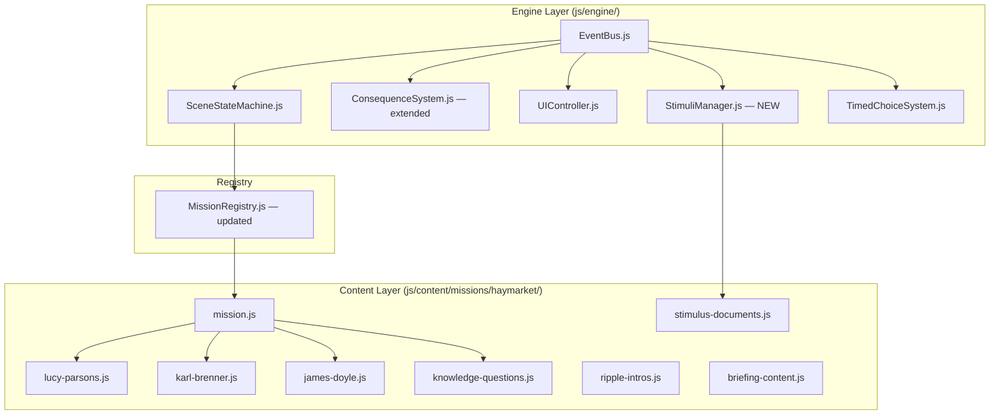

# Design Document: Haymarket Affair Mission

## Overview

The Haymarket Affair mission is the fourth mission in Witness Interactive, set in Chicago on May 4, 1886. Three playable roles — Lucy Parsons (labor organizer), Karl Brenner (German immigrant machinist), James Doyle (Pinkerton detective) — each play through six scenes spanning late April through August 1886.

## Historical Source Material

All historical content — scene narratives, stimulus document text, knowledge question stems, ripple event descriptions, and outcome epilogues — MUST be grounded in the primary and secondary sources at:

**`.kiro/skills/ap-curriculum/references/haymarket_raw_content/`**

| File | Use for |
|------|---------|
| `Account-of-the-Haymarket-Riot.txt` | Scene 04 bomb/chaos narrative across all roles; `hm-doc-4` Tribune framing; eyewitness detail (Crane Brothers building, gas lamps, Randolph & Desplaines) |
| `ebsco_haymarket_analysis.txt` | AP pause question explanations; knowledge question explanations; media bias analysis for `hm-doc-2` and `hm-doc-4` sourcing questions; immigrant labor context |
| `ebsco_summary.txt` | Quick fact-check: casualty figures (11 dead, 60+ wounded), key actors, dates |
| `The-Haymarket-Tragedy.txt` | Biographical detail on Albert Parsons, Lucy Parsons, August Spies, Samuel Fielden, Louis Lingg; trial narrative; Altgeld pardon; outcome epilogues; ripple event descriptions |

**Rule**: Consult the relevant source file before writing any scene narrative, stimulus document text, or knowledge question. Do not invent historical details that can be verified or contradicted by these sources.

This mission introduces two engine extensions:
1. **StimuliManager** — handles real primary source documents that unlock mid-scene, each followed by an AP pause question
2. **ConsequenceSystem range-check** — extends `calculateOutcome()` to support numeric range conditions for Lucy Parsons' movement trust meter

It also introduces three new question types woven throughout the experience:
- **Prediction Questions** — unscored mid-scene questions asking players to predict consequences
- **Cross-Role Questions** — knowledge checkpoint questions asking players to consider another role's perspective
- **Synthesis Questions** — post-ripple questions connecting Haymarket to broader historical patterns

Every scene, question, and ripple event is tagged with both **AP Reasoning Processes** (causation, contextualization, continuity, perspective, argumentation, complexity) and **SPICE-T themes** (Social, Political, Interaction with Environment, Cultural, Economic, Technological), plus **unit section numbers** (Unit 6.5, Unit 6.6, Unit 7.1) for direct teacher curriculum mapping.

Writing register: Geraldine Brooks — sensory, immersive, factually grounded. No vague terms. No anachronistic language.

## Architecture

### Component Interaction



### New Files

| File | Layer | Purpose |
|------|-------|---------|
| `js/engine/StimuliManager.js` | Engine | Handles stimulus document display and AP pause questions |
| `js/content/missions/haymarket/mission.js` | Content | Mission metadata, ripple events, role imports |
| `js/content/missions/haymarket/lucy-parsons.js` | Content | Lucy Parsons scenes and outcomes |
| `js/content/missions/haymarket/karl-brenner.js` | Content | Karl Brenner scenes and outcomes |
| `js/content/missions/haymarket/james-doyle.js` | Content | James Doyle scenes and outcomes |
| `js/content/missions/haymarket/knowledge-questions.js` | Content | 12+ AP-style questions (4+ per role) |
| `js/content/missions/haymarket/ripple-intros.js` | Content | Path-specific ripple intro texts |
| `js/content/missions/haymarket/briefing-content.js` | Content | 5-page Chicago Daily Tribune briefing |
| `js/content/missions/haymarket/stimulus-documents.js` | Content | 7 real primary source documents with pause questions |

### Modified Files

| File | Change |
|------|--------|
| `js/content/MissionRegistry.js` | Add Haymarket import and registration |
| `js/engine/ConsequenceSystem.js` | Add range-check condition support + Haymarket survival cases |
| `js/main.js` | Initialize StimuliManager |
| `config/update-notes.json` | Add player-facing update entry |
| `config/version.js` | Increment version |


## Components and Interfaces

### StimuliManager (New)

**Purpose**: Displays real primary source documents mid-scene and presents AP pause questions. Communicates exclusively via EventBus.

**Interface**:
```javascript
class StimuliManager {
  constructor(eventBus)

  // Called when a scene loads — checks for stimuliUnlock array
  handleSceneTransition(sceneData)

  // Display a single stimulus document overlay
  showDocument(documentId)

  // Display AP pause question after document is read
  showPauseQuestion(pauseQuestion)

  // Hide the overlay and resume scene
  dismissDocument()
}
```

**Events Consumed**:
- `scene:transition` — checks `scene.stimuliUnlock` array; queues documents for display

**Events Emitted**:
- `stimuli:shown` — `{ documentId }`
- `stimuli:dismissed` — `{ documentId, answeredCorrectly }`
- `stimuli:pause-question-answered` — `{ documentId, correct, selectedId }`

**Behavior**:
- If `stimuliUnlock` is absent or empty, StimuliManager does nothing
- Documents are shown in array order, one at a time
- Player must dismiss each document before the next appears
- Pause question is shown after the document text, before the dismiss button
- Answering the pause question is required before dismissal (no skip)
- StimuliManager does NOT block scene choices — documents appear as an overlay

### ConsequenceSystem — Range-Check Extension

**New condition syntax** added to outcome `conditions` objects:
```javascript
// Exact boolean match (existing)
{ hm_lp_attended_rally: true }

// Range check (new)
{ hm_lp_movement_trust: { gte: 3 } }
{ hm_lp_movement_trust: { lte: 1 } }
{ hm_lp_movement_trust: { gte: 2, lte: 4 } }
```

**Extended `calculateOutcome()` logic** (pseudocode):
```
for each condition key:
  value = flags[key]
  conditionValue = conditions[key]

  if conditionValue is object (range check):
    if conditionValue.gte defined AND value < conditionValue.gte → no match
    if conditionValue.lte defined AND value > conditionValue.lte → no match
  else:
    if value !== conditionValue → no match
```

**Movement Trust initialization**: `hm_lp_movement_trust` MUST be explicitly initialized to `0` when the Lucy Parsons role loads. It must NOT inherit any default from the psychology system. Add this to the Lucy Parsons role's first scene's initialization logic or as a consequence on role selection:

```javascript
// In lucy-parsons.js, first scene's consequences or role init
// hm_lp_movement_trust starts at 0 — explicit, not inherited
```

The ConsequenceSystem's `setFlag()` only fires on `choice:made` events. To guarantee initialization, the Lucy Parsons role file SHALL include an `initFlags` array on the role export:

```javascript
export default {
  id: 'hm-lucy-parsons',
  initFlags: { hm_lp_movement_trust: 0 },  // explicit initialization
  scenes: lucyParsonsScenes,
  outcomes: lucyParsonsOutcomes
}
```

SceneStateMachine SHALL apply `initFlags` when loading a role via `loadRole()`.


```javascript
case 'hm-lucy-parsons':
case 'hm-karl-brenner':
case 'hm-james-doyle':
  return { survived: true, deathChance: 0, modifiers: {} };
```

### Scene Data Format — Full Haymarket Schema

```javascript
{
  id: "hm-lp-scene-01",
  narrative: `...`,

  // AP tagging (all three required)
  apThemes: ["contextualization", "perspective"],   // AP Reasoning Processes
  apKeyConcept: "KC-5.1.I",                         // AP key concept code
  apUnit: "Unit 6.5",                               // AP unit section number

  // SPICE-T tagging (required)
  spiceT: ["Social", "Economic"],

  // Atmospheric and audio
  atmosphericEffect: null,
  ambientTrack: "./audio/ambient/hm-ambient-westside-evening.mp3",
  narratorAudio: "./audio/narration/lucy-parsons/hm-lp-scene-01.mp3",

  // New mechanics
  stimuliUnlock: ["hm-doc-1a"],       // primary source documents to show
  predictionQuestion: null,           // or { question, options, reveal } object
  timedChoice: null,                  // or { enabled, duration, defaultChoice }
  deathCheckpoint: false,             // always false for Haymarket

  choices: [
    {
      id: "hm-lp-choice-01-a",
      text: "...",
      consequences: {
        hm_lp_movement_trust: 1,      // numeric increment
        hm_lp_spoke_publicly: true    // boolean flag
      },
      psychologyEffects: {            // optional display-only
        morale: 1,
        humanity: 1
        // valid keys: morale, loyalty, humanity, composure — NOT awareness
      },
      nextScene: "hm-lp-scene-02"
    }
  ]
}
```

### Prediction Question Format

Stored inline in scene objects as `predictionQuestion`:

```javascript
predictionQuestion: {
  question: "The Revenge Circular has just been distributed. What do you predict will be the most immediate consequence of workers gathering at Haymarket Square tonight?",
  options: [
    { id: "a", text: "A peaceful rally that disperses without incident" },
    { id: "b", text: "A bomb explosion that kills police officers and workers" },
    { id: "c", text: "Police arrest the speakers before the meeting begins" },
    { id: "d", text: "The mayor orders the meeting cancelled" }
  ],
  // No correctId — unscored
  reveal: "On the evening of May 4th, 1886, an unknown person threw a bomb into the police ranks as they moved to disperse the crowd. Seven police officers and at least four workers died. The identity of the bomber was never conclusively established."
}
```

### Knowledge Question Format — Extended

```javascript
{
  id: "hm-lp-q-01",
  roleSpecific: "hm-lucy-parsons",
  questionType: "before",             // "before" | "during" | "cross-role" | "synthesis"
  apSkill: "contextualization",
  spiceT: ["Economic", "Social"],
  apUnit: "Unit 6.5",
  question: "...",
  options: [
    { id: "a", text: "...", correct: true },
    { id: "b", text: "...", correct: false },
    { id: "c", text: "...", correct: false },
    { id: "d", text: "...", correct: false }
  ],
  explanation: "... citing specific historical evidence ..."
}
```

**questionType values**:
- `"before"` — tests pre-event context (briefing phase knowledge)
- `"during"` — tests the event itself
- `"cross-role"` — asks player to consider another role's perspective (tagged `perspective`)
- `"synthesis"` — connects Haymarket to broader historical pattern (tagged `argumentation`)

### Stimulus Document Format

```javascript
{
  id: "hm-doc-3",
  title: "Revenge Circular",
  source: "August Spies, Chicago, May 3, 1886",
  date: "May 3, 1886",
  spiceT: ["Political", "Social"],
  apUnit: "Unit 6.5",
  text: `REVENGE! Workingmen, to Arms!!!

Your masters sent out their bloodhounds — the police — they killed six of your brothers at McCormick's this afternoon. They killed the poor wretches because they, like you, had the courage to disobey the supreme will of your bosses. They killed them because they dared ask for the shortening of the hours of toil. They killed them to show you, "Free American Citizens," that you must be satisfied and contented with whatever your bosses condescend to allow you, or you will get killed!

You have for years endured the most abject humiliations; you have for years suffered unmeasurable iniquities; you have worked yourself to death; you have endured the pangs of want and hunger; your children you have sacrificed to the factory lords — in short: you have been miserable and obedient slaves all these years. Why? To satisfy the insatiable greed, to fill the coffers of your lazy thieving master? When will you stop? When will you put an end to this misery?

WORKINGMEN, AROUSE! The masters sent out their bloodhounds — the police — they killed six of your brothers at McCormick's this afternoon...

To Arms we call you, to Arms!

Your Brothers`,
  pauseQuestion: {
    question: "What does the Revenge Circular reveal about the relationship between the McCormick shooting and the Haymarket meeting?",
    options: [
      { id: "a", text: "The circular was written before the McCormick shooting occurred", correct: false },
      { id: "b", text: "The McCormick shooting directly triggered the call for the Haymarket meeting", correct: true },
      { id: "c", text: "The circular called for a peaceful candlelight vigil", correct: false },
      { id: "d", text: "The circular was issued by the Chicago Police Department", correct: false }
    ],
    correctId: "b",
    explanation: "August Spies wrote the Revenge Circular on the evening of May 3rd, hours after Pinkerton guards and police shot striking workers at the McCormick plant. The circular explicitly called workers to arms in response to the McCormick killings, making the causal link between the shooting and the Haymarket meeting direct and documented in the primary source itself."
  }
}
```


## Data Models

### Mission Metadata (`mission.js`)

```javascript
{
  id: 'haymarket-affair',
  title: 'The Haymarket Affair',
  historicalDate: '1886-05-04',
  era: 'Modern',
  unlocked: true,
  teaser: 'Chicago, 1886 — a bomb, a trial, and the birth of the labor movement',
  roleSelectionSubtitle: 'Three perspectives on the night that changed American labor',
  apUnits: ['Unit 6.5', 'Unit 6.6', 'Unit 7.1'],
  roles: [
    { id: 'hm-lucy-parsons', name: 'Lucy Parsons', ... },
    { id: 'hm-karl-brenner', name: 'Karl Brenner', ... },
    { id: 'hm-james-doyle',  name: 'James Doyle',  ... }
  ],
  historicalRipple: [ /* 6+ events, each with spiceT + apUnit */ ],
  knowledgeQuestions: [ /* imported */ ]
}
```

### AP Tagging Coverage Map

All six AP Reasoning Processes and all six SPICE-T themes must appear across the 18 scenes:

| AP Reasoning Process | Minimum appearances | Primary scenes |
|---------------------|--------------------|-|
| contextualization | 2 | LP-01, KB-01, JD-01 (pre-event world) |
| causation | 4 | LP-04, KB-03, KB-05, JD-05 |
| perspective | 4 | LP-02, JD-01, JD-02, JD-06 |
| complexity | 3 | LP-03, KB-04, JD-04 |
| argumentation | 2 | LP-06, JD-06 |
| continuity | 3 | LP-06, KB-06, ripple events |

| SPICE-T Theme | Minimum appearances | Primary scenes |
|--------------|--------------------|-|
| Social | 4 | LP-01, KB-01, KB-02, JD-01 |
| Political | 4 | LP-05, LP-06, JD-04, JD-06 |
| Interaction with Environment | 2 | KB-02 (march), LP-04 (bomb) |
| Cultural | 2 | KB-01 (Arbeiter-Zeitung), JD-01 (IWPA culture) |
| Economic | 4 | KB-01, KB-03, LP-01, LP-02 |
| Technological | 2 | LP-05 (press), KB-01 (machinery) |

### Lucy Parsons Outcomes

```javascript
// Outcome 1: The Voice That Would Not Stop
{
  id: "hm-lp-outcome-voice",
  survived: true,
  conditions: { hm_lp_movement_trust: { gte: 3 }, hm_lp_published_arbeiter: true },
  epilogue: `...`
}

// Outcome 2: The Movement and the Man
{
  id: "hm-lp-outcome-movement-man",
  survived: true,
  conditions: { hm_lp_movement_trust: { gte: 2, lte: 3 } },
  epilogue: `...`
}

// Outcome 3: The Private Grief
{
  id: "hm-lp-outcome-private-grief",
  survived: true,
  conditions: { hm_lp_movement_trust: { lte: 1 } },
  epilogue: `...`
}

// Default catch-all (must be last)
{ id: "hm-lp-outcome-default", survived: true, conditions: {}, epilogue: `...` }
```

### Historical Ripple Events

```javascript
[
  {
    id: 'hm-ripple-01', date: '1886-08-20',
    title: 'Eight Defendants Sentenced — Four to Death',
    description: 'Judge Joseph Gary sentenced seven of the eight Haymarket defendants to death and one to fifteen years in prison. The trial was widely criticized: no defendant was proven to have thrown the bomb, and the jury included men with stated prejudices against labor. The convictions were upheld on appeal.',
    apTheme: 'argumentation', spiceT: 'Political', apUnit: 'Unit 6.5', animationDelay: 1000
  },
  {
    id: 'hm-ripple-02', date: '1887-11-11',
    title: 'Four Haymarket Martyrs Executed',
    description: 'Albert Parsons, August Spies, George Engel, and Adolph Fischer were hanged. Louis Lingg died in his cell the night before, reportedly by suicide. Two sentences were commuted to life imprisonment. The executions galvanized the international labor movement.',
    apTheme: 'causation', spiceT: 'Political', apUnit: 'Unit 6.5', animationDelay: 2000
  },
  {
    id: 'hm-ripple-03', date: '1889-07-14',
    title: 'May Day Adopted as International Workers\' Day',
    description: 'The Second International, meeting in Paris, designated May 1st as International Workers\' Day in commemoration of the Haymarket martyrs and the eight-hour movement. May Day is now observed in over 80 countries — but not as a federal holiday in the United States.',
    apTheme: 'continuity', spiceT: ['Social', 'Political'], apUnit: 'Unit 6.6', animationDelay: 3000
  },
  {
    id: 'hm-ripple-04', date: '1893-06-26',
    title: 'Governor Altgeld Pardons the Surviving Defendants',
    description: 'Illinois Governor John Peter Altgeld issued a 18,000-word pardon message concluding that the Haymarket defendants had not received a fair trial. The pardon ended his political career. His message remains one of the most detailed critiques of judicial misconduct in American history.',
    apTheme: 'argumentation', spiceT: 'Political', apUnit: 'Unit 6.5', animationDelay: 4000
  },
  {
    id: 'hm-ripple-05', date: '1938-06-25',
    title: 'Fair Labor Standards Act Establishes Eight-Hour Workday',
    description: 'The FLSA established the 40-hour workweek and federal minimum wage. The eight-hour day that Chicago workers marched for in 1886 — and that the Haymarket defendants died for — became federal law 52 years later. The law covered approximately 11 million workers at enactment.',
    apTheme: 'causation', spiceT: ['Economic', 'Political'], apUnit: 'Unit 7.1', animationDelay: 5000
  },
  {
    id: 'hm-ripple-06', date: '1919-01-01',
    title: 'Red Scare — Anarchist Persecution Intensifies',
    description: 'The post-WWI Red Scare built directly on the anti-anarchist legal framework established after Haymarket. The 1903 Immigration Act barred anarchists from entry. The 1918 Sedition Act criminalized anti-government speech. The Palmer Raids of 1919–1920 deported hundreds of labor organizers, many of them immigrants — the same demographic as the Haymarket defendants.',
    apTheme: 'continuity', spiceT: ['Political', 'Social'], apUnit: 'Unit 7.1', animationDelay: 6000
  }
]
```

### Knowledge Question Structure — Per Role

Each role has 4+ questions covering all four types:

**Lucy Parsons (hm-lucy-parsons)**:
- Q1 `before` / `contextualization` / `Economic` — wage conditions and the eight-hour demand
- Q2 `during` / `causation` / `Political` — Haymarket bomb and the trial
- Q3 `cross-role` / `perspective` / `Political` — Pinkerton or machinist view of the movement
- Q4 `synthesis` / `argumentation` / `['Political','Economic']` — state suppression of labor, KC-5.1.I + KC-5.4.I

**Karl Brenner (hm-karl-brenner)**:
- Q1 `before` / `contextualization` / `['Economic','Cultural']` — immigrant labor and the Arbeiter-Zeitung
- Q2 `during` / `causation` / `['Social','Political']` — McCormick shooting and the Revenge Circular
- Q3 `cross-role` / `perspective` / `Political` — labor organizer or Pinkerton view of the McCormick shooting
- Q4 `synthesis` / `argumentation` / `['Economic','Social']` — immigrant political engagement, KC-5.2.I

**James Doyle (hm-james-doyle)**:
- Q1 `before` / `contextualization` / `['Political','Economic']` — Pinkerton agency and private labor suppression
- Q2 `during` / `perspective` / `Political` — undercover surveillance and the IWPA
- Q3 `cross-role` / `perspective` / `['Social','Political']` — labor organizer or machinist view of the trial
- Q4 `synthesis` / `argumentation` / `['Political','Economic']` — private/state power against labor, KC-5.4.I + KC-7.1.I

### Briefing Page Metadata Format

```javascript
{
  vol: 'Vol. XLII — No. 124',
  date: 'Chicago, Illinois — May 1886',
  price: 'Two cents',
  hSize: 'sz-lg',
  hClass: '',
  h: 'The Eight-Hour Movement',
  deck: '80,000 workers march in Chicago — the largest labor demonstration in American history',
  body: `...`,
  ticker: 'May 1, 1886: 340,000 workers nationwide participate in the eight-hour strike.',
  // New metadata fields
  spiceT: ['Economic', 'Social'],
  apUnit: 'Unit 6.5',
  apTheme: 'contextualization'
}
```

### Post-Ripple Question

Stored in `mission.js` as `postRippleQuestion` (same for all three roles):

```javascript
postRippleQuestion: {
  questionType: 'synthesis',
  apSkill: 'argumentation',
  spiceT: ['Political', 'Economic', 'Social'],
  apUnit: 'Unit 6.6',
  question: "Which of the following best explains the most significant long-term consequence of the Haymarket Affair for American labor and political history?",
  options: [
    {
      id: "a",
      text: "The Haymarket bombing permanently discredited the labor movement, preventing the passage of labor protections for decades",
      correct: false
    },
    {
      id: "b",
      text: "The Haymarket trial established a precedent for using conspiracy charges against labor organizers, while simultaneously galvanizing international labor solidarity and contributing to the eventual passage of the eight-hour workday",
      correct: true
    },
    {
      id: "c",
      text: "The Haymarket Affair had no lasting impact because the labor movement quickly recovered and achieved its goals within five years",
      correct: false
    },
    {
      id: "d",
      text: "The Haymarket bombing proved that anarchist violence was the primary obstacle to labor reform in the Gilded Age",
      correct: false
    }
  ],
  correctId: "b",
  explanation: "The correct answer models AP skill 6.D complexity: the Haymarket trial did establish a dangerous precedent (conspiracy charges without proof of individual guilt, upheld in Spies v. Illinois 1887), AND it galvanized international labor solidarity (May Day 1889) and contributed to the long arc toward the FLSA 1938. The event had contradictory effects — suppressing American labor organizing in the short term while energizing it internationally and in the long term."
}
```

### StimuliManager — Document Deduplication

StimuliManager tracks shown document IDs in a session-scoped Set. Before showing a document, it checks if the ID has already been shown:

```javascript
// In StimuliManager
this.shownDocuments = new Set();

showDocument(documentId) {
  if (this.shownDocuments.has(documentId)) return; // already shown
  this.shownDocuments.add(documentId);
  // ... display logic
}
```

This prevents `hm-doc-1b` from appearing twice if it unlocks in both the briefing and a scene's `stimuliUnlock` array.

### Named Characters Per Role

| Role | Named NPC | Occupation | Appears in |
|------|-----------|-----------|-----------|
| Lucy Parsons | Wilhelm | Ink pressman (print trade worker), Pinkerton informant | LP Scene 02 |
| Karl Brenner | Heinrich Müller | Machinist, coworker | KB Scenes 01, 03 |
| James Doyle | Captain William Ward | Pinkerton handler | JD Scenes 02, 04 |

Wilhelm's occupation is intentionally ironic: an ink pressman — a worker in the labor press trade — is informing on the labor movement. This detail was established in the pre-spec session work and must be preserved in Scene 02.

### Ambient Audio Mapping

| Track | Scenes |
|-------|--------|
| `hm-ambient-westside-evening.mp3` | LP-01, LP-02, KB-01, KB-02, JD-01, JD-02 |
| `hm-ambient-haymarket-crowd.mp3` | LP-03, KB-04, JD-04 |
| `hm-ambient-chaos.mp3` | LP-04, KB-05, JD-05 |
| `hm-ambient-streets-morning.mp3` | LP-05, KB-03, JD-03 |
| `hm-ambient-courtroom.mp3` | LP-06, KB-06, JD-06 |


## Correctness Properties

*A property is a characteristic or behavior that should hold true across all valid executions of a system — essentially, a formal statement about what the system should do. Properties serve as the bridge between human-readable specifications and machine-verifiable correctness guarantees.*

Property 1: Mission Registration Round-Trip
*For any* valid Haymarket mission configuration object with required fields (id, title, historicalDate, era, roles), registering it with MissionRegistry and then calling `getMission('haymarket-affair')` should return an object with matching id, title, and roles array.
**Validates: Requirements 1.1**

Property 2: Relative Asset Paths
*For any* scene object in any Haymarket content file, every non-null string value in `ambientTrack` and `narratorAudio` fields should not begin with `/` — it must begin with `./` or `../`.
**Validates: Requirements 1.5, 17.3, 17.4**

Property 3: Haymarket Flag Prefix Invariant
*For any* choice object in any Haymarket scene, every key in the `consequences` object should begin with `hm_`.
**Validates: Requirements 1.6**

Property 4: Stimulus Document Flow
*For any* scene object with a non-empty `stimuliUnlock` array, when StimuliManager processes a `scene:transition` event for that scene, it should emit `stimuli:shown` for each document ID in the array, and each `stimuli:shown` event should be followed by a `stimuli:pause-question-answered` event before the next document is shown.
**Validates: Requirements 4.1, 4.3**

Property 5: StimuliManager No-Op on Empty stimuliUnlock (Edge Case)
*For any* scene object where `stimuliUnlock` is absent, null, or an empty array, StimuliManager should emit zero `stimuli:shown` events when processing that scene's `scene:transition` event.
**Validates: Requirements 4.8**

Property 6: Prediction Question Structure
*For any* scene object that includes a `predictionQuestion` field, the object should have a non-empty `reveal` string and should NOT have a `correctId` field — prediction questions are unscored.
**Validates: Requirements 15.3, 15.4, 15.5**

Property 7: SPICE-T Non-Empty on Every Scene
*For any* scene object in any Haymarket role file, the `spiceT` array should be non-empty — at least one SPICE-T theme must be present.
**Validates: Requirements 7.1**

Property 8: All Six SPICE-T Themes Covered
*For* the complete set of all Haymarket scenes across all three roles, the union of all `spiceT` arrays should contain all six themes: `Social`, `Political`, `Interaction with Environment`, `Cultural`, `Economic`, `Technological`.
**Validates: Requirements 7.4**

Property 9: AP Tagging Completeness
*For any* scene object in any Haymarket role file, the `apThemes` array should be non-empty with each value being one of the six valid AP Reasoning Processes (`causation`, `contextualization`, `continuity`, `perspective`, `argumentation`, `complexity`), the `apKeyConcept` field should match the pattern `KC-X.X.X`, and the `apUnit` field should be a non-empty string matching the pattern `Unit X.X`.
**Validates: Requirements 8.1, 8.2, 8.3, 8.4, 9.1**

Property 10: Stimulus Document Structural Completeness
*For any* stimulus document object in `stimulus-documents.js`, the object should contain all required fields: `id`, `title`, `source`, `date`, `text`, `spiceT` (non-empty array), `apUnit` (non-empty string), and `pauseQuestion` (object with `question`, `options` array of length 4, `correctId`, and `explanation`).
**Validates: Requirements 14.3, 14.4**

Property 11: Default Catch-All Outcome Position
*For any* role's outcomes array in any Haymarket role file, the last element should have an empty `conditions` object (`{}`), ensuring a catch-all outcome always exists and is evaluated last.
**Validates: Requirements 19.5**

Property 12: No Death Checkpoints in Haymarket Scenes
*For any* scene object in any Haymarket role file, the `deathCheckpoint` field should be either absent or explicitly `false` — never `true`.
**Validates: Requirements 19.6, 22.2**

Property 13: Question Set Completeness Per Role
*For any* role's knowledge questions array, there should be at least one question of each `questionType`: `"before"`, `"during"`, `"cross-role"`, and `"synthesis"`. Additionally, every question should have a non-empty `apUnit` field and a non-empty `spiceT` array.
**Validates: Requirements 21.2, 21.3, 9.2, 9.3**

Property 14: Movement Trust Range Invariant
*For any* sequence of Lucy Parsons choices applied to ConsequenceSystem, the value of `hm_lp_movement_trust` should always remain in the range [0, 5] — never below 0 and never above 5.
**Validates: Requirements 13.1**

Property 15: Range-Check Condition Evaluation
*For any* numeric flag value V and range condition object C (with optional `gte` and `lte` fields), the range-check evaluator should return true if and only if: (C.gte is undefined OR V >= C.gte) AND (C.lte is undefined OR V <= C.lte).
**Validates: Requirements 13.4**

Property 16: Haymarket Survival Always True
*For any* of the three Haymarket role IDs (`hm-lucy-parsons`, `hm-karl-brenner`, `hm-james-doyle`), calling `ConsequenceSystem.determineSurvival(roleId)` should return an object with `survived: true` and `deathChance: 0`, regardless of what flags are set.
**Validates: Requirements 22.1**


## Error Handling

### StimuliManager
- If a document ID in `stimuliUnlock` is not found in `stimulus-documents.js`, StimuliManager logs a warning and skips that document — does not crash
- If `pauseQuestion` is missing from a document, StimuliManager shows the document text without a question and allows immediate dismissal, logging a warning
- If `predictionQuestion` is present but missing `reveal`, StimuliManager shows the question and options but skips the reveal step, logging a warning

### ConsequenceSystem Range-Check Extension
- If a range condition value is not an object (e.g., `{ hm_lp_movement_trust: "high" }`), the evaluator logs a warning and treats it as a non-match
- If `gte` or `lte` values are not numbers, the evaluator logs a warning and skips that bound
- Existing boolean flag matching is unchanged — the extension is additive only

### Audio
- Missing ambient or narrator audio files are handled by the existing NarratorAudioManager null guard (`if (!src) return`)
- All Haymarket audio paths are placeholders until real files are recorded

## Testing Strategy

### Dual Testing Approach

Both unit tests and property-based tests are required and complementary.

### Property-Based Testing

**Library**: fast-check loaded via CDN UMD build (no npm, consistent with no-build-tools constraint).
**Minimum iterations**: 100 per property test.
**Tag format**: `// Feature: haymarket-affair-mission, Property N: <title>`

| Property | Test File | Generator approach |
|----------|-----------|-------------------|
| P1: Mission registration | haymarket-data.test.js | fc.record() with valid mission shape |
| P2: Relative asset paths | haymarket-data.test.js | iterate all scene objects |
| P3: hm_ flag prefix | haymarket-data.test.js | iterate all choice consequences |
| P4: Stimulus document flow | StimuliManager.test.js | fc.array(fc.string()) for doc IDs |
| P5: No-op on empty stimuliUnlock | StimuliManager.test.js | fc.oneof(null, [], undefined) |
| P6: Prediction question structure | haymarket-data.test.js | iterate all scenes with predictionQuestion |
| P7: SPICE-T non-empty per scene | haymarket-data.test.js | iterate all scenes |
| P8: All six SPICE-T themes covered | haymarket-data.test.js | aggregate all spiceT values |
| P9: AP tagging completeness | haymarket-data.test.js | iterate all scenes |
| P10: Stimulus doc structure | haymarket-data.test.js | iterate all stimulus documents |
| P11: Catch-all outcome last | haymarket-data.test.js | check last outcome per role |
| P12: No deathCheckpoint | haymarket-data.test.js | iterate all Haymarket scenes |
| P13: Question set completeness | haymarket-data.test.js | group questions by role, check types |
| P14: movement_trust range | haymarket-data.test.js | fc.array(fc.integer({min:0,max:1})) |
| P15: Range-check evaluation | ConsequenceSystem.test.js | fc.integer(), fc.record({gte,lte}) |
| P16: Haymarket survival | ConsequenceSystem.test.js | fc.constantFrom(3 role IDs) |

### Unit Tests
- StimuliManager: specific document display sequence, pause question rendering, dismiss behavior
- ConsequenceSystem: boundary values for range-check (gte:3 with value 3 = match; value 2 = no match)
- Prediction question: verify reveal is shown after any answer selection
- Cross-role question: verify questionType 'cross-role' is tagged with apSkill 'perspective'
- Briefing page 4 mid-point triggering hm-doc-0 unlock
- Outcome selection for each Lucy Parsons outcome (specific flag combinations)

### Integration Tests (Manual Playwright)
1. Lucy Parsons high trust path → "Voice That Would Not Stop" outcome
2. Lucy Parsons low trust path → "Private Grief" outcome
3. Karl Brenner attended + escaped → "Witness" outcome
4. James Doyle refused testimony → "Refusal" outcome
5. Verify stimulus documents appear mid-scene for all stimuliUnlock arrays
6. Verify prediction questions appear and reveal fires after answer
7. Verify no cross-mission flag contamination (play Pearl Harbor after Haymarket)
8. Verify timeline shows Haymarket at 1886 position
9. Verify knowledge checkpoint shows all four question types per role
