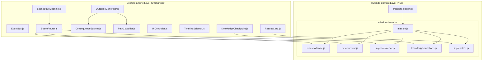

# Design Document: Rwanda Genocide Mission

## Overview

The Rwanda Genocide Mission implements the Rwandan Genocide (April–July 1994) as a playable historical experience within Witness Interactive, following the established Pearl Harbor architecture while introducing significantly deeper branching narrative structures. This mission serves as proof that the platform can handle complex, morally ambiguous historical events with pedagogical rigor and emotional weight.

The design prioritizes:
- **True branching narratives**: Choices route to different scene IDs, not just flag variations
- **Aftermath as narrative space**: Post-genocide scenes (gacaca courts, reconciliation, refugee camps) are full branches, not epilogues
- **Trauma-informed writing**: Violence present but not gratuitous; horror in choices, not descriptions
- **Historical grounding**: Every fact traceable to `docs/RwandanGenocide(1990–Aftermath).md`
- **AP curriculum alignment**: Only causation, continuity, perspective, complexity (no argumentation)
- **Architecture compliance**: Zero engine modifications; reuse all Pearl Harbor systems

The mission flow progresses through: Timeline Selection → Role Selection → Branching Narrative Scenes (8-10 per role) → Outcome Screen → Historical Ripple Timeline → Knowledge Checkpoint → Results Card.

## Architecture

### High-Level System Architecture



### Architectural Principles

1. **Zero Engine Modifications**: All Rwanda-specific logic lives in content files
2. **Scene Router Pattern**: Explicit scene IDs replace sequential navigation
3. **Flag Namespacing**: All Rwanda flags use `rw_` prefix to avoid collisions
4. **Path Classification**: Outcome selection based on weighted flag scoring
5. **Trauma-Informed Design**: Content guidelines enforced at design level

### Folder Structure

```
js/content/missions/rwanda/
├── mission.js              # Mission metadata and registration
├── hutu-moderate.js        # Augustin's 8-10 scenes + 4 outcomes
├── tutsi-survivor.js       # Immaculée's 8-10 scenes + 4 outcomes
├── un-peacekeeper.js       # Captain Webb's 8-10 scenes + 4 outcomes
├── knowledge-questions.js  # 9 questions (3 per role)
└── ripple-intros.js        # 9 path-specific intros (3 roles × 3 paths)
```

## Components and Interfaces

### Mission Registry Integration

**File**: `js/content/missions/rwanda/mission.js`

**Structure**:
```javascript
export default {
  id: 'rwanda-genocide',
  title: 'Rwanda, 1994',
  historicalDate: '1994-04-06',
  era: 'Modern',
  unlocked: true,
  teaser: 'Experience the 100 days that shook the world from three impossible perspectives',
  roles: [
    // Imported from role files
  ],
  historicalRipple: [
    // 8 ripple events
  ],
  knowledgeQuestions: [
    // Imported from knowledge-questions.js
  ]
};
```

### Role File Structure

Each role file exports:
```javascript
export const ROLE_DATA = {
  id: string,
  name: string,
  description: string,
  scenes: Scene[],
  outcomes: Outcome[]
};
```

### Scene Object Schema

```javascript
{
  id: string,                    // Format: 'rw-hm-scene-01', 'rw-ts-scene-02a'
  narrative: string,             // 100-160 words, second person present tense
  apThemes: string[],            // ['causation', 'continuity', 'perspective', 'complexity']
  choices: Choice[],             // 3-4 choices per scene
  atmosphericEffect: string|null,// 'smoke', 'shake', 'dawn', 'explosion', null
  ambientTrack: string,          // Filename only: 'rw-radio-rtlm-ambient.wav'
  narratorAudio: string,         // Full path: 'audio/narration/hutu-moderate/rw-hm-scene-01.mp3'
  radioClips: string[]|null      // Optional RTLM broadcasts (trauma-informed)
}
```

### Choice Object Schema

```javascript
{
  id: string,                    // Format: 'rw-hm-choice-01-a'
  text: string,                  // 4-8 words, no melodrama
  consequences: object,          // { rw_helped_celestin: true, rw_staffed_roadblock: false }
  nextScene: string|null         // Scene ID or null for terminal
}
```

### Outcome Object Schema

```javascript
{
  id: string,                    // Format: 'rw-hm-outcome-rescue-survived'
  survived: boolean,
  conditions: object,            // Consequence flags that trigger this outcome
  epilogue: string,              // 150-200 words, second person, past tense at end
  deathContext: {                // Optional, for killed outcomes
    cause: string,
    historicalRate: string,
    yourChoices: string
  }
}
```

## Data Models

### Path Classification System

Rwanda uses three path variants per role:

**Hutu Moderate (Augustin)**:
- **Rescue Path**: Actively sheltered Tutsi neighbors, risked family safety
- **Compliance Path**: Followed orders, staffed roadblocks, maintained position
- **Flight Path**: Fled Kigali, avoided direct participation, survived in hiding

**Tutsi Survivor (Immaculée)**:
- **Hidden Path**: Sheltered by Hutu friends/family, survived in concealment
- **Enclave Path**: Reached UN-protected site (hotel, stadium), survived in crowd
- **Testimony Path**: Witnessed massacres, documented atrocities, carried evidence

**UN Peacekeeper (Captain Webb)**:
- **Stayed Path**: Remained in Rwanda, protected civilians at hotel/stadium
- **Evacuated Path**: Followed orders to withdraw, left Rwandans behind
- **Documented Path**: Stayed to gather evidence, sent reports, defied orders

### Consequence Flag Architecture

All flags use `rw_` prefix. Flags are boolean unless otherwise noted.

**Hutu Moderate Flags**:
```javascript
{
  rw_helped_celestin: boolean,        // Sheltered Tutsi neighbor
  rw_staffed_roadblock: boolean,      // Obeyed order to man checkpoint
  rw_attended_rally: boolean,         // Went to Hutu Power meeting
  rw_fled_kigali: boolean,            // Left city before genocide escalated
  rw_misdirected_militia: boolean,    // Gave false info to protect someone
  rw_testified_gacaca: boolean,       // Spoke at post-genocide court
  rw_confessed_complicity: boolean,   // Admitted role in aftermath
  rw_relocated_village: boolean       // Moved away post-genocide
}
```

**Tutsi Survivor Flags**:
```javascript
{
  rw_trusted_church: boolean,         // Went to church (often massacre site)
  rw_hid_with_hutu: boolean,          // Sheltered by Hutu friend
  rw_reached_hotel: boolean,          // Made it to Hôtel des Mille Collines
  rw_split_family: boolean,           // Separated to improve odds
  rw_showed_id_card: boolean,         // Presented identity card at roadblock
  rw_witnessed_massacre: boolean,     // Saw killings, carries testimony
  rw_survived_rape: boolean,          // Endured sexual violence
  rw_testified_ictr: boolean          // Gave evidence to tribunal
}
```

**UN Peacekeeper Flags**:
```javascript
{
  rw_stayed_after_withdrawal: boolean,  // Remained when others evacuated
  rw_protected_hotel: boolean,          // Guarded Mille Collines enclave
  rw_sent_genocide_fax: boolean,        // Reported atrocities to HQ
  rw_defied_orders: boolean,            // Acted beyond mandate
  rw_evacuated_expatriates: boolean,    // Prioritized foreigners over Rwandans
  rw_documented_evidence: boolean,      // Gathered photos/testimony
  rw_suffered_ptsd: boolean,            // Lasting psychological trauma
  rw_testified_inquiry: boolean         // Spoke at post-genocide investigation
}
```

### Path Classification Rules

Path classification uses weighted scoring:

```javascript
export const PATH_RULES = {
  'hutu-moderate': [
    { variant: 'rescue', flag: 'rw_helped_celestin', weight: 4 },
    { variant: 'rescue', flag: 'rw_misdirected_militia', weight: 3 },
    { variant: 'rescue', flag: 'rw_testified_gacaca', weight: 2 },
    
    { variant: 'compliance', flag: 'rw_staffed_roadblock', weight: 4 },
    { variant: 'compliance', flag: 'rw_attended_rally', weight: 3 },
    { variant: 'compliance', flag: 'rw_confessed_complicity', weight: 2 },
    
    { variant: 'flight', flag: 'rw_fled_kigali', weight: 4 },
    { variant: 'flight', flag: 'rw_relocated_village', weight: 2 }
  ],
  'tutsi-survivor': [
    { variant: 'hidden', flag: 'rw_hid_with_hutu', weight: 4 },
    { variant: 'hidden', flag: 'rw_split_family', weight: 2 },
    
    { variant: 'enclave', flag: 'rw_reached_hotel', weight: 4 },
    { variant: 'enclave', flag: 'rw_trusted_church', weight: -2 }, // negative: church often = death
    
    { variant: 'testimony', flag: 'rw_witnessed_massacre', weight: 4 },
    { variant: 'testimony', flag: 'rw_testified_ictr', weight: 3 },
    { variant: 'testimony', flag: 'rw_documented_evidence', weight: 2 }
  ],
  'un-peacekeeper': [
    { variant: 'stayed', flag: 'rw_stayed_after_withdrawal', weight: 4 },
    { variant: 'stayed', flag: 'rw_protected_hotel', weight: 3 },
    { variant: 'stayed', flag: 'rw_defied_orders', weight: 2 },
    
    { variant: 'evacuated', flag: 'rw_evacuated_expatriates', weight: 4 },
    { variant: 'evacuated', flag: 'rw_suffered_ptsd', weight: 2 },
    
    { variant: 'documented', flag: 'rw_sent_genocide_fax', weight: 4 },
    { variant: 'documented', flag: 'rw_documented_evidence', weight: 3 },
    { variant: 'documented', flag: 'rw_testified_inquiry', weight: 2 }
  ]
};
```

**Classification Algorithm**:
1. Sum weights for each path variant
2. Highest total wins
3. Ties go to first variant alphabetically
4. Minimum threshold: 4 points required

### Historical Ripple Events

8 events spanning April 1994 to present:

```javascript
export const HISTORICAL_RIPPLE = [
  {
    id: 'rw-ripple-01',
    date: '1994-04-07',
    title: 'Moderate Leaders Assassinated',
    description: 'Within hours of the plane crash, presidential guards and Interahamwe militias systematically killed Prime Minister Agathe Uwilingiyimana and other moderate Hutu politicians. Roadblocks went up across Kigali. The genocide had begun.',
    apTheme: 'causation',
    animationDelay: 1000
  },
  {
    id: 'rw-ripple-02',
    date: '1994-04-21',
    title: 'UN Reduces UNAMIR to 270 Troops',
    description: 'After ten Belgian peacekeepers were murdered, the UN Security Council voted to cut UNAMIR from 2,500 to 270 troops. General Dallaire and remaining soldiers protected enclaves but could not stop the massacres spreading across Rwanda.',
    apTheme: 'perspective',
    animationDelay: 2000
  },
  {
    id: 'rw-ripple-03',
    date: '1994-04-06 to 1994-07-04',
    title: '100 Days: 500,000–800,000 Killed',
    description: 'Between April and July 1994, extremist Hutu militias, soldiers, and ordinary citizens killed between 500,000 and 800,000 Tutsi and thousands of Hutu moderates. Machetes, clubs, and small arms. Churches became massacre sites. Identity cards determined life or death.',
    apTheme: 'complexity',
    animationDelay: 3000
  },
  {
    id: 'rw-ripple-04',
    date: '1994-07-04',
    title: 'RPF Captures Kigali',
    description: 'The Rwandan Patriotic Front, led by Paul Kagame, captured Kigali and ended the genocide. Two million Hutu refugees—including many perpetrators—fled to Zaire and Tanzania. The RPF formed a Government of National Unity.',
    apTheme: 'causation',
    animationDelay: 4000
  },
  {
    id: 'rw-ripple-05',
    date: '1994-11-08',
    title: 'International Criminal Tribunal Created',
    description: 'The UN Security Council established the International Criminal Tribunal for Rwanda (ICTR) in Arusha, Tanzania. Over 17 years, ICTR tried 69 cases, convicting 59 people including media leaders who broadcast hate propaganda.',
    apTheme: 'continuity',
    animationDelay: 5000
  },
  {
    id: 'rw-ripple-06',
    date: '2003-2004',
    title: '20,000 Detainees Released',
    description: 'Rwanda held 130,000 genocide suspects in overcrowded prisons. Facing a massive backlog, authorities released 20,000 lower-level detainees based on confessions or lack of evidence. Survivors feared renewed intimidation.',
    apTheme: 'complexity',
    animationDelay: 6000
  },
  {
    id: 'rw-ripple-07',
    date: '2005-2012',
    title: 'Gacaca Courts Conclude',
    description: 'Rwanda created 11,000 community gacaca courts with lay judges to try 1.2–1.5 million genocide cases. Survivors testified publicly. Perpetrators confessed for reduced sentences. The system prioritized speed and coexistence over due process. Ethnic identity was banned from politics.',
    apTheme: 'continuity',
    animationDelay: 7000
  },
  {
    id: 'rw-ripple-08',
    date: '1994-Present',
    title: 'Hôtel des Mille Collines Legacy',
    description: 'The hotel where 1,200 people sheltered during the genocide became a symbol of survival and moral complexity. Paul Rusesabagina, the manager, was later convicted in Rwanda of terrorism charges. Debates over heroism, complicity, and memory continue.',
    apTheme: 'perspective',
    animationDelay: 8000
  }
];
```


## Branching Scene Architecture

### Scene Flow Diagrams

Each role has 8-10 scenes supporting true branching. Scenes diverge at decision points and do NOT reconverge until aftermath or outcomes.

#### Hutu Moderate (Augustin) - Scene Flow

```
rw-hm-scene-01 (April 6, evening)
    ├─→ rw-hm-scene-02a (Help Celestin hide)
    │       ├─→ rw-hm-scene-03a (Roadblock: misdirect militia)
    │       │       └─→ rw-hm-scene-04a (Aftermath: gacaca testimony)
    │       │               └─→ OUTCOME (rescue path)
    │       └─→ rw-hm-scene-03b (Roadblock: comply with orders)
    │               └─→ rw-hm-scene-04b (Aftermath: confession)
    │                       └─→ OUTCOME (compliance path)
    │
    ├─→ rw-hm-scene-02b (Attend Hutu Power rally)
    │       └─→ rw-hm-scene-03c (Staff roadblock)
    │               └─→ rw-hm-scene-04c (Aftermath: denial)
    │                       └─→ OUTCOME (compliance path)
    │
    └─→ rw-hm-scene-02c (Flee Kigali)
            └─→ rw-hm-scene-03d (Hide in countryside)
                    └─→ rw-hm-scene-04d (Aftermath: refugee camp)
                            └─→ OUTCOME (flight path)
```

**Total scenes**: 9 (1 start + 3 branch layer 1 + 4 branch layer 2 + 1 aftermath per branch = 9)

#### Tutsi Survivor (Immaculée) - Scene Flow

```
rw-ts-scene-01 (April 7, morning)
    ├─→ rw-ts-scene-02a (Go to church)
    │       ├─→ rw-ts-scene-03a (Escape massacre)
    │       │       └─→ rw-ts-scene-04a (Aftermath: ICTR testimony)
    │       │               └─→ OUTCOME (testimony path)
    │       └─→ rw-ts-scene-03b (Hide in church ceiling)
    │               └─→ rw-ts-scene-04b (Aftermath: survivor guilt)
    │                       └─→ OUTCOME (hidden path)
    │
    ├─→ rw-ts-scene-02b (Seek Hutu friend's house)
    │       └─→ rw-ts-scene-03c (Hide in attic)
    │               └─→ rw-ts-scene-04c (Aftermath: reconciliation meeting)
    │                       └─→ OUTCOME (hidden path)
    │
    └─→ rw-ts-scene-02c (Try to reach hotel)
            └─→ rw-ts-scene-03d (Roadblock negotiation)
                    └─→ rw-ts-scene-04d (Aftermath: hotel survivor)
                            └─→ OUTCOME (enclave path)
```

**Total scenes**: 9 (1 start + 3 branch layer 1 + 4 branch layer 2 + 1 aftermath per branch = 9)

#### UN Peacekeeper (Captain Webb) - Scene Flow

```
rw-un-scene-01 (April 7, UNAMIR HQ)
    ├─→ rw-un-scene-02a (Stay at hotel)
    │       ├─→ rw-un-scene-03a (Defy orders to evacuate)
    │       │       └─→ rw-un-scene-04a (Aftermath: PTSD treatment)
    │       │               └─→ OUTCOME (stayed path)
    │       └─→ rw-un-scene-03b (Protect civilians, follow mandate)
    │               └─→ rw-un-scene-04b (Aftermath: inquiry testimony)
    │                       └─→ OUTCOME (stayed path)
    │
    ├─→ rw-un-scene-02b (Evacuate expatriates)
    │       └─→ rw-un-scene-03c (Leave Rwandans behind)
    │               └─→ rw-un-scene-04c (Aftermath: guilt and advocacy)
    │                       └─→ OUTCOME (evacuated path)
    │
    └─→ rw-un-scene-02c (Document atrocities)
            └─→ rw-un-scene-03d (Send reports to HQ)
                    └─→ rw-un-scene-04d (Aftermath: whistleblower)
                            └─→ OUTCOME (documented path)
```

**Total scenes**: 9 (1 start + 3 branch layer 1 + 4 branch layer 2 + 1 aftermath per branch = 9)

### Timed Choice Specifications

Each role has minimum 2 timed choices with pedagogically meaningful defaults.

**Hutu Moderate Timed Choices**:
1. **Scene rw-hm-scene-03a/b/c (Roadblock)**
   - Duration: 12 seconds
   - Default: "Wave them through" (compliance → victims killed)
   - Rationale: Most officials complied; path of least resistance led to death

2. **Scene rw-hm-scene-02a (Celestin at door)**
   - Duration: 10 seconds
   - Default: "Tell him to leave" (self-preservation → neighbor dies)
   - Rationale: Fear for family was the most common reason for non-rescue

**Tutsi Survivor Timed Choices**:
1. **Scene rw-ts-scene-03d (Roadblock)**
   - Duration: 10 seconds
   - Default: "Show university card" (trusting documents → may be killed)
   - Rationale: Many initially trusted official processes; "normal" response often failed

2. **Scene rw-ts-scene-02a (Church or hide)**
   - Duration: 12 seconds
   - Default: "Go to church" (trusting authority → often massacre site)
   - Rationale: Churches were perceived as safe; this trust was weaponized

**UN Peacekeeper Timed Choices**:
1. **Scene rw-un-scene-02a (Hotel under threat)**
   - Duration: 15 seconds
   - Default: "Call Dallaire, stall" (bureaucratic response → delays but doesn't refuse)
   - Rationale: UN peacekeepers often stalled rather than directly refusing; institutional caution

2. **Scene rw-un-scene-02b (Evacuation order)**
   - Duration: 12 seconds
   - Default: "Follow orders" (obedience → leave Rwandans behind)
   - Rationale: Most peacekeepers followed withdrawal orders; obedience was the norm

### Aftermath Scene Design Rules

All aftermath scenes (scene-04a/b/c/d) follow these rules:

1. **Post-Genocide Timeframe**: Set in 2005-2012 (gacaca era) or 1994-1996 (immediate aftermath)
2. **Full Narrative Branches**: Not epilogues; scenes with choices and consequences
3. **Tension Between Justice and Reconciliation**: Present both as lived experience
4. **No "Correct" Path**: Neither punishment nor reconciliation is endorsed
5. **Reference Earlier Choices**: Explicitly name actions player took during genocide
6. **Extended Length**: 120-150 words (longer than branch scenes)
7. **Emotional Weight**: Acknowledge magnitude without melodrama

**Example Aftermath Scenarios**:
- **Gacaca court**: Testify, confess, deny, judge
- **"No ethnicity" policy**: Embrace, resent, perform compliance
- **Refugee camp in Zaire**: Register with UN, stay with militia, disappear
- **Perpetrator return**: Attend meetings, refuse, relocate
- **Survivor commemoration**: Attend official ceremony, private mourning, avoid entirely

## Correctness Properties

*A property is a characteristic or behavior that should hold true across all valid executions of a system—essentially, a formal statement about what the system should do. Properties serve as the bridge between human-readable specifications and machine-verifiable correctness guarantees.*

Before writing correctness properties, I will perform prework analysis on the acceptance criteria from the requirements document.


### Property Reflection

After analyzing all acceptance criteria, I identified the following consolidations:

**Properties to Combine**:
- 2.2 and 2.3 (role structure) can combine into one comprehensive role validation property
- 3.1 and 3.2 (branching structure) can combine into one branching validation property
- 10.1 and 10.2 (audio paths) can combine into one audio path validation property
- TR-3.1, TR-3.2, TR-3.3 (scene structure) can combine into one scene validation property
- TR-4.1 and TR-4.2 (choice structure) can combine into one choice validation property
- TR-5.1 and TR-5.2 (outcome structure) can combine into one outcome validation property

**Redundancies Eliminated**:
- Multiple word count properties (12.5, 9.2, 4.2, 5.2) are all testing the same pattern, just on different fields
- Path format properties (1.3, 10.1, 10.2) all test path conventions and can be consolidated

**Final Property Count**: Approximately 25-30 unique, non-redundant properties covering:
- Mission and role registration/structure
- Scene graph integrity and branching
- Consequence flag management
- Audio and atmospheric effect configuration
- Content constraints (word counts, naming conventions)
- Knowledge questions and ripple events

### Correctness Properties

Property 1: Mission Registration Completeness
*For any* mission object with required fields (id, title, historicalDate, era, roles, historicalRipple, knowledgeQuestions), registering it with the Mission_Registry should make it queryable by ID and appear in the timeline.
**Validates: Requirements US-1.1, US-1.3, TR-6.1**

Property 2: Role Structure Completeness
*For any* role in the Rwanda mission, it should have a name, description, scenes array with 8-10 elements, and outcomes array with at least 4 elements.
**Validates: Requirements US-2.1, US-2.2, US-2.3**

Property 3: True Branching Scene Routing
*For any* scene in the first two layers (scene-01, scene-02x), choices should route to different nextScene IDs, and those IDs should follow the branch naming convention (ending with letter suffixes like -03a, -03b).
**Validates: Requirements US-3.1, US-3.2**

Property 4: Branch Path Independence
*For any* two scenes on different branches (e.g., scene-02a vs scene-02b), their descendant scenes should not share a common nextScene until aftermath scenes (scene-04x).
**Validates: Requirements US-3.3**

Property 5: Consequence Flag Setting
*For any* choice with a non-empty consequences object, making that choice should set all specified flags in the Consequence_System with the correct values.
**Validates: Requirements US-4.1**

Property 6: Outcome Condition Validity
*For any* outcome object, all flag names in its conditions object should match flags that are set by at least one choice in the role's scene graph.
**Validates: Requirements US-4.3**

Property 7: Aftermath Scene Structure
*For any* role, it should have 2-3 scenes with IDs matching the pattern scene-04[a-d], and each of those scenes should have a non-empty choices array.
**Validates: Requirements US-5.1, US-5.2**

Property 8: Timed Choice Configuration
*For any* role, it should have at least 2 scenes with timedChoice.enabled = true, and for each timed choice, the duration should be between 10000 and 15000 milliseconds.
**Validates: Requirements US-6.1, US-6.3**

Property 9: Historical Ripple Ordering
*For any* mission's historicalRipple array, it should have exactly 8 elements, and the date fields should be in chronological ascending order.
**Validates: Requirements US-7.1**

Property 10: Ripple Event Structure
*For any* ripple event, it should have all required fields (id, date, title, description, apTheme, animationDelay), and apTheme should be one of the valid AP themes.
**Validates: Requirements US-7.2**

Property 11: Knowledge Question Distribution
*For any* mission's knowledgeQuestions array, it should have exactly 9 elements, with 3 questions tagged for each of the 3 roles.
**Validates: Requirements US-8.1**

Property 12: Knowledge Question AP Tagging
*For any* knowledge question, it should have an apTheme field with a value from the valid set (causation, continuity, perspective, complexity).
**Validates: Requirements US-8.2**

Property 13: Ripple Intro Structure
*For any* mission's ripple intros object, it should have 3 role keys, each containing 3 path keys (rescue/compliance/flight, hidden/enclave/testimony, stayed/evacuated/documented), for a total of 9 intro variants.
**Validates: Requirements US-9.1**

Property 14: Ripple Intro Word Count
*For any* ripple intro string, splitting by whitespace should yield between 80 and 120 words.
**Validates: Requirements US-9.2**

Property 15: Audio Path Format Validation
*For any* scene, the ambientTrack field should be a filename only (no path separators), and the narratorAudio field should start with 'audio/narration/' and end with '.mp3'.
**Validates: Requirements US-10.1, US-10.2**

Property 16: Atmospheric Effect Validity
*For any* scene, the atmosphericEffect field should be either null or one of the valid effect names ('smoke', 'shake', 'dawn', 'explosion').
**Validates: Requirements US-11.1**

Property 17: Prohibited Language Absence
*For any* scene narrative or choice text, it should not contain direct dehumanizing slurs like "cockroaches" or "inyenzi" used as direct speech (indirect references like "the word RTLM used" are acceptable).
**Validates: Requirements US-12.3**

Property 18: Scene Narrative Word Count
*For any* scene narrative, splitting by whitespace should yield between 100 and 160 words.
**Validates: Requirements US-12.5**

Property 19: ES6 Module Syntax
*For any* JavaScript file in the Rwanda mission directory, it should use ES6 import/export syntax and not contain require() calls.
**Validates: Requirements TR-1.2**

Property 20: Relative Path Usage
*For any* path string in scene objects (ambientTrack, narratorAudio, atmosphericEffect), it should not start with 'http', 'https', or '/' (absolute paths).
**Validates: Requirements TR-1.3**

Property 21: Role File Export Structure
*For any* role file (hutu-moderate.js, tutsi-survivor.js, un-peacekeeper.js), the default export should be an object with scenes and outcomes arrays.
**Validates: Requirements TR-2.2**

Property 22: Scene ID Prefix Convention
*For any* scene in hutu-moderate.js, the ID should start with 'rw-hm-'. For tutsi-survivor.js, 'rw-ts-'. For un-peacekeeper.js, 'rw-un-'.
**Validates: Requirements TR-2.3**

Property 23: Scene Object Required Fields
*For any* scene object, it should have all required fields: id, narrative, apThemes (array with at least 1 valid theme), choices (array with 3-4 elements), atmosphericEffect, ambientTrack, narratorAudio.
**Validates: Requirements TR-3.1, TR-3.2, TR-3.3**

Property 24: Choice Object Required Fields
*For any* choice object, it should have all required fields: id, text (4-8 words), consequences (object), nextScene (string or null).
**Validates: Requirements TR-4.1, TR-4.2**

Property 25: Outcome Object Required Fields
*For any* outcome object, it should have all required fields: id, survived (boolean), conditions (object), epilogue (150-200 words).
**Validates: Requirements TR-5.1, TR-5.2**

Property 26: Scene Graph Connectivity
*For any* role's scene graph, starting from the first scene and following all nextScene references, all scenes in the scenes array should be reachable (no orphaned scenes).
**Validates: Requirements US-3.3 (implicit)**

Property 27: Terminal Scene Identification
*For any* scene where all choices have nextScene = null, that scene should be classified as terminal and trigger outcome calculation.
**Validates: Requirements US-3.3 (implicit)**

Property 28: Flag Namespace Consistency
*For any* consequence flag set by Rwanda mission choices, the flag name should start with 'rw_' prefix to avoid collisions with other missions.
**Validates: Requirements TR-1.1 (architecture compliance)**

## Error Handling

### Content Validation Errors

**Invalid Scene Structure**:
- If a scene is missing required fields, the Scene_Router should log an error and skip that scene
- If a scene's apThemes array is empty, log warning: "Scene [id] missing AP theme tags"
- If a scene's choices array has fewer than 3 or more than 4 choices, log warning: "Scene [id] has invalid choice count"

**Invalid Choice Structure**:
- If a choice's nextScene references a non-existent scene ID, log error and treat as terminal
- If a choice's text is outside 4-8 word range, log warning but allow
- If a choice's consequences object is empty, log warning: "Choice [id] sets no flags"

**Invalid Outcome Structure**:
- If an outcome's conditions reference flags that are never set, log warning: "Outcome [id] has unreachable conditions"
- If an outcome's epilogue is outside 150-200 word range, log warning but allow
- If multiple outcomes have identical conditions, log error: "Ambiguous outcome conditions"

### Runtime Errors

**Path Classification Failures**:
- If no path variant reaches the minimum threshold (4 points), default to first variant alphabetically
- If flag weights sum to zero, log warning and use default path
- If Path_Classifier receives invalid flag names, log error and ignore those flags

**Audio Path Errors**:
- If ambientTrack contains path separators, log error and use fallback silent track
- If narratorAudio path is malformed, log error and skip narration
- If audio files fail to load, continue gameplay without audio

**Branching Errors**:
- If Scene_Router detects a loop (scene A → scene B → scene A), log error and break loop
- If Scene_Router finds orphaned scenes (unreachable from start), log warning during validation
- If all choices in a non-terminal scene have nextScene = null, log error and force outcome calculation

### Historical Accuracy Errors

**Source Document Violations**:
- If content review identifies facts not in `docs/RwandanGenocide(1990–Aftermath).md`, flag for revision
- If dates, names, or statistics contradict source document, reject content
- If dehumanizing language appears directly (not as indirect reference), reject content

**Trauma-Informed Writing Violations**:
- If scene narrative exceeds 160 words, log warning: "Scene [id] may be too dense"
- If radioClips array contains direct slurs, reject content
- If violence is described graphically rather than implied, flag for revision

## Testing Strategy

### Dual Testing Approach

**Unit Tests**: Verify specific examples, edge cases, and error conditions
- Mission registration with valid/invalid data
- Scene graph validation (orphaned scenes, loops, broken references)
- Path classification with edge case flag combinations
- Audio path format validation
- Word count boundary conditions (99 words, 161 words, etc.)

**Property-Based Tests**: Verify universal properties across all inputs
- For all scenes, required fields exist and are valid types
- For all choices, nextScene references resolve or are null
- For all outcomes, conditions reference settable flags
- For all roles, scene graphs are connected and acyclic
- For all ripple events, dates are chronologically ordered

### Property Test Configuration

- Minimum 100 iterations per property test
- Each test tagged with: **Feature: rwanda-genocide-mission, Property {number}: {property_text}**
- Use existing property-based testing library (fast-check for JavaScript)
- Tests run in CI/CD pipeline before deployment

### Manual Testing Requirements

**Historical Accuracy Review**:
- Content lead verifies all facts against source document
- Educator reviews AP theme alignment
- Sensitivity reader checks trauma-informed writing compliance

**Playthrough Testing**:
- Complete all 3 roles, all path variants (9 playthroughs total)
- Verify branching works (choices lead to different scenes)
- Verify aftermath scenes reference earlier choices
- Verify outcomes match path classification
- Verify knowledge questions are role-appropriate

**Accessibility Testing**:
- Screen reader test (NVDA/JAWS)
- Keyboard navigation test (Tab, Enter, Arrow keys)
- Color contrast verification (WCAG AA)
- Mobile viewport test (320px, 768px, 1280px)

### Integration Testing

**Architecture Compliance**:
- Verify Rwanda mission works with existing engine systems unchanged
- Verify no modifications to `js/engine/*.js` files
- Verify EventBus communication patterns maintained
- Verify consequence flags don't collide with Pearl Harbor flags

**Cross-Mission Testing**:
- Play Pearl Harbor, then Rwanda in same session
- Verify missions don't interfere with each other
- Verify timeline displays both missions correctly
- Verify results card tracks both missions separately


## Scene Content Guidelines

### Narrative Writing Standards

**Voice and Tense**:
- Second person present tense: "You stand at the roadblock. The radio crackles."
- Shift to past tense only in final sentence of outcomes: "You carried that choice forward."

**Length Requirements**:
- Branch scenes: 100-160 words
- Aftermath scenes: 120-150 words (longer for emotional weight)
- Outcome epilogues: 150-200 words

**Sensory Details** (minimum 3 per scene):
- Sound: radio static, distant explosions, silence after chaos
- Smell: smoke, dust, fear-sweat
- Physical sensation: heat, exhaustion, adrenaline
- Visual: smoke columns, roadblock barriers, identity cards

**Trauma-Informed Constraints**:
- Violence is present but not gratuitous
- Horror in choices, not descriptions
- No direct dehumanizing language (use indirect references)
- Example: ❌ "The radio calls them cockroaches"
- Example: ✅ "The radio uses the language it always uses for people like you"

### Choice Text Standards

**Length**: 4-8 words
**Tone**: Direct, no melodrama
**Format**: Action-oriented, not philosophical

**Good Examples**:
- "Help Celestin hide in the attic"
- "Staff the roadblock as ordered"
- "Flee Kigali before dawn"
- "Show your university ID card"

**Bad Examples**:
- "Courageously risk everything to save your neighbor" (melodramatic, 8+ words)
- "Do the right thing" (vague, philosophical)
- "Think about what to do" (not action-oriented)

### Aftermath Scene Requirements

**Timeframe**: 2005-2012 (gacaca era) or 1994-1996 (immediate aftermath)

**Required Elements**:
1. Reference specific earlier choices by name
2. Present justice vs. reconciliation tension
3. No "correct" path endorsed
4. Show costs of all choices
5. Include at least one choice about how to move forward

**Example Structure**:
```
[120-150 word narrative]
- References: "You helped Celestin. He survived. His family did not."
- Tension: "The gacaca court asks you to testify. Celestin's son is in the crowd."
- Choices:
  - "Testify fully about what you saw"
  - "Testify but protect some names"
  - "Refuse to participate"
```


## Audio and Atmospheric Design

### Ambient Track Specifications

All ambient tracks are placeholder filenames. Developer sources actual audio files separately.

**Hutu Moderate Tracks**:
- `rw-radio-rtlm-ambient.wav` - RTLM broadcasts (distant, muffled)
- `rw-crowd-night-ambient.wav` - Nighttime Kigali, distant voices
- `rw-roadblock-ambient.wav` - Traffic, militia voices, tension
- `rw-countryside-ambient.wav` - Rural Rwanda, birds, wind

**Tutsi Survivor Tracks**:
- `rw-church-interior-ambient.wav` - Church acoustics, whispers
- `rw-hiding-silence-ambient.wav` - Near-silence, breathing, fear
- `rw-machete-distant-ambient.wav` - Distant violence (implied, not graphic)
- `rw-hotel-interior-ambient.wav` - Crowded hotel, multiple languages

**UN Peacekeeper Tracks**:
- `rw-military-radio-ambient.wav` - Radio chatter, static
- `rw-unamir-hq-ambient.wav` - Office sounds, tension
- `rw-convoy-ambient.wav` - Vehicle sounds, checkpoints
- `rw-evacuation-ambient.wav` - Helicopter, urgency

### Atmospheric Effect Usage

**Smoke**: Distant fires visible during genocide
- Scenes: Roadblocks, city views, aftermath
- Visual: Dark overlay with particle effect

**Shake**: Explosions, grenades at massacre sites
- Scenes: Church attacks, hotel threats
- Visual: Screen shake animation

**Dawn**: Morning of April 7, 1994
- Scenes: First scenes for each role
- Visual: Gradual lightening, orange tint

**Explosion**: Direct violence nearby
- Scenes: Combat, attacks on enclaves
- Visual: Flash + shake combination

### Narrator Audio Path Convention

Format: `audio/narration/{role-id}/rw-{role-prefix}-scene-{scene-number}.mp3`

**Examples**:
- Hutu Moderate: `audio/narration/hutu-moderate/rw-hm-scene-01.mp3`
- Tutsi Survivor: `audio/narration/tutsi-survivor/rw-ts-scene-02a.mp3`
- UN Peacekeeper: `audio/narration/un-peacekeeper/rw-un-scene-03b.mp3`


## Knowledge Questions Design

### Question Distribution

9 questions total: 3 per role

**Hutu Moderate Questions**:
1. RTLM's role in mobilization (causation)
2. Identity cards as genocide tool (complexity)
3. Concept of "bystander" vs. perpetrator (perspective)

**Tutsi Survivor Questions**:
1. Churches as massacre sites (perspective)
2. Arusha Accords failure (causation)
3. Gacaca courts vs. ICTR (continuity)

**UN Peacekeeper Questions**:
1. Dallaire's genocide fax (causation)
2. Peacekeeping mandate limits (complexity)
3. Genocide Convention obligations (perspective)

### Question Format

```javascript
{
  id: string,
  role: 'hutu-moderate' | 'tutsi-survivor' | 'un-peacekeeper',
  question: string,
  choices: string[4],
  correctIndex: number,
  explanations: string[4],
  apTheme: 'causation' | 'continuity' | 'perspective' | 'complexity'
}
```

### Question Writing Guidelines

**Question Stem**:
- Clear, specific, grounded in role experience
- Reference events player witnessed
- Avoid "which of the following" when possible

**Answer Choices**:
- One clearly correct answer
- Three plausible distractors
- Avoid "all of the above" or "none of the above"
- Mix specific facts with conceptual understanding

**Explanations**:
- Correct answer: Why it's right + historical context
- Incorrect answers: Why they're wrong + common misconception addressed


## Ripple Intro Design

### Path-Specific Intro Structure

9 intros total: 3 roles × 3 paths

**Format**:
- 80-120 words
- Second person, reflective tone
- Connect personal choices to macro-historical consequences
- No congratulatory tone
- Acknowledge complexity and cost

**Hutu Moderate Intros**:

**Rescue Path**:
"You helped Celestin. You hid him when the militias came. You lied to neighbors who asked questions. You risked your family for someone else's. Some Hutu who did what you did were killed alongside those they protected. Some survived and carried guilt for those they couldn't save. Rwanda's reconciliation asks people like you to live next to people who didn't make your choice. The history that follows is shaped by thousands of small decisions like yours—and by the millions who made different ones."

**Compliance Path**:
"You followed orders. You staffed the roadblock. You checked identity cards. You waved some through and stopped others. Most Hutu officials did what you did—not from hatred, but from fear, pressure, or belief in what the radio said. Gacaca courts later asked people like you to confess and explain. Some did. Some didn't. The history that follows is shaped by the choices of ordinary people who became part of something larger than themselves."

**Flight Path**:
"You fled Kigali. You left before the worst began. You survived by not being there. Millions of Hutu refugees fled to Zaire and Tanzania after July 1994, some perpetrators, some bystanders, some who opposed the genocide. The camps became political, militarized, and eventually ignited the Congo wars. The history that follows is shaped by those who stayed, those who fled, and those who returned."

**Tutsi Survivor Intros**:

**Hidden Path**:
"You survived because someone hid you. A Hutu neighbor, a friend, a stranger who chose risk over safety. You spent weeks in an attic, a latrine, a ceiling, moving at night, silent during the day. Most Tutsi who survived did so because of people like that. Gacaca courts later asked survivors like you to testify about who killed and who saved. The history that follows is shaped by those small acts of courage and the trauma they couldn't prevent."

**Enclave Path**:
"You reached the hotel. You made it past roadblocks, through militia checkpoints, into a UN-protected enclave. Twelve hundred people sheltered there. UN peacekeepers held the perimeter. You survived in a crowd, waiting for the RPF to arrive. Most Tutsi who tried to reach safe sites didn't make it. The history that follows is shaped by the few places where protection held and the many where it didn't."

**Testimony Path**:
"You witnessed the massacres. You saw what happened at the church, the roadblock, the school. You survived and you remember. The ICTR and gacaca courts later asked survivors like you to testify, to name perpetrators, to describe what you saw. Some survivors found power in testimony. Others found only re-traumatization. The history that follows is shaped by those who spoke and those who couldn't."

**UN Peacekeeper Intros**:

**Stayed Path**:
"You stayed. When the Belgian contingent withdrew, when the Security Council cut the force to 270, you remained. You protected the hotel, the stadium, the enclaves you could hold. You watched massacres you couldn't stop. General Dallaire later said UNAMIR could have saved thousands with a stronger mandate. You lived with what you did and what you couldn't do. The history that follows is shaped by the few who stayed and the many who left."

**Evacuated Path**:
"You followed orders. You evacuated expatriates and left Rwandans behind. You saw people begging to board the convoys. You followed the mandate. Most peacekeepers did what you did. Some carried guilt for decades. Some defended the decision as the only realistic option. The history that follows is shaped by the international community's choice to withdraw rather than intervene."

**Documented Path**:
"You documented what you saw. You sent reports, took photos, gathered testimony. You defied orders to stay silent. You tried to make the world see what was happening. The genocide fax, the media coverage, the evidence that later convicted RTLM leaders—all came from people like you. The history that follows is shaped by those who documented atrocities and by the world's choice to ignore them until it was too late."


## Implementation Roadmap

### Phase 1: Mission Structure (Foundation)

**Files to Create**:
1. `js/content/missions/rwanda/mission.js` - Mission metadata
2. `js/content/missions/rwanda/hutu-moderate.js` - Role structure (empty scenes)
3. `js/content/missions/rwanda/tutsi-survivor.js` - Role structure (empty scenes)
4. `js/content/missions/rwanda/un-peacekeeper.js` - Role structure (empty scenes)
5. `js/content/missions/rwanda/knowledge-questions.js` - Question structure
6. `js/content/missions/rwanda/ripple-intros.js` - Intro structure

**Validation**:
- Mission appears in timeline
- Roles display in role selection
- Scene graph validates (no broken references)
- All paths lead to outcomes

### Phase 2: Content Writing (Narrative)

**Order of Writing**:
1. Hutu Moderate scenes (9 scenes)
2. Tutsi Survivor scenes (9 scenes)
3. UN Peacekeeper scenes (9 scenes)
4. Outcome epilogues (12 outcomes: 4 per role)
5. Knowledge questions (9 questions)
6. Ripple intros (9 intros)

**Content Review Checkpoints**:
- Historical accuracy verification (every 3 scenes)
- Trauma-informed writing check (every role)
- AP theme alignment review (after all scenes)
- Word count validation (automated)

### Phase 3: Integration Testing

**Test Scenarios**:
1. Full playthrough: Hutu Moderate, all 3 paths
2. Full playthrough: Tutsi Survivor, all 3 paths
3. Full playthrough: UN Peacekeeper, all 3 paths
4. Cross-mission test: Pearl Harbor → Rwanda in same session
5. Accessibility test: Screen reader, keyboard navigation
6. Mobile test: 320px, 768px, 1280px viewports

**Success Criteria**:
- All 9 playthroughs complete without errors
- Branching works (choices lead to different scenes)
- Outcomes match path classification
- Knowledge questions display correctly
- Ripple timeline animates properly
- No console errors
- No engine modifications required

### Phase 4: Deployment

**Pre-Deployment Checklist**:
- [ ] All content reviewed for historical accuracy
- [ ] All content reviewed for trauma-informed writing
- [ ] All scenes have AP theme tags
- [ ] All audio paths follow convention
- [ ] All consequence flags use `rw_` prefix
- [ ] Mission registered in `main.js`
- [ ] Update notes written in `config/update-notes.json`
- [ ] Version bumped in `config/version.js`
- [ ] Full playthrough test passed
- [ ] Accessibility test passed
- [ ] Mobile test passed

**Deployment Steps**:
1. Commit to feature branch: `feat/rwanda-genocide-mission`
2. Run automated tests (property tests, unit tests)
3. Manual playthrough review
4. Merge to main
5. Deploy to GitHub Pages
6. Verify live deployment


## Risks and Mitigations

| Risk | Impact | Likelihood | Mitigation |
|------|--------|------------|------------|
| Historical inaccuracy undermines educational value | High | Medium | All content verified against source document; educator review required |
| Gratuitous violence traumatizes students | High | Medium | Trauma-informed writing guidelines enforced; sensitivity reader review |
| Branching complexity creates broken paths | Medium | Medium | Automated scene graph validation; comprehensive playthrough testing |
| Audio path errors break immersion | Medium | Low | Strict path format validation; fallback to silent mode |
| Performance issues on mobile | Low | Low | Reuse existing engine systems; no new performance-heavy features |
| Content too dense for students | Medium | Medium | Word count limits enforced; educator feedback during testing |
| Aftermath scenes feel preachy | Medium | Medium | "No correct path" principle enforced; multiple perspectives presented |
| Path classification ambiguous | Low | Medium | Weighted scoring system with clear thresholds; default fallback |
| Cross-mission flag collisions | Low | Low | `rw_` prefix namespace enforced; automated collision detection |
| Deployment breaks existing missions | High | Low | Zero engine modifications; integration testing with Pearl Harbor |

## Success Metrics

### Educational Outcomes

**AP Curriculum Alignment**:
- All scenes tagged with AP themes (causation, continuity, perspective, complexity)
- Knowledge questions assess upper-level thinking, not memorization
- Branching structure teaches historical contingency

**Student Engagement**:
- Completion rate: >80% of students who start a role finish it
- Replay rate: >40% of students play multiple roles
- Knowledge checkpoint score: >70% average correct

### Technical Outcomes

**Architecture Compliance**:
- Zero modifications to `js/engine/*.js` files
- All Rwanda code in `js/content/missions/rwanda/`
- Mission works with existing UI components unchanged
- Feedback system captures Rwanda data automatically

**Performance**:
- Scene transitions: <500ms
- Audio loading: Non-blocking
- Mobile performance: 60fps on mid-range devices
- No console errors during gameplay

### Content Quality

**Historical Accuracy**:
- All facts traceable to source document
- Educator review: "Historically sound"
- No anachronisms or invented details

**Trauma-Informed Writing**:
- Sensitivity reader review: "Appropriate for classroom"
- No gratuitous violence
- Horror in choices, not descriptions
- Dehumanizing language only as indirect reference

## Appendix: Historical Source Mapping

All content must be traceable to `docs/RwandanGenocide(1990–Aftermath).md`. Key sections:

**Section 1: Timeline and Political Architecture**
- Used for: Mission date, historical context, RTLM role
- Scenes: All opening scenes, radio broadcasts

**Section 2: RPF Origins and Campaign**
- Used for: UN peacekeeper perspective, RPF advance
- Scenes: UN peacekeeper scenes, aftermath scenes

**Section 3: Hutu Power Ideology and RTLM**
- Used for: Propaganda content, militia mobilization
- Scenes: Hutu moderate scenes, roadblock scenes

**Section 4: Arusha Accords Failure**
- Used for: UN mandate limits, international response
- Scenes: UN peacekeeper scenes, knowledge questions

**Section 5: Perspectives from the Ground**
- Used for: All role narratives, decision points
- Scenes: All branch scenes, choice text

**Section 6: Aftermath (Justice and Reconciliation)**
- Used for: Gacaca scenes, reconciliation tension
- Scenes: All aftermath scenes (scene-04x)

**Section 7: Survivor and Perpetrator Accounts**
- Used for: Specific testimonies, emotional arcs
- Scenes: Tutsi survivor scenes, outcome epilogues

**Section 8: Hotel Rwanda / Hôtel des Mille Collines**
- Used for: UN peacekeeper enclave scenes
- Scenes: UN peacekeeper hotel scenes, ripple event

---

**Document Version:** 1.0  
**Last Updated:** 2025-01-15  
**Status:** Draft — Awaiting Review

