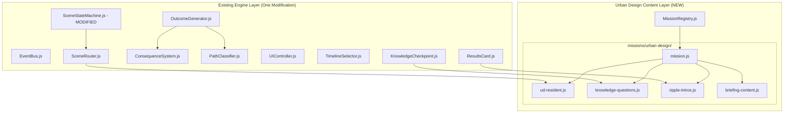

# Design Document: The Divided City Mission

## Overview

The Divided City Mission implements urban inequality from 1930s redlining through modern heat islands as a playable historical experience within Witness Interactive, following the established Rwanda architecture. This mission demonstrates how federal housing policy created lasting spatial inequality, serving as the first AP Human Geography mission in the platform.

The design prioritizes:
- **Multi-era narrative continuity**: One property/family followed through three distinct time periods
- **Spatial thinking**: Choices demonstrate cause-and-effect in urban geography
- **Data-driven education**: Concrete statistics (mortgage gap, temperature delta, wealth gap) integrated into narrative
- **Policy-to-outcome causation**: 1934 decisions create 2024 consequences
- **Architecture compliance**: Zero engine modifications except SceneStateMachine aftermath fix
- **Mission isolation**: Complete namespace separation from Pearl Harbor and Rwanda

The mission flow progresses through: Timeline Selection → Role Selection → Multi-Era Narrative Scenes (9 total) → Outcome Screen → Historical Ripple Timeline → Knowledge Checkpoint → Results Card.

## Architecture

### High-Level System Architecture



### Architectural Principles

1. **Minimal Engine Modification**: Only SceneStateMachine aftermath detection updated to support `ud-` prefix
2. **Linear-with-Branches Pattern**: Scenes progress chronologically through eras with branching within each era
3. **Flag Namespacing**: All urban design flags use `ud_` prefix to avoid collisions
4. **Path Classification**: Simple flag-check helper (PathClassifier not yet built for multi-mission support)
5. **Pedagogical Data Integration**: Statistics embedded naturally in narrative text

### Folder Structure

```
js/content/missions/urban-design/
├── mission.js              # Mission metadata and registration
├── ud-resident.js          # The Legacy Resident's 9 scenes + 3-4 outcomes
├── knowledge-questions.js  # 5 APHG 6.10 questions
├── ripple-intros.js        # 3 path-specific intros (equity/complicity/adaptation)
└── briefing-content.js     # Historical context pages (4-6 pages)
```

## Components and Interfaces

### Mission Registry Integration

**File**: `js/content/missions/urban-design/mission.js`

**Structure**:
```javascript
export default {
  id: 'aphg-urban-design',
  title: 'The Divided City',
  historicalDate: '1934-06-28',  // National Housing Act signing
  era: 'Modern',
  unlocked: true,
  teaser: 'Experience how 1930s housing policy created modern urban inequality',
  roleSelectionSubtitle: 'Follow one property through three eras of urban development',
  roles: [
    // Single role: ud-resident
  ],
  historicalRipple: [
    // 8 ripple events
  ],
  knowledgeQuestions: [
    // Imported from knowledge-questions.js
  ]
};
```


### Role File Structure

Single role file exports:
```javascript
export default {
  id: 'ud-resident',
  name: 'The Legacy Resident',
  description: 'Follow one property and family through 90 years of urban policy',
  scenes: Scene[],      // 9 scenes across 3 eras
  outcomes: Outcome[]   // 3-4 outcomes based on path
};
```

### Scene Object Schema

```javascript
{
  id: string,                    // Format: 'ud-res-scene-01' through 'ud-res-scene-09'
  narrative: string,             // 120-150 words, second person present tense
  apThemes: string[],            // ['causation', 'spatial-analysis', 'comparison', 'human-environment-interaction']
  choices: Choice[],             // 2-3 choices per scene
  atmosphericEffect: string|null,// 'danger-glow' (redlining), 'warning-glow' (heat island), null
  ambientTrack: null,            // ALWAYS null - silent mission
  narratorAudio: null,           // ALWAYS null - silent mission
  soundEffects: null             // ALWAYS null - silent mission
}
```

**CRITICAL: Silent Mission Requirement**
- The urban-design mission is a 100% silent experience
- NO `ambientTrack`, NO `narratorAudio`, NO `soundEffects` in any ud- scene
- Immersion comes from narrative text and atmospheric visual effects only
- Narrative must use enhanced sensory language to compensate for lack of audio
- This is an intentional design constraint that differentiates urban-design from Pearl Harbor/Rwanda

### Choice Object Schema

```javascript
{
  id: string,                    // Format: 'ud-res-choice-01-a'
  text: string,                  // 4-8 words, action-oriented
  consequences: object,          // { ud_fought_redlining: true, ud_equity_loss: 5 }
  nextScene: string|'outcome'    // Scene ID or 'outcome' for terminal
}
```

### Outcome Object Schema

```javascript
{
  id: string,                    // Format: 'ud-res-outcome-equity-path'
  survived: true,                // Always true for urban-design (no death scenarios)
  conditions: object,            // Consequence flags that trigger this outcome
  epilogue: string               // 200-300 words, second person, present tense at end
}
```

## Data Models

### Path Classification System

Urban Design uses three path variants for the single role:

**The Legacy Resident (ud-resident)**:
- **Equity Path**: Fought redlining, supported fair housing, resisted blockbusting
- **Complicity Path**: Accepted designation, didn't resist, prioritized property value
- **Adaptation Path**: Focused on personal survival, adapted to changing neighborhood

### Consequence Flag Architecture

All flags use `ud_` prefix. Flags are boolean unless otherwise noted.

**Urban Design Flags**:
```javascript
{
  // Era 1: The Line (1930s Redlining)
  ud_fought_redlining: boolean,           // Challenged HOLC 'D' grade designation
  ud_accepted_designation: boolean,       // Accepted 'D' grade without protest
  ud_documented_appraisal: boolean,       // Kept records of discriminatory appraisal
  ud_equity_loss: number,                 // Property value decline (0-10 scale)
  
  // Era 2: The Panic (1960s Blockbusting/White Flight)
  ud_resisted_blockbusting: boolean,      // Refused to sell to speculator
  ud_sold_to_speculator: boolean,         // Panic-sold at low price
  ud_stayed_through_transition: boolean,  // Remained as neighborhood changed
  ud_witnessed_disinvestment: boolean,    // Saw services decline
  
  // Era 3: The Heat (Modern Heat Island/Gentrification)
  ud_supported_mixed_use: boolean,        // Backed sustainable development
  ud_resisted_gentrification: boolean,    // Opposed displacement
  ud_measured_heat_island: boolean,       // Documented temperature differences
  ud_advocated_environmental_justice: boolean  // Spoke about unequal burdens
}
```

### Path Classification Rules

Path classification uses simple flag-check helper (PathClassifier not yet multi-mission ready):

```javascript
export function classifyUrbanDesignPath(flags) {
  // Equity Path: Fought injustice at multiple stages (rare but heroic)
  if (flags.ud_fought_redlining && flags.ud_supported_mixed_use) {
    return 'equity';
  }
  
  // Complicity Path: Accepted or benefited from discriminatory systems (common among privileged)
  if (flags.ud_accepted_designation || flags.ud_sold_to_speculator) {
    return 'complicity';
  }
  
  // Adaptation Path: Focused on survival/adaptation (most common historical response)
  if (flags.ud_stayed_through_transition && flags.ud_measured_heat_island) {
    return 'adaptation';
  }
  
  // Default: adaptation (historically accurate - most residents were forced into adaptation by federal policy)
  // This is both technically safe and pedagogically meaningful: the weight of federal policy
  // made adaptation the path of least resistance for most families
  return 'adaptation';
}
```

**Default Outcome Requirement**:
The `ud-resident.js` file MUST include a catch-all outcome with minimal or no conditions:

```javascript
{
  id: 'ud-res-outcome-adaptation-default',
  survived: true,
  conditions: {},  // Empty conditions = always matches if no other outcome fits
  epilogue: 'You adapted. Most families did. The federal government drew the lines in 1934...'
}
```

This ensures:
- No player ever reaches a "no outcome found" error state
- Historical accuracy: adaptation was the most common response
- Technical robustness: graceful degradation if flag logic fails


### Historical Ripple Events

8 events spanning 1934 to 2024:

```javascript
export const HISTORICAL_RIPPLE = [
  {
    id: 'ud-ripple-01',
    date: '1934-06-28',
    title: 'National Housing Act Creates HOLC',
    description: 'President Roosevelt signed the National Housing Act, creating the Home Owners\' Loan Corporation. HOLC appraisers graded neighborhoods A through D based on "risk." Black neighborhoods received D grades—red on the map. Banks refused loans. This single policy created the mortgage gap: $120 billion in federal loans, less than 2% to non-white families.',
    apTheme: 'causation',
    animationDelay: 1000
  },
  {
    id: 'ud-ripple-02',
    date: '1944-06-22',
    title: 'GI Bill Excludes Black Veterans',
    description: 'The GI Bill offered home loans to returning WWII veterans, but local banks and realtors denied Black veterans access to suburban housing. White veterans bought homes in Levittown and similar suburbs. Black veterans were steered to redlined urban areas. The wealth gap began: home equity became the primary wealth-building tool for white families.',
    apTheme: 'spatial-analysis',
    animationDelay: 2000
  },
  {
    id: 'ud-ripple-03',
    date: '1948-05-03',
    title: 'Shelley v. Kraemer Bans Racial Covenants',
    description: 'The Supreme Court ruled that courts could not enforce racial covenants in property deeds. However, the decision did not ban the covenants themselves, and informal discrimination continued. Redlining persisted through bank policies and realtor practices. The spatial pattern was already set.',
    apTheme: 'continuity',
    animationDelay: 3000
  },
  {
    id: 'ud-ripple-04',
    date: '1956-06-29',
    title: 'Interstate Highway Act Destroys Black Neighborhoods',
    description: 'The Federal-Aid Highway Act funded interstate highways through urban cores. Planners routed highways through Black neighborhoods, destroying homes and businesses. In city after city, I-95, I-10, I-5 cut through redlined districts. The highways created physical barriers, isolating communities and accelerating disinvestment.',
    apTheme: 'human-environment-interaction',
    animationDelay: 4000
  },
  {
    id: 'ud-ripple-05',
    date: '1968-04-11',
    title: 'Fair Housing Act Outlaws Discrimination',
    description: 'One week after Martin Luther King Jr.\'s assassination, Congress passed the Fair Housing Act, banning discrimination in housing sales and rentals. But the law could not undo 34 years of redlining. The wealth gap, the tax base erosion, the infrastructure neglect—all remained. Spatial inequality had become structural.',
    apTheme: 'continuity',
    animationDelay: 5000
  },
  {
    id: 'ud-ripple-06',
    date: '1990-2000',
    title: 'New Urbanism Proposes Mixed-Use Development',
    description: 'Urban planners promoted New Urbanism: walkable neighborhoods, mixed-use development, public transit. The movement offered solutions to sprawl and car dependency. But in formerly redlined areas, "revitalization" often meant gentrification. Long-term residents faced displacement as property values rose.',
    apTheme: 'comparison',
    animationDelay: 6000
  },
  {
    id: 'ud-ripple-07',
    date: '2010-2020',
    title: 'Environmental Justice Research Documents Heat Islands',
    description: 'Researchers mapped urban heat islands using satellite data. The pattern was clear: formerly redlined neighborhoods were 5°F to 12°F hotter than green-graded areas. Decades of disinvestment meant fewer trees, more asphalt, less green space. The 1930s maps predicted 21st-century temperatures.',
    apTheme: 'human-environment-interaction',
    animationDelay: 7000
  },
  {
    id: 'ud-ripple-08',
    date: '2024-Present',
    title: 'The Wealth Gap Persists',
    description: 'Ninety years after the National Housing Act, the median white family holds 8 to 10 times the wealth of the median Black family. Most of that gap is home equity—denied in 1934, compounded over generations. The divided city remains divided. The question is no longer why, but what comes next.',
    apTheme: 'causation',
    animationDelay: 8000
  }
];
```

## Branching Scene Architecture

### Scene Flow Diagram

The Legacy Resident (ud-resident) - 9 scenes across 3 eras:

```
ERA 1: THE LINE (1930s Redlining)
ud-res-scene-01 (Federal appraiser visits, explains HOLC grading)
    ├─→ ud-res-scene-02 (Neighborhood receives 'D' grade, property values drop)
    │       ├─→ ud-res-scene-03a (Fight designation, document discrimination)
    │       └─→ ud-res-scene-03b (Accept designation, focus on family)
    │
ERA 2: THE PANIC (1960s Blockbusting/White Flight)
    ├─→ ud-res-scene-04 (Real estate speculator arrives) [TRIGGERS aftermath:reached]
    │       ├─→ ud-res-scene-05a (Resist blockbusting, stay in neighborhood)
    │       └─→ ud-res-scene-05b (Sell to speculator, watch services decline)
    │
ERA 3: THE HEAT (Modern Heat Island/Gentrification)
    ├─→ ud-res-scene-06 (Grandchild inherits property, sees heat island data)
    │       ├─→ ud-res-scene-07a (Support mixed-use development)
    │       ├─→ ud-res-scene-07b (Resist gentrification, protect residents)
    │       └─→ ud-res-scene-07c (Document environmental injustice)
    │
    └─→ OUTCOME (equity/complicity/adaptation path)
```

**Total scenes**: 9 (3 per era, with branching in scenes 03, 05, and 07)

**Scene 04 Critical Requirement**: Must trigger `aftermath:reached` event for timeline transition. This requires SceneStateMachine.js to recognize `ud-` prefix.

### Era Structure and Pedagogical Goals

**Era 1: The Line (Scenes 01-03)**
- **Historical Context**: 1934 HOLC redlining begins
- **Pedagogical Goal**: Understand how federal policy created spatial inequality
- **Data Point**: Mortgage Gap ($120B federal loans, <2% to non-white families)
- **Spatial Concept**: Disinvestment → Tax Base erosion
- **Choices**: Fight designation vs. accept it

**Era 2: The Panic (Scenes 04-06)**
- **Historical Context**: 1960s blockbusting and white flight
- **Pedagogical Goal**: Understand how private actors exploited policy-created patterns
- **Data Point**: Tax base collapse as property values plummet
- **Spatial Concept**: Blockbusting cycle (Agent → Fear → Sell-off → Decline)
- **Choices**: Resist speculator vs. sell and leave

**Era 3: The Heat (Scenes 07-09)**
- **Historical Context**: Modern heat islands and gentrification
- **Pedagogical Goal**: Connect 1930s policy to 2024 environmental inequality
- **Data Point**: Temperature Delta (5-12°F hotter in redlined areas), Wealth Gap (8-10x)
- **Spatial Concept**: Human-Environment Interaction, Environmental Justice
- **Choices**: Support mixed-use development vs. resist gentrification vs. document injustice

### Spatial Correlation Visualization

To ensure the narrative fully realizes the spatial concepts, writers should visualize the correlation being described:

**The 1934-to-2024 Spatial Pattern**:
```
1934 HOLC Map          →    2024 Temperature Map
┌─────────────┐             ┌─────────────┐
│ A (Green)   │             │ 75°F        │  ← Tree canopy, investment
│ B (Blue)    │             │ 78°F        │
│ C (Yellow)  │             │ 82°F        │
│ D (Red)     │             │ 87°F        │  ← No trees, asphalt, heat
└─────────────┘             └─────────────┘
```

**The Causal Chain** (must be explicit in narrative):
1. **1934**: Federal policy grades neighborhood 'D' (red)
2. **1934-1962**: Banks deny mortgages → No investment → Property values fall
3. **1960s**: Disinvestment → Tax base erodes → City cuts services → Trees not maintained
4. **1970s-2000s**: Highways built through redlined areas → More asphalt, less green space
5. **2024**: Satellite data shows 5-12°F temperature difference → Heat island effect

**Scene 07-09 Writing Requirement**:
Each Era 3 scene MUST include at least one of these spatial correlation elements:
- Visual description: "The satellite map shows your block in deep red—87 degrees. Three miles west, the green-graded neighborhood: 75 degrees."
- Temporal connection: "The 1934 map predicted this. The appraiser's 'D' grade meant no loans, no investment, no trees."
- Physical experience: "You step outside. The heat hits immediately. No shade. The green-graded neighborhood has tree canopy. You have asphalt."
- Data point: "Researchers measured it: formerly redlined areas are 5 to 12 degrees hotter. Your grandmother's 'D' grade created your heat island."

This ensures students understand the SPATIAL CAUSATION, not just the historical facts.


## Correctness Properties

### Property Reflection

After analyzing all acceptance criteria from requirements.md, I identified the following consolidations:

**Properties to Combine**:
- Scene structure validation (US-3) can combine multiple field checks into comprehensive scene validation
- Audio path validation (US-8) can combine format and existence checks
- Mission metadata (US-10) can combine all registration fields
- Flag namespace (US-13) can combine prefix checks across all content

**Redundancies Eliminated**:
- Multiple word count properties test the same pattern on different fields
- Path format properties all test the same convention

**Final Property Count**: Approximately 20-25 unique properties covering:
- Mission and role registration
- Scene graph integrity (no dead ends, valid routing)
- Consequence flag management (namespace isolation)
- Audio and atmospheric effect configuration
- Content constraints (word counts, naming conventions)
- Knowledge questions and ripple events
- Mission isolation (no cross-mission contamination)

### Correctness Properties

**Property 1: Mission Registration Completeness**
*For any* mission object with required fields (id, title, historicalDate, era, roles, historicalRipple, knowledgeQuestions), registering it with MissionRegistry should make it queryable by ID and appear in the timeline.
**Validates: Requirements US-10**

**Property 2: Role Structure Completeness**
*For any* role in the urban-design mission, it should have a name, description, scenes array with exactly 9 elements, and outcomes array with 3-4 elements.
**Validates: Requirements US-2**

**Property 3: Scene Routing Validity**
*For any* scene's choices, the nextScene field should either reference a valid scene ID in the scenes array, be 'outcome' for terminal scenes, or be null.
**Validates: Requirements US-3**

**Property 4: No Dead Ends**
*For any* scene graph, starting from scene-01 and following all possible nextScene paths, all scenes in the scenes array should be reachable.
**Validates: Requirements US-3**

**Property 5: Consequence Flag Namespace**
*For any* consequence flag set by urban-design choices, the flag name should start with 'ud_' prefix.
**Validates: Requirements US-13, Technical Constraints**

**Property 6: Scene 04 Aftermath Trigger**
*For the* scene with ID 'ud-res-scene-04', it should be positioned to trigger the aftermath:reached event when loaded by SceneStateMachine.
**Validates: Requirements US-3, US-9**

**Property 7: Historical Ripple Ordering**
*For the* mission's historicalRipple array, it should have exactly 8 elements, and the date fields should be in chronological ascending order.
**Validates: Requirements US-6**

**Property 8: Ripple Event Structure**
*For any* ripple event, it should have all required fields (id, date, title, description, apTheme, animationDelay), and apTheme should be a valid APHG skill.
**Validates: Requirements US-6**

**Property 9: Knowledge Question Count**
*For the* mission's knowledgeQuestions array, it should have exactly 5 elements, all tagged for 'ud-resident' role.
**Validates: Requirements US-7**

**Property 10: Knowledge Question Structure**
*For any* knowledge question, it should have all required fields (id, roleSpecific, apSkill, question, options array with 4 elements, explanation).
**Validates: Requirements US-7**

**Property 11: Ripple Intro Path Coverage**
*For the* mission's ripple intros object, it should have the 'ud-resident' key containing exactly 3 path keys (equity, complicity, adaptation).
**Validates: Requirements US-11**

**Property 12: Ripple Intro Word Count**
*For any* ripple intro string, splitting by whitespace should yield between 80 and 120 words.
**Validates: Requirements US-11**

**Property 13: Audio Path Format**
*For any* scene in urban-design mission, the narratorAudio, ambientTrack, and soundEffects fields must be null or omitted (silent mission requirement).
**Validates: Requirements US-8, Silent Mission Rule**

**Property 14: Atmospheric Effect Validity**
*For any* scene, the atmosphericEffect field should be either null or one of the valid effect names ('danger-glow', 'warning-glow', 'smoke', 'shake', 'dawn', 'explosion').
**Validates: Requirements US-5, Atmospheric Effect Mapping**

**Property 15: Scene Narrative Word Count**
*For any* scene narrative, splitting by whitespace should yield between 120 and 150 words.
**Validates: Requirements US-3**

**Property 16: ES6 Module Syntax**
*For any* JavaScript file in the urban-design mission directory, it should use ES6 import/export syntax and not contain require() calls.
**Validates: Technical Constraints**

**Property 17: Scene ID Prefix Convention**
*For any* scene in ud-resident.js, the ID should start with 'ud-res-scene-' followed by a two-digit number (01-09).
**Validates: Requirements US-3, Technical Constraints**

**Property 18: Scene Object Required Fields**
*For any* scene object, it should have all required fields: id, narrative, apThemes (array with at least 1 valid theme), choices (array with 2-3 elements), atmosphericEffect, ambientTrack, narratorAudio.
**Validates: Requirements US-3, US-4**

**Property 19: Choice Object Required Fields**
*For any* choice object, it should have all required fields: id, text, consequences (object), nextScene (string or 'outcome').
**Validates: Requirements US-3**

**Property 20: Outcome Object Required Fields**
*For any* outcome object, it should have all required fields: id, survived (always true), conditions (object), epilogue (200-300 words).
**Validates: Requirements US-3**

**Property 20a: Default Outcome Existence**
*For the* ud-resident role, there must be at least one outcome with empty conditions object ({}) to serve as the catch-all default.
**Validates: Path Classification Robustness**

**Property 21: Mission Isolation - No Cross-Mission Flags**
*For any* scene in urban-design mission, the consequences object should not contain flags starting with 'rw_' or 'ph_' prefixes.
**Validates: Requirements US-13**

**Property 22: Mission Isolation - No Cross-Mission Scene References**
*For any* scene in urban-design mission, the nextScene field should not reference scene IDs starting with 'rw-' or 'ph-' prefixes.
**Validates: Requirements US-13**

**Property 23: Historical Date Accuracy**
*For the* mission metadata, the historicalDate field should be exactly '1934-06-28' (National Housing Act signing date).
**Validates: Requirements US-10**

**Property 24: Era Classification**
*For the* mission metadata, the era field should be 'Modern' to group with Rwanda mission in timeline.
**Validates: Requirements US-10**

**Property 25: Briefing Content Structure**
*For the* briefing content file, it should export BRIEFING_PAGES, BRIEFING_CARDS, BRIEFING_FINALS, BRIEFING_UI_TEXT, and BRIEFING_CARD_TEMPLATES objects.
**Validates: Requirements US-12**


## Error Handling

### Content Validation Errors

**Invalid Scene Structure**:
- If a scene is missing required fields, SceneRouter should log an error and skip that scene
- If a scene's apThemes array is empty, log warning: "Scene [id] missing AP theme tags"
- If a scene's choices array has fewer than 2 or more than 3 choices, log warning: "Scene [id] has invalid choice count"

**Invalid Choice Structure**:
- If a choice's nextScene references a non-existent scene ID (and is not 'outcome'), log error and treat as terminal
- If a choice's consequences object contains non-`ud_` prefixed flags, log error: "Choice [id] uses invalid flag namespace"
- If a choice's text is outside 4-8 word range, log warning but allow

**Invalid Outcome Structure**:
- If an outcome's conditions reference flags that are never set, log warning: "Outcome [id] has unreachable conditions"
- If an outcome's epilogue is outside 200-300 word range, log warning but allow
- If multiple outcomes have identical conditions, log error: "Ambiguous outcome conditions"

### Runtime Errors

**Path Classification Failures**:
- If classifyUrbanDesignPath() receives invalid flags, default to 'adaptation' path
- If no flags are set, log warning and use 'adaptation' as default
- If flag values are unexpected types, log error and skip that flag

**Audio Path Errors**:
- If narratorAudio path is malformed, log error and skip narration
- If audio files fail to load, continue gameplay without audio
- If ambientTrack is specified (should be null for urban-design), log warning

**Branching Errors**:
- If SceneRouter detects a loop (scene A → scene B → scene A), log error and break loop
- If SceneRouter finds orphaned scenes (unreachable from scene-01), log warning during validation
- If all choices in a non-terminal scene have nextScene = 'outcome', allow (valid terminal scene pattern)

**SceneStateMachine Aftermath Error**:
- If scene-04 does not trigger aftermath:reached event, log error: "Timeline transition failed - check SceneStateMachine ud- prefix support"
- If aftermath:reached fires for wrong scene, log error with scene ID

### Mission Isolation Errors

**Cross-Mission Contamination**:
- If ConsequenceSystem detects `ud_` flags during Pearl Harbor or Rwanda playthrough, log error: "Mission isolation violated"
- If urban-design scenes reference `rw_` or `ph_` flags, reject content during validation
- If MissionRegistry contains duplicate mission IDs, log error and refuse to register

**Resource Collision**:
- If audio paths overlap with existing missions, log warning: "Audio path collision detected"
- If briefing images use same filenames as other missions, log error and refuse to load

## Testing Strategy

### Dual Testing Approach

**Unit Tests**: Verify specific examples, edge cases, and error conditions
- Mission registration with valid/invalid data
- Scene graph validation (orphaned scenes, loops, broken references)
- Path classification with edge case flag combinations
- Audio path format validation
- Word count boundary conditions
- SceneStateMachine aftermath trigger for `ud-` prefix

**Property-Based Tests**: Verify universal properties across all inputs
- For all scenes, required fields exist and are valid types
- For all choices, nextScene references resolve or are 'outcome'
- For all outcomes, conditions reference settable flags
- For the role, scene graph is connected and acyclic
- For all ripple events, dates are chronologically ordered
- For all flags, namespace isolation is maintained

### Property Test Configuration

- Minimum 100 iterations per property test
- Each test tagged with: **Feature: urban-design-mission, Property {number}: {property_text}**
- Use existing property-based testing library (fast-check for JavaScript)
- Tests run in CI/CD pipeline before deployment

### Manual Testing Requirements

**Historical Accuracy Review**:
- Content lead verifies all facts against historical sources
- Educator reviews APHG 6.10 alignment
- Data points (mortgage gap, temperature delta, wealth gap) verified against research

**Playthrough Testing**:
- Complete all 3 path variants (equity, complicity, adaptation)
- Verify branching works (choices lead to different scenes)
- Verify scene-04 triggers timeline transition
- Verify outcomes match path classification
- Verify knowledge questions are appropriate for APHG 6.10

**Accessibility Testing**:
- Screen reader test (NVDA/JAWS)
- Keyboard navigation test (Tab, Enter, Arrow keys)
- Color contrast verification (WCAG AA)
- Mobile viewport test (320px, 768px, 1280px)

### Integration Testing

**Architecture Compliance**:
- Verify urban-design mission works with existing engine (except SceneStateMachine fix)
- Verify SceneStateMachine modification doesn't break Rwanda or Pearl Harbor
- Verify EventBus communication patterns maintained
- Verify consequence flags don't collide with other missions

**Cross-Mission Testing**:
- Play Pearl Harbor, then urban-design in same session
- Play Rwanda, then urban-design in same session
- Verify missions don't interfere with each other
- Verify timeline displays all three missions correctly in chronological order
- Verify results card tracks all missions separately

**Regression Testing** (Requirements US-14):
- Full playthrough of one Pearl Harbor role confirms 100% original behavior
- Full playthrough of one Rwanda role confirms 100% original behavior
- Verify `rw-ts-scene-04` still triggers aftermath:reached event
- Verify Pearl Harbor `ph_` flags still determine survival correctly
- Verify knowledge checkpoint filtering works (no `ud-` questions in Rwanda/Pearl Harbor)
- Verify TimelineSelector renders all three missions without layout shifts


## Scene Content Guidelines

### Narrative Writing Standards

**Voice and Tense**:
- Second person present tense: "You stand in the living room. The appraiser marks his clipboard."
- Maintain continuity across eras: "Your grandmother stood here. Your mother stood here. Now you stand here."

**Length Requirements**:
- All scenes: 120-150 words (consistent length for pacing)
- Outcome epilogues: 200-300 words (extended for reflection)

**Data Integration** (minimum 1 data point per era):
- Era 1: Mortgage Gap ($120B federal loans, <2% to non-white families)
- Era 2: Tax base collapse, property value decline percentages
- Era 3: Temperature Delta (5-12°F hotter), Wealth Gap (8-10x)

**Spatial Concepts** (connect data to geography):
- Mortgage Gap → Disinvestment and Tax Base erosion
- Temperature Delta → Human-Environment Interaction and infrastructure neglect
- Wealth Gap → Intergenerational Equity and spatial inequality

**Sensory Details** (minimum 3 per scene, enhanced for silent mission):
- Visual: HOLC maps, property deeds, heat shimmer, lack of trees, red ink on documents
- Tactile: Summer heat pressing down, no shade, asphalt radiating warmth
- Temporal: Silence of abandoned streets, heavy stillness, generational continuity
- Spatial: Temperature differences across neighborhoods, tree canopy vs. asphalt
- Atmospheric: Red border glow (danger-glow), amber glow (warning-glow), visual policy impacts

**Silent Mission Writing Requirements**:
- NO audio cues to describe (no "you hear..." or "the sound of...")
- ENHANCED visual and tactile descriptions to compensate
- Use atmospheric effects as narrative elements: "The screen pulses red—the federal designation"
- Describe silence and stillness as active sensory experiences
- Focus on documents, maps, data, physical environment

**Tone**:
- Dark, serious, present (matching frontend design rules)
- No congratulatory language
- Acknowledge complexity and cost of all choices
- Use APHG terminology naturally: disinvestment, tax base, infrastructure, gentrification, mixed-use development

### Choice Text Standards

**Length**: 4-8 words
**Tone**: Direct, action-oriented
**Format**: No melodrama, no philosophical framing

**Good Examples**:
- "Challenge the 'D' grade designation"
- "Accept the appraisal, protect family"
- "Refuse the speculator's offer"
- "Support mixed-use development plan"
- "Document the heat island effect"

**Bad Examples**:
- "Courageously fight against systemic injustice" (melodramatic, 6+ words)
- "Do what's right for the community" (vague, philosophical)
- "Think about the implications" (not action-oriented)

### Era-Specific Writing Guidelines

**Era 1: The Line (1930s)**
- Historical context: HOLC appraisers, federal policy, "risk" assessment
- Language: "D grade," "red on the map," "mortgage denial," "property value"
- Atmosphere: Bureaucratic, official, seemingly neutral but discriminatory
- **Atmospheric Effect**: `danger-glow` (red border pulse) for scenes showing HOLC designation
- **Visual Focus**: Documents, maps, red ink, official stamps, property deeds
- Choices: Fight vs. accept, document vs. comply

**Era 2: The Panic (1960s)**
- Historical context: Blockbusting, white flight, real estate speculation
- Language: "changing neighborhood," "property values falling," "services declining," "tax base"
- Atmosphere: Fear, pressure, rapid change, exploitation
- **Atmospheric Effect**: `null` or subtle `smoke` (neighborhood transition)
- **Visual Focus**: Empty storefronts, moving trucks, declining infrastructure, speculator's car
- Choices: Resist vs. sell, stay vs. leave

**Era 3: The Heat (Modern)**
- Historical context: Heat islands, environmental justice, gentrification
- Language: "temperature difference," "tree canopy," "mixed-use," "displacement," "environmental burden"
- Atmosphere: Data-driven, reflective, forward-looking, physically oppressive heat
- **Atmospheric Effect**: `warning-glow` (amber/orange border pulse) for heat island scenes
- **Visual Focus**: Thermometers, satellite maps, asphalt vs. trees, heat shimmer, sweat
- Choices: Support development vs. resist gentrification vs. document injustice
- **CRITICAL**: Explicitly describe heat/lack of trees in narrative text (no audio to convey physical discomfort)

## Audio and Atmospheric Design

### Silent Mission Philosophy

**Rule**: The urban-design mission is a 100% silent experience.

**Prohibition**: No `ambientTrack`, `narratorAudio`, or `soundEffects` properties in any ud- scene objects.

**Rationale**:
- Differentiates urban-design from audio-heavy Pearl Harbor and Rwanda missions
- Focuses attention on visual atmospheric effects and narrative text
- Simplifies implementation (no audio file management)
- Creates a contemplative, document-reading experience appropriate for policy analysis

**Writing Compensation**: Narrative text must use enhanced sensory language:
- Visual: "The appraiser's pen marks the map in red ink"
- Tactile: "The summer heat presses down, no shade, no relief"
- Temporal: "The silence of an abandoned street, services withdrawn"
- Spatial: "Three miles west, tree canopy. Here, asphalt and heat shimmer"

### Atmospheric Effect Usage (Leveraging Existing Code)

**Rule**: Use existing AtmosphericEffects.js visual logic to provide environmental feedback.

**Available Effects** (already implemented in engine):
- `danger-glow`: Red border pulse using `--color-crisis` (#8B0000)
- `warning-glow`: Amber/Orange border pulse using `--color-dawn` (#FF6B35)
- `smoke`: Dark overlay with particle effect
- `shake`: Screen shake animation
- `dawn`: Gradual lightening with orange tint
- `explosion`: Flash + shake combination

**Urban Design Mission Mapping**:

**Era 1: The Line (Scenes 01-03) - Redlining**
- **Effect**: `danger-glow` (Red border pulse)
- **Represents**: HOLC "D" grade designation, systemic discrimination, federal policy harm
- **Color**: `--color-crisis` (#8B0000)
- **Usage**: `atmosphericEffect: 'danger-glow'`
- **Narrative Pairing**: "The appraiser marks your block in red. 'D' grade. High risk."

**Era 2: The Panic (Scenes 04-06) - Blockbusting/White Flight**
- **Effect**: `null` or subtle `smoke` (optional)
- **Represents**: Neighborhood transition, uncertainty, disinvestment
- **Usage**: `atmosphericEffect: null` or `atmosphericEffect: 'smoke'`
- **Narrative Pairing**: "The speculator's car idles at the curb. Services are declining."

**Era 3: The Heat (Scenes 07-09) - Heat Island Effect**
- **Effect**: `warning-glow` (Amber/Orange border pulse)
- **Represents**: Urban heat island, environmental injustice, physical manifestation of 1934 policy
- **Color**: `--color-dawn` (#FF6B35)
- **Usage**: `atmosphericEffect: 'warning-glow'`
- **Narrative Pairing**: "The thermometer reads 87°F. Three miles west: 75°F. The 1934 map predicted this."

**Implementation Notes**:
- These effects already exist in `js/engine/AtmosphericEffects.js` - NO new code needed
- Effects are triggered via scene object `atmosphericEffect` key
- UIController reads `atmosphericEffect` and calls AtmosphericEffects.js methods
- Glow effects provide visual reinforcement of documented environmental racism
- Must be paired with sensory narrative descriptions (never use decoratively)

**Verification**:
- Confirm these changes do NOT affect audio settings for Pearl Harbor (`ph-`) or Rwanda (`rw-`) missions
- Test that `danger-glow` and `warning-glow` render correctly in urban-design scenes
- Verify no audio attempts to load for ud- scenes (check console for errors)

### Deprecated Audio Specifications

~~**Ambient Track Specifications**~~ (NOT USED - Silent Mission)

~~Urban-design mission uses `ambientTrack: null` for all scenes (no ambient audio in MVP).~~

~~**Narrator Audio Path Convention**~~ (NOT USED - Silent Mission)

~~Format: `audio/narration/ud-resident/ud-res-scene-{scene-number}.mp3`~~

**CORRECTION**: The urban-design mission does NOT use audio. All audio-related properties must be `null` or omitted entirely.

## Knowledge Questions Design

### Question Distribution

5 questions total: All for `ud-resident` role

**Question Topics**:
1. Definition and mechanism of Redlining (Policy) - causation
2. Difference between Redlining and Blockbusting (Practice) - comparison
3. Impact of White Flight on a city's tax base (Economic geography) - spatial-analysis
4. Why formerly redlined areas have less tree canopy (Human-Environment Interaction) - human-environment-interaction
5. APHG 6.10: Mixed-use Development as sustainable solution - causation

### Question Format

```javascript
{
  id: string,
  roleSpecific: 'ud-resident',
  apSkill: 'causation' | 'spatial-analysis' | 'comparison' | 'human-environment-interaction',
  question: string,
  options: [
    { id: string, text: string, correct: boolean }  // 4 options
  ],
  explanation: string
}
```

### Question Writing Guidelines

**Question Stem**:
- Clear, specific, grounded in APHG 6.10 concepts
- Reference spatial patterns and processes
- Avoid "which of the following" when possible

**Answer Choices**:
- One clearly correct answer
- Three plausible distractors
- Avoid "all of the above" or "none of the above"
- Mix specific facts with conceptual understanding

**Explanations**:
- Correct answer: Why it's right + APHG concept connection
- Incorrect answers: Why they're wrong + common misconception addressed

## Ripple Intro Design

### Path-Specific Intro Structure

3 intros total: 1 role × 3 paths

**Format**:
- 80-120 words
- Second person, reflective tone
- Connect personal choices to macro-historical consequences
- No congratulatory tone
- Acknowledge complexity and cost

**Equity Path Intro**:
"You fought the 'D' grade. You documented the discrimination. You resisted the speculator. You supported mixed-use development. At each decision point, you chose equity over ease. Some who made your choices saw their neighborhoods stabilize. Others watched gentrification displace the very people they tried to protect. The 1934 map predicted the 2024 temperature map. Your choices couldn't erase that pattern, but they shaped how your community responded. The history that follows is built on thousands of decisions like yours—and millions who chose differently."

**Complicity Path Intro**:
"You accepted the 'D' grade. You sold to the speculator. You prioritized property value and family security. Most homeowners made the choices you made—not from hatred, but from fear, pressure, or belief in the system. The mortgage gap, the tax base collapse, the heat island effect—all emerged from individual decisions that seemed rational at the time. The history that follows is shaped by the cumulative weight of those choices and the spatial inequality they created."

**Adaptation Path Intro**:
"You adapted. You stayed through the transition. You measured the temperature difference. You documented the environmental injustice. You focused on survival and understanding rather than resistance or compliance. Many residents made the choices you made—neither heroes nor villains, but people navigating systems larger than themselves. The history that follows is shaped by those who adapted, documented, and carried forward the knowledge of what happened and why."


## Implementation Roadmap

### Phase 1: Engine Fix (Foundation)

**Critical First Step**:
1. Modify `js/engine/SceneStateMachine.js` to support `ud-` prefix for aftermath detection
   - Current code (line ~200): `if (newScene.id.startsWith('rw-') && newScene.id.includes('-scene-04'))`
   - **Option A** (Prefix-agnostic): `if (newScene.id.includes('-scene-04'))`
   - **Option B** (Multi-prefix): `if ((newScene.id.startsWith('rw-') || newScene.id.startsWith('ud-')) && newScene.id.includes('-scene-04'))`
   - Recommended: Option A for future-proofing

**Validation**:
- Test that `ud-res-scene-04` triggers `aftermath:reached` event
- Regression test: Verify `rw-ts-scene-04` still works
- No other engine modifications required

### Phase 2: Mission Structure (Content Foundation)

**Files to Create** (in order):
1. `js/content/missions/urban-design/mission.js` - Mission metadata (empty role import)
2. `js/content/missions/urban-design/ud-resident.js` - Role structure with 9 scene stubs
3. `js/content/missions/urban-design/knowledge-questions.js` - 5 question stubs
4. `js/content/missions/urban-design/ripple-intros.js` - 3 intro stubs
5. `js/content/missions/urban-design/briefing-content.js` - Briefing structure

**Validation**:
- Mission appears in timeline selector
- Role displays in role selection screen
- Scene graph validates (no broken references, no dead ends)
- All paths lead to outcomes
- No console errors

### Phase 3: Content Writing (Narrative)

**Order of Writing**:
1. **Era 1 scenes** (scenes 01-03): Redlining narrative with mortgage gap data
2. **Era 2 scenes** (scenes 04-06): Blockbusting narrative with tax base data
3. **Era 3 scenes** (scenes 07-09): Heat island narrative with temperature/wealth gap data
   - **CRITICAL**: Each Era 3 scene must explicitly describe spatial correlation (see Spatial Correlation Visualization section)
4. **Outcome epilogues** (3-4 outcomes): Equity, complicity, adaptation paths
   - **REQUIRED**: Include default catch-all outcome with empty conditions ({}) for adaptation path
5. **Knowledge questions** (5 questions): APHG 6.10 concepts
6. **Ripple intros** (3 intros): Path-specific transition text
7. **Briefing content** (4-6 pages): Historical context

**Content Review Checkpoints**:
- Historical accuracy verification (after each era)
- APHG 6.10 alignment review (after all scenes)
- Data point integration check (verify all 3 data points present)
- Word count validation (automated)
- Spatial concept connections verified

### Phase 4: Integration and Testing

**Test Scenarios**:
1. Full playthrough: Equity path (fight redlining → resist blockbusting → support mixed-use)
2. Full playthrough: Complicity path (accept designation → sell to speculator → resist gentrification)
3. Full playthrough: Adaptation path (document discrimination → stay through transition → measure heat island)
4. Cross-mission test: Pearl Harbor → urban-design in same session
5. Cross-mission test: Rwanda → urban-design in same session
6. Regression test: Pearl Harbor full playthrough (verify no interference)
7. Regression test: Rwanda full playthrough (verify no interference)
8. Accessibility test: Screen reader, keyboard navigation
9. Mobile test: 320px, 768px, 1280px viewports

**Success Criteria**:
- All 3 playthroughs complete without errors
- Scene-04 triggers timeline transition correctly
- Outcomes match path classification
- Knowledge questions display correctly
- Ripple timeline animates properly
- No console errors
- No cross-mission flag contamination
- Pearl Harbor and Rwanda still work perfectly
- TimelineSelector shows all 3 missions in chronological order

### Phase 5: Deployment

**Pre-Deployment Checklist**:
- [ ] SceneStateMachine modification tested and working
- [ ] All content reviewed for historical accuracy
- [ ] All scenes have APHG theme tags
- [ ] All audio paths follow convention (placeholders)
- [ ] All consequence flags use `ud_` prefix
- [ ] All data points integrated (mortgage gap, temperature delta, wealth gap)
- [ ] Mission registered in `js/content/MissionRegistry.js`
- [ ] Update notes written in `config/update-notes.json`
- [ ] Version bumped in `config/version.js` (suggest 1.5.0)
- [ ] Full playthrough test passed (all 3 paths)
- [ ] Regression tests passed (Pearl Harbor + Rwanda)
- [ ] Accessibility test passed
- [ ] Mobile test passed
- [ ] Mission isolation verified (no `ud_` flags in other missions)

**Deployment Steps**:
1. Commit to feature branch: `feat/urban-design-mission`
2. Run automated tests (property tests, unit tests)
3. Manual playthrough review (all 3 paths)
4. Regression testing (Pearl Harbor + Rwanda)
5. Merge to main
6. Deploy to GitHub Pages
7. Verify live deployment
8. Monitor for errors in first 24 hours

## Risks and Mitigations

| Risk | Impact | Likelihood | Mitigation |
|------|--------|------------|------------|
| SceneStateMachine fix breaks Rwanda/Pearl Harbor | High | Low | Comprehensive regression testing; Option A (prefix-agnostic) is safest |
| Data points feel forced or preachy | Medium | Medium | Integrate naturally into narrative; educator review required |
| Heat island effect unclear without graphics | Medium | High | Explicitly describe in narrative text; add note about future graphics |
| Path classification too simple | Low | Medium | Simple flag-check works for 3 paths; can enhance later with PathClassifier |
| Cross-mission flag collision | High | Low | `ud_` prefix enforced; automated collision detection in tests |
| Historical inaccuracy undermines educational value | High | Low | All content verified against historical sources; educator review |
| Content too dense for students | Medium | Medium | Word count limits enforced; APHG terminology used naturally |
| Timeline chronology confusing (1934 vs 1941 vs 1994) | Low | Medium | Era grouping ('Modern') helps; timeline selector shows all missions clearly |
| Briefing content doesn't match mission tone | Low | Low | Follow Rwanda pattern; dark, serious, document-style |
| Performance issues on mobile | Low | Low | Reuse existing engine systems; no new performance-heavy features |

## Success Metrics

### Educational Outcomes

**APHG 6.10 Alignment**:
- All scenes tagged with APHG skills (causation, spatial-analysis, comparison, human-environment-interaction)
- Knowledge questions assess spatial thinking, not memorization
- Data points connect to spatial concepts (mortgage gap → disinvestment, temperature delta → human-environment interaction, wealth gap → intergenerational equity)

**Student Engagement**:
- Completion rate: >80% of students who start the mission finish it
- Replay rate: >30% of students play multiple paths
- Knowledge checkpoint score: >70% average correct
- Cross-mission engagement: >50% of students play urban-design after Pearl Harbor or Rwanda

### Technical Outcomes

**Architecture Compliance**:
- Only one engine modification (SceneStateMachine aftermath detection)
- All urban-design code in `js/content/missions/urban-design/`
- Mission works with existing UI components unchanged
- Feedback system captures urban-design data automatically
- No cross-mission flag contamination

**Performance**:
- Scene transitions: <500ms
- Audio loading: Non-blocking (placeholders only)
- Mobile performance: 60fps on mid-range devices
- No console errors during gameplay
- Timeline selector renders 3 missions without layout shifts

**Mission Isolation**:
- Zero `ud_` flags appear in Pearl Harbor or Rwanda content
- Zero `rw_` or `ph_` flags appear in urban-design content
- ConsequenceSystem correctly isolates flags by mission
- MissionRegistry exports exactly 3 mission objects
- Regression tests pass 100%

### Content Quality

**Historical Accuracy**:
- All facts traceable to historical sources
- Data points verified: $120B/<2% (mortgage gap), 5-12°F (temperature delta), 8-10x (wealth gap)
- Educator review: "Historically sound and APHG-aligned"
- No anachronisms or invented details

**Spatial Thinking**:
- Students understand WHY patterns exist, not just WHAT they are
- Causation chains clear: 1934 policy → 1960s disinvestment → 2024 heat islands
- Spatial concepts explicitly connected to data points
- Multi-era structure demonstrates continuity and change over time

## Appendix: Historical Source Requirements

All content must be traceable to verified historical sources. Key topics:

**1934 National Housing Act and HOLC**
- Source: Federal Housing Administration archives, HOLC maps
- Used for: Era 1 scenes, mortgage gap data, redlining methodology
- Key fact: $120 billion in federal loans, less than 2% to non-white families

**1944 GI Bill Suburban Bias**
- Source: Veterans Administration records, suburban development studies
- Used for: Historical ripple event, wealth gap context
- Key fact: Black veterans denied access to suburban housing despite GI Bill eligibility

**1960s Blockbusting and White Flight**
- Source: Urban history research, real estate practice documentation
- Used for: Era 2 scenes, tax base erosion data
- Key fact: Blockbusting cycle (Agent → Fear → Sell-off → Decline)

**1968 Fair Housing Act**
- Source: Congressional records, civil rights legislation
- Used for: Historical ripple event, continuity theme
- Key fact: Law couldn't undo 34 years of redlining's spatial effects

**2010-2020 Heat Island Research**
- Source: Environmental justice studies, satellite temperature data
- Used for: Era 3 scenes, temperature delta data
- Key fact: Formerly redlined areas are 5-12°F hotter due to lack of tree canopy

**2024 Wealth Gap Data**
- Source: Federal Reserve Survey of Consumer Finances
- Used for: Era 3 scenes, intergenerational equity theme
- Key fact: Median white family holds 8-10x wealth of median Black family, mostly home equity

## GitHub Pages Deployment Configuration

### Objective

Configure the project structure and codebase for 100% compatibility with GitHub Pages (Linux-based static hosting).

### 1. Case-Sensitivity Audit

**Requirement**: Perform a recursive audit of all import statements and file names.

**Rule**: Every import must match the filename's casing exactly.

**Validation Steps**:
```bash
# Search for all import statements
grep -r "import.*from" js/ --include="*.js"

# Verify MissionRegistry.js casing
ls -la js/content/MissionRegistry.js

# Verify urban-design mission files
ls -la js/content/missions/urban-design/
```

**Critical Files to Verify**:
- `js/content/MissionRegistry.js` (PascalCase)
- `js/engine/EventBus.js` (PascalCase)
- `js/content/missions/urban-design/mission.js` (kebab-case folder, lowercase file)
- `js/content/missions/urban-design/ud-resident.js` (kebab-case)
- `js/content/missions/urban-design/knowledge-questions.js` (kebab-case)
- `js/content/missions/urban-design/ripple-intros.js` (kebab-case)
- `js/content/missions/urban-design/briefing-content.js` (kebab-case)

**Action**: Ensure all imports in urban-design mission files match exact casing:
```javascript
// CORRECT
import EventBus from '../../engine/EventBus.js';
import MissionRegistry from '../MissionRegistry.js';

// INCORRECT (will fail on Linux)
import eventBus from '../../engine/eventbus.js';
import missionRegistry from '../missionregistry.js';
```

### 2. Relative Path Resolution

**Requirement**: Ensure all asset paths (audio, images, modules) are relative rather than absolute.

**Rule**: Change absolute paths (e.g., `/js/engine/...`) to relative paths (e.g., `./js/engine/...` or `../engine/...`).

**Context**: GitHub Pages often hosts projects at subfolders (e.g., `username.github.io/project-name/`). Absolute paths starting with `/` will point to the root domain and fail to load the scripts.

**Files to Audit**:
- `index.html` - Script tag must use relative path
- `js/main.js` - All imports must be relative
- `js/content/missions/urban-design/*.js` - All imports and audio paths must be relative

**Correct Patterns**:
```html
<!-- index.html -->
<script type="module" src="./js/main.js"></script>
```

```javascript
// js/content/missions/urban-design/mission.js
import udResident from './ud-resident.js';  // ✓ Relative to current file

// js/content/missions/urban-design/ud-resident.js
export default {
  scenes: [{
    narratorAudio: 'audio/narration/ud-resident/ud-res-scene-01.mp3'  // ✓ Relative to project root
  }]
};
```

**Incorrect Patterns**:
```html
<!-- WRONG -->
<script type="module" src="/js/main.js"></script>
```

```javascript
// WRONG
import udResident from '/js/content/missions/urban-design/ud-resident.js';
```

### 3. MIME Type & Extension Compliance

**Requirement**: Explicitly include the `.js` extension in all ES6 module imports.

**Rule**: `import EventBus from './EventBus'` must be `import EventBus from './EventBus.js'`.

**Reason**: GitHub Pages' default Nginx configuration requires explicit extensions to serve the correct `application/javascript` MIME type.

**Audit Command**:
```bash
# Find imports without .js extension
grep -r "import.*from.*['\"]\..*[^\.js]['\"]" js/ --include="*.js"
```

**Urban Design Mission Files to Verify**:
```javascript
// js/content/missions/urban-design/mission.js
import udResident from './ud-resident.js';  // ✓ Has .js
import knowledgeQuestions from './knowledge-questions.js';  // ✓ Has .js
import rippleIntros from './ripple-intros.js';  // ✓ Has .js
import briefingContent from './briefing-content.js';  // ✓ Has .js

// js/content/missions/urban-design/ud-resident.js
// No imports needed (pure data)

// js/content/MissionRegistry.js
import urbanDesignMission from './missions/urban-design/mission.js';  // ✓ Has .js
```

### 4. Handling the `_` (Underscore) Restriction

**Requirement**: Verify no top-level folders start with an underscore (e.g., `_content`).

**Reason**: GitHub Pages uses Jekyll by default, which ignores folders starting with `_`.

**Fix**: Add an empty file named `.nojekyll` to the root directory to bypass Jekyll processing and ensure all files are served.

**Action**:
```bash
# Create .nojekyll file
touch .nojekyll

# Verify it exists
ls -la .nojekyll
```

**Verification**: Check that `.kiro` folder is not ignored (it starts with `.` but `.nojekyll` ensures it's served).

### 5. Clean URL Strategy

**Requirement**: Since GitHub Pages does not support server-side routing, ensure the `SceneRouter.js` uses hash-based routing or simple internal state management rather than the Browser History API.

**Success Criteria**: A page refresh on a specific scene should not return a 404 error.

**Current Implementation**: Witness Interactive uses internal state management (no URL routing), so this is already compliant.

**Verification**: 
- No use of `window.history.pushState()` or `window.history.replaceState()`
- All navigation handled via EventBus and SceneStateMachine
- Page refresh always loads `index.html` and starts from timeline selector

### 6. Deployment Checklist

**Pre-Deployment Verification**:

- [ ] **Create `.nojekyll` file** in the root directory
  ```bash
  touch .nojekyll
  git add .nojekyll
  git commit -m "chore: add .nojekyll for GitHub Pages compatibility"
  ```

- [ ] **Verify `index.html` uses relative path**
  ```html
  <script type="module" src="./js/main.js"></script>
  ```

- [ ] **Audit all imports for `.js` extension**
  ```bash
  grep -r "import.*from.*['\"]\..*[^\.js]['\"]" js/ --include="*.js"
  # Should return no results
  ```

- [ ] **Verify case-sensitivity of all imports**
  ```bash
  # Check MissionRegistry import in main.js
  grep "MissionRegistry" js/main.js
  # Should match: import MissionRegistry from './content/MissionRegistry.js';
  ```

- [ ] **Ensure all audio placeholders use relative paths**
  ```javascript
  // js/content/missions/urban-design/ud-resident.js
  narratorAudio: 'audio/narration/ud-resident/ud-res-scene-01.mp3'
  // NOT: /audio/narration/... or ./audio/narration/...
  ```

- [ ] **Verify no absolute paths in any file**
  ```bash
  grep -r "src=\"/js" . --include="*.html" --include="*.js"
  grep -r "from \"/js" . --include="*.js"
  # Should return no results
  ```

- [ ] **Test locally with a simple HTTP server**
  ```bash
  # Python 3
  python -m http.server 8000
  
  # Node.js
  npx http-server -p 8000
  
  # Then visit: http://localhost:8000
  ```

- [ ] **Verify all missions load correctly**
  - Pearl Harbor mission loads
  - Rwanda mission loads
  - Urban Design mission loads (after implementation)
  - Timeline selector shows all 3 missions
  - No console errors related to module loading

- [ ] **Test on actual GitHub Pages URL**
  - Deploy to `gh-pages` branch or configure in repository settings
  - Visit `https://royceshannon2-blip.github.io/Witness-Interactive/`
  - Verify all assets load (check Network tab in DevTools)
  - Verify no 404 errors for `.js` files

### 7. Common GitHub Pages Issues and Fixes

**Issue 1: Module not found (404)**
- **Cause**: Missing `.js` extension or incorrect casing
- **Fix**: Add `.js` to all imports, verify exact filename casing

**Issue 2: MIME type error**
- **Cause**: Server not recognizing `.js` files as JavaScript
- **Fix**: Ensure `.js` extension is present, check `.nojekyll` exists

**Issue 3: Assets not loading from subfolder**
- **Cause**: Absolute paths pointing to root domain
- **Fix**: Change all `/js/...` to `./js/...` or relative paths

**Issue 4: Jekyll ignoring files**
- **Cause**: Folders starting with `_` or `.` are ignored by Jekyll
- **Fix**: Add `.nojekyll` file to root directory

**Issue 5: 404 on page refresh**
- **Cause**: Trying to use Browser History API for routing
- **Fix**: Use hash-based routing or internal state (already implemented)

### 8. Urban Design Mission Specific Checks

**File Structure Verification**:
```
js/content/missions/urban-design/
├── mission.js              ✓ lowercase, .js extension
├── ud-resident.js          ✓ kebab-case, .js extension
├── knowledge-questions.js  ✓ kebab-case, .js extension
├── ripple-intros.js        ✓ kebab-case, .js extension
└── briefing-content.js     ✓ kebab-case, .js extension
```

**Import Verification in `mission.js`**:
```javascript
import udResident from './ud-resident.js';  // ✓ Relative, .js extension
import knowledgeQuestions from './knowledge-questions.js';  // ✓
import rippleIntros from './ripple-intros.js';  // ✓
import briefingContent from './briefing-content.js';  // ✓
```

**Import Verification in `MissionRegistry.js`**:
```javascript
import urbanDesignMission from './missions/urban-design/mission.js';  // ✓
```

**Audio Path Verification in `ud-resident.js`**:
```javascript
{
  id: 'ud-res-scene-01',
  narratorAudio: 'audio/narration/ud-resident/ud-res-scene-01.mp3',  // ✓ Relative to root
  // NOT: /audio/... or ./audio/... or ../../../audio/...
}
```

### 9. Deployment Workflow

**Step 1: Pre-Deployment Audit**
```bash
# Run all verification commands
./scripts/verify-github-pages-compatibility.sh  # Create this script
```

**Step 2: Local Testing**
```bash
# Start local server
python -m http.server 8000

# Open browser
open http://localhost:8000

# Test all missions
# Check console for errors
```

**Step 3: Commit and Push**
```bash
git add .
git commit -m "feat(urban-design): add mission with GitHub Pages compatibility"
git push origin main
```

**Step 4: Deploy to GitHub Pages**
```bash
# Option A: Deploy from main branch (if configured in repo settings)
# GitHub Actions will automatically deploy

# Option B: Deploy to gh-pages branch
git checkout -b gh-pages
git push origin gh-pages
```

**Step 5: Verify Live Deployment**
```bash
# Visit live URL
open https://royceshannon2-blip.github.io/Witness-Interactive/

# Check DevTools Network tab for:
# - All .js files load (200 status)
# - No 404 errors
# - No MIME type errors
# - All missions appear in timeline
```

### 10. Success Criteria

Deployment is successful when:
- ✅ All JavaScript modules load without 404 errors
- ✅ All missions (Pearl Harbor, Rwanda, Urban Design) appear in timeline selector
- ✅ No MIME type errors in console
- ✅ No case-sensitivity errors on Linux
- ✅ Audio paths resolve correctly (even if files don't exist yet)
- ✅ Page refresh doesn't cause 404
- ✅ All relative paths resolve correctly in subfolder deployment
- ✅ `.nojekyll` file prevents Jekyll processing
- ✅ No absolute paths break when deployed to subfolder

---

**Document Version:** 1.0  
**Last Updated:** 2025-03-16  
**Status:** Complete — Ready for Implementation
