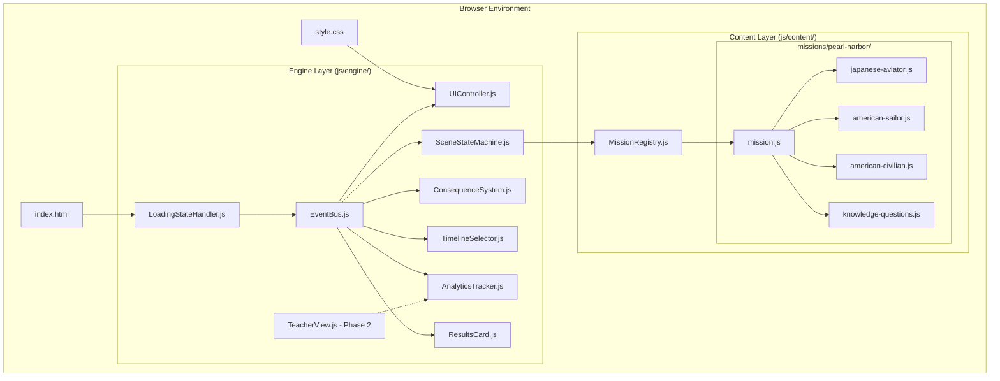

# Design Document: Witness Interactive Pearl Harbor

## Overview

Witness Interactive: Pearl Harbor is a browser-based interactive historical experience that allows players to witness the December 7, 1941 attack from three distinct perspectives. The system is architected as a scalable, data-driven game engine where the Pearl Harbor mission serves as the first of 50+ planned historical missions.

The design prioritizes:
- **Zero-dependency deployment**: Pure HTML/CSS/JavaScript with ES6 modules, deployable via GitHub Pages
- **Data-driven architecture**: All content separated from engine logic for easy expansion
- **Educational rigor**: Every scene tagged with AP US History reasoning skills (causation, continuity, perspective)
- **Accessibility**: WCAG 2.1 AA compliance with full keyboard navigation
- **Immersive realism**: Cinematic dark UI with CSS-based atmospheric effects

The game flow progresses through: Landing Screen → Interactive Timeline → Role Selection → Narrative Scenes (with choices) → Outcome Screen → Historical Ripple Timeline → Knowledge Checkpoint → Shareable Results Card.

## Architecture

### High-Level System Architecture



### Architectural Principles

1. **Event-Driven Communication**: All components communicate via EventBus, eliminating direct dependencies
2. **Scene State Machine**: Scenes are pure data objects processed by a state machine
3. **Mission Registry Pattern**: New missions register themselves; engine discovers them automatically
4. **Separation of Concerns**: Engine handles logic, content defines story, CSS handles presentation
5. **No Global State**: ES6 modules with explicit imports/exports only

### Folder Structure

```
witness-interactive/
├── index.html                 # Single entry point
├── css/
│   └── style.css             # All styles with CSS custom properties
├── js/
│   ├── main.js               # Application bootstrap
│   ├── engine/
│   │   ├── EventBus.js       # Pub/sub event system
│   │   ├── SceneStateMachine.js  # Scene transition logic
│   │   ├── ConsequenceSystem.js  # Decision tracking
│   │   ├── UIController.js   # DOM manipulation
│   │   ├── TimelineSelector.js   # Historical timeline UI
│   │   ├── ResultsCard.js    # Shareable outcome card
│   │   ├── LoadingStateHandler.js  # Module loading states
│   │   ├── AnalyticsTracker.js   # Session tracking
│   │   └── TeacherView.js    # Phase 2: Teacher dashboard hook
│   └── content/
│       ├── MissionRegistry.js    # Mission catalog
│       └── missions/
│           └── pearl-harbor/
│               ├── mission.js    # Mission metadata
│               ├── japanese-aviator.js
│               ├── american-sailor.js
│               ├── american-civilian.js
│               └── knowledge-questions.js
├── README.md
└── CONTRIBUTING.md
```

## Components and Interfaces

### EventBus

**Purpose**: Lightweight pub/sub system for decoupled component communication

**Interface**:
```javascript
class EventBus {
  // Subscribe to an event
  on(eventName: string, callback: Function): void
  
  // Unsubscribe from an event
  off(eventName: string, callback: Function): void
  
  // Publish an event with optional data
  emit(eventName: string, data?: any): void
}
```

**Events Published**:
- `game:start` - Game initialization complete
- `mission:selected` - Player chose a mission (data: missionId)
- `role:selected` - Player chose a role (data: roleId)
- `scene:transition` - Moving to new scene (data: sceneId)
- `choice:made` - Player made a decision (data: choiceId, consequences)
- `game:complete` - Narrative sequence finished
- `checkpoint:complete` - Knowledge questions answered

### SceneStateMachine

**Purpose**: Manages scene transitions and validates state changes

**Interface**:
```javascript
class SceneStateMachine {
  constructor(eventBus: EventBus)
  
  // Load a role's scene sequence
  loadRole(missionId: string, roleId: string): void
  
  // Get current scene data
  getCurrentScene(): Scene
  
  // Transition to next scene based on choice
  transitionTo(nextSceneId: string, consequences: object): void
  
  // Check if narrative is complete
  isComplete(): boolean
}
```

**Scene Data Structure**:
```javascript
{
  id: string,              // Unique scene identifier
  narrative: string,       // Main story text
  apThemes: string[],      // AP reasoning skills: ["causation", "perspective"]
  choices: [
    {
      id: string,
      text: string,
      consequences: {       // Flags set by this choice
        flagName: boolean | number
      },
      nextScene: string
    }
  ],
  atmosphericEffect: string | null  // "smoke", "fire", "shake", null
}
```

### ConsequenceSystem

**Purpose**: Tracks player decisions and calculates outcomes

**Interface**:
```javascript
class ConsequenceSystem {
  constructor(eventBus: EventBus)
  
  // Set a consequence flag
  setFlag(flagName: string, value: boolean | number): void
  
  // Get a flag value
  getFlag(flagName: string): boolean | number | undefined
  
  // Get all flags
  getAllFlags(): object
  
  // Calculate outcome based on flags
  calculateOutcome(outcomeRules: object): string
  
  // Reset all flags (new game)
  reset(): void
}
```

**Outcome Calculation**:
Outcomes are determined by evaluating consequence flags against predefined rules:
```javascript
{
  survived: true,
  epilogue: "japanese-aviator-returned-home",
  conditions: {
    avoided_aa_fire: true,
    fuel_conserved: true
  }
}
```

### UIController

**Purpose**: Handles all DOM manipulation and screen rendering

**Interface**:
```javascript
class UIController {
  constructor(eventBus: EventBus)
  
  // Render a specific screen
  showScreen(screenName: string, data?: object): void
  
  // Render current scene
  renderScene(scene: Scene): void
  
  // Show loading animation
  showLoading(): void
  
  // Apply atmospheric effect
  applyEffect(effectName: string): void
  
  // Update progress indicator
  updateProgress(current: number, total: number): void
}
```

**Screen Types**:
- `landing` - Title and intro
- `timeline` - Interactive historical timeline
- `role-selection` - Choose perspective
- `scene` - Narrative with choices
- `outcome` - Survival result and epilogue
- `historical-ripple` - Animated timeline
- `knowledge-checkpoint` - AP questions
- `results-card` - Shareable completion card

### TimelineSelector

**Purpose**: Renders interactive historical timeline for mission selection

**Interface**:
```javascript
class TimelineSelector {
  constructor(eventBus: EventBus, missionRegistry: MissionRegistry)
  
  // Render timeline with all missions
  render(containerElement: HTMLElement): void
  
  // Handle node click
  onNodeClick(missionId: string): void
  
  // Show tooltip on hover
  showTooltip(missionId: string, position: {x, y}): void
}
```

### ResultsCard

**Purpose**: Generates shareable outcome card for social media and teacher verification

**Interface**:
```javascript
class ResultsCard {
  constructor(eventBus: EventBus)
  
  // Generate card with session results
  generateCard(sessionData: object): HTMLElement
  
  // Copy card text to clipboard
  copyCardText(): void
  
  // Download card as image (future enhancement)
  downloadCard(): void
}
```

**Card Data Structure**:
```javascript
{
  missionTitle: string,
  roleName: string,
  survived: boolean,
  checkpointScore: number,
  totalQuestions: number,
  completionTimestamp: string,
  apThemesEngaged: string[]
}
```

### LoadingStateHandler

**Purpose**: Manages loading states during ES6 module initialization and asset loading

**Interface**:
```javascript
class LoadingStateHandler {
  // Show loading animation
  showLoading(message?: string): void
  
  // Hide loading animation
  hideLoading(): void
  
  // Update loading progress
  updateProgress(percent: number): void
}
```

**Timeline Node Structure**:
```javascript
{
  missionId: string,
  title: string,
  historicalDate: string,  // ISO format: "1941-12-07"
  era: string,             // "Ancient", "Medieval", "Modern", etc.
  unlocked: boolean,
  teaser: string           // One-line description
}
```

### MissionRegistry

**Purpose**: Central catalog of all missions

**Interface**:
```javascript
class MissionRegistry {
  // Register a new mission
  register(mission: Mission): void
  
  // Get mission by ID
  getMission(missionId: string): Mission
  
  // Get all missions
  getAllMissions(): Mission[]
  
  // Get missions by era
  getMissionsByEra(era: string): Mission[]
}
```

**Mission Data Structure**:
```javascript
{
  id: string,
  title: string,
  historicalDate: string,
  era: string,
  unlocked: boolean,
  teaser: string,
  roles: [
    {
      id: string,
      name: string,
      description: string,
      scenes: Scene[]
    }
  ],
  knowledgeQuestions: Question[],
  historicalRipple: RippleEvent[]
}
```

### AnalyticsTracker

**Purpose**: Tracks session data for future analytics integration

**Interface**:
```javascript
class AnalyticsTracker {
  constructor(eventBus: EventBus)
  
  // Start tracking a session
  startSession(): void
  
  // Log a player action
  logAction(actionType: string, data: object): void
  
  // Get session summary
  getSessionSummary(): object
  
  // Export session data as JSON
  exportSession(): string
}
```

**Session Data Structure**:
```javascript
{
  sessionId: string,
  startTime: timestamp,
  endTime: timestamp,
  missionId: string,
  roleId: string,
  choices: [
    {sceneId: string, choiceId: string, timestamp: timestamp}
  ],
  consequenceFlags: object,
  checkpointScore: number,
  checkpointAnswers: [
    {questionId: string, selectedAnswer: string, correct: boolean}
  ]
}
```

### TeacherView (Phase 2 - Placeholder)

**Purpose**: Future teacher dashboard for classroom management and student progress tracking

**Planned Interface** (Not implemented in MVP):
```javascript
class TeacherView {
  // View aggregated student results
  viewClassResults(classCode: string): object
  
  // Generate class performance report
  generateReport(classCode: string): string
  
  // Track which students completed which missions
  getCompletionStatus(classCode: string): object
}
```

**Business Model Hook**:
- Phase 1 (MVP): Students can copy/share results text with teachers manually
- Phase 2 (Post-pitch): Teacher dashboard with class codes and automated tracking
- Phase 3 (School district licensing): LMS integration, grade export, curriculum mapping

This placeholder signals to pitch judges that the B2B school district licensing path has been considered in the architecture.

## Data Models

### Scene Model

Scenes are the atomic unit of narrative content. Each scene is a pure JavaScript object:

```javascript
{
  id: "ja-scene-01",
  narrative: "You sit in the cockpit of your Mitsubishi A6M Zero...",
  apThemes: ["perspective", "causation"],
  atmosphericEffect: null,
  choices: [
    {
      id: "ja-choice-01-a",
      text: "Follow your squadron leader's path exactly",
      consequences: {
        disciplined_approach: true
      },
      nextScene: "ja-scene-02"
    },
    {
      id: "ja-choice-01-b",
      text: "Take a slightly different angle to avoid potential AA fire",
      consequences: {
        avoided_aa_fire: true,
        independent_thinking: true
      },
      nextScene: "ja-scene-02"
    }
  ]
}
```

### Role Model

Roles define playable perspectives within a mission:

```javascript
{
  id: "japanese-aviator",
  name: "Japanese Naval Aviator",
  description: "Experience the attack from the cockpit of a Zero fighter",
  scenes: [
    // Array of Scene objects
  ]
}
```

### Knowledge Question Model

AP-style assessment questions:

```javascript
{
  id: "ph-q-01",
  roleSpecific: "japanese-aviator",
  apSkill: "causation",
  question: "Which factor most directly contributed to Japan's decision to attack Pearl Harbor?",
  options: [
    {
      id: "a",
      text: "U.S. oil embargo following Japan's invasion of Indochina",
      correct: true
    },
    {
      id: "b",
      text: "Japanese desire to colonize Hawaii",
      correct: false
    },
    {
      id: "c",
      text: "U.S. declaration of war on Germany",
      correct: false
    },
    {
      id: "d",
      text: "Japanese alliance with Italy",
      correct: false
    }
  ],
  explanation: "The U.S. oil embargo was a direct economic pressure..."
}
```

### Historical Ripple Event Model

Timeline events showing long-term consequences:

```javascript
{
  id: "ripple-01",
  date: "December 8, 1941",
  title: "U.S. Declares War on Japan",
  description: "President Roosevelt's 'Day of Infamy' speech...",
  apTheme: "causation",
  animationDelay: 1000  // ms delay before revealing
}
```

### Outcome Model

Defines possible endings based on consequence flags:

```javascript
{
  id: "ja-outcome-survived",
  conditions: {
    avoided_aa_fire: true,
    fuel_conserved: true
  },
  survived: true,
  epilogue: "You return to the carrier Akagi. Your mission was successful, but you wonder about the consequences of this day..."
}
```

## Correctness Properties

*A property is a characteristic or behavior that should hold true across all valid executions of a system—essentially, a formal statement about what the system should do. Properties serve as the bridge between human-readable specifications and machine-verifiable correctness guarantees.*


### Property Reflection

After analyzing all acceptance criteria, I identified the following redundancies:

**Redundant Properties to Consolidate:**
- 3.5 and 3A.6 both test unlocked mission/node click → role selection (combine into one)
- 5.5 and 18.5 both test progress indicator display (combine into one)
- 6.2 and 20.1 both test state persistence during session (combine into one)
- 7.3 and 7.4 both test outcome reflects choices (combine into one)
- 14.2 and 14.3 test event bus pub/sub (combine into comprehensive event bus property)
- 15.2 is duplicate of 2.1 (mission registration)
- 22.1 and 22.2 can combine into comprehensive results summary property
- 23.1 and 23.2 can combine into role completion tracking property
- 24.1, 24.2, 24.4 all test AP theme tagging (combine into one comprehensive property)

**Properties That Subsume Others:**
- Property testing "scene transitions preserve state" (20.3) subsumes individual state tracking tests
- Property testing "all interactive elements keyboard accessible" (25.1) subsumes individual keyboard tests
- Property testing "analytics tracks all actions" (26.2) subsumes individual tracking tests

**Final Property Set:**
After consolidation, we have approximately 35-40 unique, non-redundant properties covering:
- Mission and role registration/loading
- Scene state machine transitions
- Consequence flag management
- Event bus communication
- UI rendering and navigation
- Timeline selector behavior
- Knowledge checkpoint functionality
- Results and analytics tracking
- Accessibility features

### Correctness Properties

Property 1: Mission Registration Completeness
*For any* valid mission configuration object with required fields (id, title, historicalDate, era, roles), registering it with the Mission_Registry should make it queryable and available for selection.
**Validates: Requirements 2.1, 15.2**

Property 2: Scene Object Processing
*For any* valid scene object containing id, narrative, apThemes, and choices properties, the Scene_State_Machine should successfully process and render it.
**Validates: Requirements 2.4**

Property 3: Unlocked Mission Navigation
*For any* unlocked mission or timeline node, clicking it should transition the game to the role selection screen for that mission.
**Validates: Requirements 3.5, 3A.6**

Property 4: Locked Node Behavior
*For any* locked timeline node, clicking it should display a "Coming Soon" message without navigating away from the timeline screen.
**Validates: Requirements 3A.7**

Property 5: Timeline Tooltip Display
*For any* timeline node, hovering or tapping it should display a tooltip containing the event name, date, and teaser description.
**Validates: Requirements 3A.5**

Property 6: Timeline Auto-Population
*For any* mission added to the Mission_Registry with a historicalDate field, the Timeline_Selector should automatically render it on the timeline in chronological position.
**Validates: Requirements 3A.10**

Property 7: Mission Metadata Validation
*For any* mission registered in the Mission_Registry, it should include historicalDate (ISO format) and era fields.
**Validates: Requirements 3A.12**

Property 8: Role Display Completeness
*For any* selected mission, the Game_Engine should display all roles defined in that mission's configuration.
**Validates: Requirements 4.1**

Property 9: Role Description Display
*For any* role displayed in the role selection screen, it should show the role's name and description.
**Validates: Requirements 4.5**

Property 10: Role Initialization
*For any* selected role, the Game_Engine should initialize the narrative sequence with that role's first scene.
**Validates: Requirements 4.3**

Property 11: Scene Narrative Display
*For any* scene being displayed, the Game_Engine should render its narrative text.
**Validates: Requirements 5.2**

Property 12: Choice Display
*For any* scene containing choices, the Game_Engine should display all choice options defined in that scene.
**Validates: Requirements 5.3**

Property 13: Choice-Based Scene Transition
*For any* choice made by the player, the Scene_State_Machine should transition to the nextScene specified in that choice's configuration.
**Validates: Requirements 5.4**

Property 14: Progress Indicator Accuracy
*For any* point in the narrative sequence, the progress indicator should accurately reflect the current scene position out of total scenes.
**Validates: Requirements 5.5, 18.5**

Property 15: Consequence Flag Setting
*For any* choice with defined consequences, making that choice should set all specified flags in the Consequence_System.
**Validates: Requirements 6.1**

Property 16: Consequence Flag Persistence
*For any* consequence flag set during a session, it should remain accessible and unchanged until the session ends or the game is reset.
**Validates: Requirements 6.2, 20.1, 20.3**

Property 17: Outcome Calculation Correctness
*For any* set of consequence flags and outcome rules, the Game_Engine should calculate the outcome that matches the flag conditions.
**Validates: Requirements 6.3**

Property 18: Flag Type Support
*For any* consequence flag, the Consequence_System should correctly store and retrieve both boolean and numeric values.
**Validates: Requirements 6.4**

Property 19: Flag Access in Scenes
*For any* scene that references consequence flags in its logic, the Scene_State_Machine should access the current flag values from the Consequence_System.
**Validates: Requirements 6.5**

Property 20: Outcome Reflects Choices
*For any* completed narrative sequence, the outcome screen should display an epilogue that corresponds to the consequence flags set by player choices.
**Validates: Requirements 7.2, 7.3, 7.4**

Property 21: Historical Ripple AP Tagging
*For any* historical ripple event displayed, it should include AP US History theme tags.
**Validates: Requirements 8.3**

Property 22: Role-Specific Questions
*For any* knowledge checkpoint, the questions presented should be tagged as specific to the role the player just completed.
**Validates: Requirements 9.3**

Property 23: Answer Feedback
*For any* answer submitted in the knowledge checkpoint, the Game_Engine should immediately indicate whether it is correct or incorrect.
**Validates: Requirements 9.4**

Property 24: Atmospheric Effect Application
*For any* scene with an atmosphericEffect property set, the Visual_Effects_System should apply the corresponding CSS effect.
**Validates: Requirements 11.5**

Property 25: Responsive Layout Preservation
*For any* viewport size change, the Game_Engine should maintain functional layout and interactive elements without breaking.
**Validates: Requirements 12.4**

Property 26: Event Bus Pub/Sub
*For any* event published on the Event_Bus, all subscribed callbacks should be invoked with the event data.
**Validates: Requirements 14.2, 14.3**

Property 27: Mission Metadata Retrieval
*For any* registered mission, querying the Mission_Registry should return its complete metadata including title, description, and unlock status.
**Validates: Requirements 15.3**

Property 28: Mission Lock Status
*For any* mission in the Mission_Registry, it should have a boolean unlocked property that determines its accessibility.
**Validates: Requirements 15.5**

Property 29: Navigation Button Presence
*For any* screen displayed, appropriate navigation buttons should be present to progress or return.
**Validates: Requirements 18.4**

Property 30: Session State Tracking
*For any* game session, the Game_Engine should track the current scene, selected role, and all consequence flags.
**Validates: Requirements 20.2**

Property 31: Results Summary Completeness
*For any* completed game session, the generated results summary should include role played, survival outcome, knowledge checkpoint score, and completion timestamp.
**Validates: Requirements 22.1, 22.2**

Property 32: Role Completion Tracking (Session-Only)
*For any* role completed during a browser session, it should be marked as completed and this status should be visible on the role selection screen for the duration of that session.
**Validates: Requirements 23.1, 23.2**

Property 33: Endings Counter Accuracy
*For any* point in the game, the "endings discovered" counter should accurately reflect the number of unique roles completed in the current session.
**Validates: Requirements 23.3**

Property 34: Scene AP Theme Tagging
*For any* scene defined in the game, it should include at least one AP US History theme tag (causation, continuity, perspective, or argumentation).
**Validates: Requirements 24.1, 24.2**

Property 35: Knowledge Question AP Tagging
*For any* knowledge checkpoint question, it should be tagged with the specific AP reasoning skill it assesses.
**Validates: Requirements 24.4**

Property 36: Results AP Theme Summary
*For any* results summary, it should list all AP themes and reasoning skills the player engaged with during their session.
**Validates: Requirements 24.5**

Property 37: Keyboard Navigation Completeness
*For any* interactive element in the game, it should be reachable and activatable using only keyboard navigation (Tab, Enter, Arrow keys).
**Validates: Requirements 25.1**

Property 38: Focus Indicator Visibility
*For any* element receiving keyboard focus, a visible focus indicator should be displayed.
**Validates: Requirements 25.2**

Property 39: ARIA Label Presence
*For any* interactive element, it should have an appropriate ARIA label for screen reader accessibility.
**Validates: Requirements 25.4**

Property 40: Session Analytics Tracking
*For any* player action (choice made, answer submitted), it should be logged in the analytics session data.
**Validates: Requirements 26.1, 26.2, 26.3**

Property 41: Outcome Card Completeness
*For any* completed game, the shareable outcome card should include mission name, role played, survival status, knowledge checkpoint score, and game title.
**Validates: Requirements 27.2, 27.4**

## Error Handling

### Input Validation

**Invalid Scene Data**:
- If a scene object is missing required fields (id, narrative, apThemes), the Scene_State_Machine should log an error to console and display a fallback error scene
- If a scene's apThemes array is empty or missing, the Scene_State_Machine should log a warning: "Scene [id] missing AP theme tags - educational integrity compromised"
- If a scene's nextScene reference points to a non-existent scene, the system should log an error and end the narrative sequence gracefully

**Invalid Mission Data**:
- If a mission is missing required fields (id, title, historicalDate, era, roles), the Mission_Registry should reject registration and log a descriptive error
- If a mission's historicalDate is not in ISO format, the Timeline_Selector should log a warning and position the node at the end of the timeline

**Invalid Choice Data**:
- If a choice is missing a nextScene property, the Scene_State_Machine should log an error and remain on the current scene
- If a choice's consequences object contains invalid flag names (non-string keys), the Consequence_System should log a warning and skip those flags

### Runtime Errors

**Module Loading Failures**:
- If an ES6 module fails to load, the Game_Engine should display a user-friendly error message: "Failed to load game components. Please refresh the page."
- If the main.js module fails to initialize, the index.html should display a fallback error message

**Event Bus Errors**:
- If an event callback throws an exception, the Event_Bus should catch it, log the error, and continue invoking other callbacks
- If an event is emitted with no subscribers, the Event_Bus should silently continue (no error)

**State Corruption**:
- If the Consequence_System detects invalid flag values (non-boolean, non-numeric), it should log a warning and treat them as undefined
- If the Scene_State_Machine loses track of the current scene, it should log an error and return to the role selection screen

### User Input Errors

**Invalid Selections**:
- If a player attempts to select a locked mission, the UI should display "Coming Soon" and prevent navigation
- If a player attempts to navigate to a non-existent scene, the system should log an error and display the outcome screen

**Accessibility Errors**:
- If keyboard navigation fails to focus an element, the system should log a warning and attempt to focus the next element in sequence
- If ARIA labels are missing, the system should log warnings during development but continue functioning

### Network Errors (Offline Mode)

**Asset Loading**:
- If CSS fails to load, the game should display unstyled but functional HTML
- If JavaScript modules fail to load due to network issues, the index.html should display a retry button

**External Resources**:
- If external resources (future audio files, images) fail to load, the game should continue without them and log warnings
- If GitHub Pages deployment fails, the system should provide clear error messages about missing files

## Testing Strategy

### MVP Testing Approach (Pre-April 4th Pitch)

**For the pitch deadline, prioritize manual + Playwright testing over property-based testing.**

The zero-dependency architecture (no npm, no build tools) conflicts with property-based testing libraries like fast-check. To ship a working game by April 4th, defer comprehensive property-based testing to Phase 2.

### Phase 1: MVP Testing (Now → April 4th)

**1. Manual Playtesting** (Critical - Do This First):
- Play through all three roles completely
- Make different choices to verify consequence flags work
- Verify outcomes reflect decisions made
- Test knowledge checkpoint scoring
- Verify results card displays correctly
- Test on mobile (320px), tablet (768px), desktop (1280px)
- Verify keyboard navigation (Tab, Enter, Arrow keys)
- Test with screen reader (basic ARIA label verification)

**2. Playwright Automated Testing** (High Priority):
- Full flow test: landing → timeline → role selection → scenes → outcome → ripple → checkpoint → results
- Responsive layout verification at 320px, 768px, 1280px
- Console error checking (no JavaScript errors on load)
- GitHub Pages deployment verification after each push to main

**3. Manual Browser Testing** (Required):
- Test on Chrome, Firefox, Safari
- Verify CSS animations (smoke, fire, screen shake) trigger correctly
- Verify timeline scrolls horizontally on mobile
- Verify all interactive elements are touch-friendly
- Verify dark theme renders correctly

### Phase 2: Comprehensive Testing (Post-Pitch)

**Property-Based Testing with fast-check**:
- Set up in a separate `tests/` branch that doesn't deploy to GitHub Pages
- Requires npm installation (conflicts with production zero-dependency rule)
- Minimum 100 iterations per property test
- Each test references design document property number
- Tag format: `// Feature: witness-interactive-pearl-harbor, Property N: [property text]`

**Test Organization** (Phase 2):
```
tests/
├── package.json          # npm dependencies (fast-check)
├── unit/
│   ├── engine/
│   │   ├── EventBus.test.js
│   │   ├── SceneStateMachine.test.js
│   │   ├── ConsequenceSystem.test.js
│   │   └── UIController.test.js
│   └── content/
│       └── pearl-harbor/
│           └── mission.test.js
└── property/
    ├── mission-registry.property.test.js
    ├── scene-state-machine.property.test.js
    ├── consequence-system.property.test.js
    └── event-bus.property.test.js
```

### Dual Testing Approach (Phase 2 Explanation)

**Unit Tests**: Verify specific examples, edge cases, and error conditions
- Specific scene transitions (e.g., Pearl Harbor landing screen → timeline)
- Specific content rendering (e.g., three roles display for Pearl Harbor)
- Edge cases (e.g., empty consequence flags, missing scene data)
- Error conditions (e.g., invalid mission registration, module loading failures)
- Integration points (e.g., EventBus connects SceneStateMachine to UIController)

**Property Tests**: Verify universal properties across all inputs
- Scene state machine processes any valid scene object
- Consequence system handles any flag name and value type
- Timeline selector positions any mission with historicalDate
- Event bus delivers events to all subscribers
- Results summary includes all required fields for any session

Together, unit tests catch concrete bugs in specific scenarios while property tests verify general correctness across the entire input space.

### Testing Priorities for MVP

**Must Test Before Pitch**:
1. ✅ All three roles playable end-to-end
2. ✅ Consequence flags affect outcomes correctly
3. ✅ Knowledge checkpoint scoring works
4. ✅ Results card displays and is shareable
5. ✅ Timeline selector shows Pearl Harbor unlocked, others locked
6. ✅ Mobile responsive (320px minimum)
7. ✅ Keyboard navigation functional
8. ✅ GitHub Pages deployment works
9. ✅ No console errors on load
10. ✅ Historical ripple timeline animates

**Nice to Have Before Pitch**:
- Playwright automated full flow test
- Cross-browser testing (Chrome, Firefox, Safari)
- Screen reader compatibility verification
- Atmospheric effects (smoke, fire, shake) working

**Defer to Phase 2**:
- Property-based testing with fast-check
- Comprehensive unit test suite
- Performance testing
- Accessibility audit (full WCAG 2.1 AA compliance)

### Browser Testing

**Manual Testing Required**:
- Visual design and CSS effects (smoke, fire, screen shake)
- Responsive layout at different viewport sizes (320px, 768px, 1280px)
- Keyboard navigation flow
- Screen reader compatibility
- GitHub Pages deployment verification

**Automated Browser Testing** (using Playwright):
- Full game flow from landing to results card
- Scene transitions and choice selection
- Knowledge checkpoint interaction
- Offline functionality after initial load

### Continuous Integration (Phase 2)

**Note**: These CI checks apply to Phase 2 after property-based testing is set up. For MVP, rely on manual testing and Playwright.

**Pre-commit Checks** (Phase 2):
- ESLint for code quality (no global variables, ES6 modules only)
- All unit tests pass
- All property tests pass (100 iterations each)

**Pre-deployment Checks** (MVP):
- Manual playtesting of all three roles
- Playwright full flow test
- Manual browser testing on Chrome, Firefox, Safari
- GitHub Pages deployment verification
- Basic accessibility check (keyboard navigation, ARIA labels)

### Test Data Generation (Phase 2)

**For Property Tests**:
- Generate random scene objects with valid structure
- Generate random mission configurations
- Generate random consequence flag names and values
- Generate random player choice sequences

**For Manual Testing** (MVP):
- Use Pearl Harbor mission data as concrete examples
- Test specific scene sequences from each role
- Test known consequence flag combinations for outcome verification
